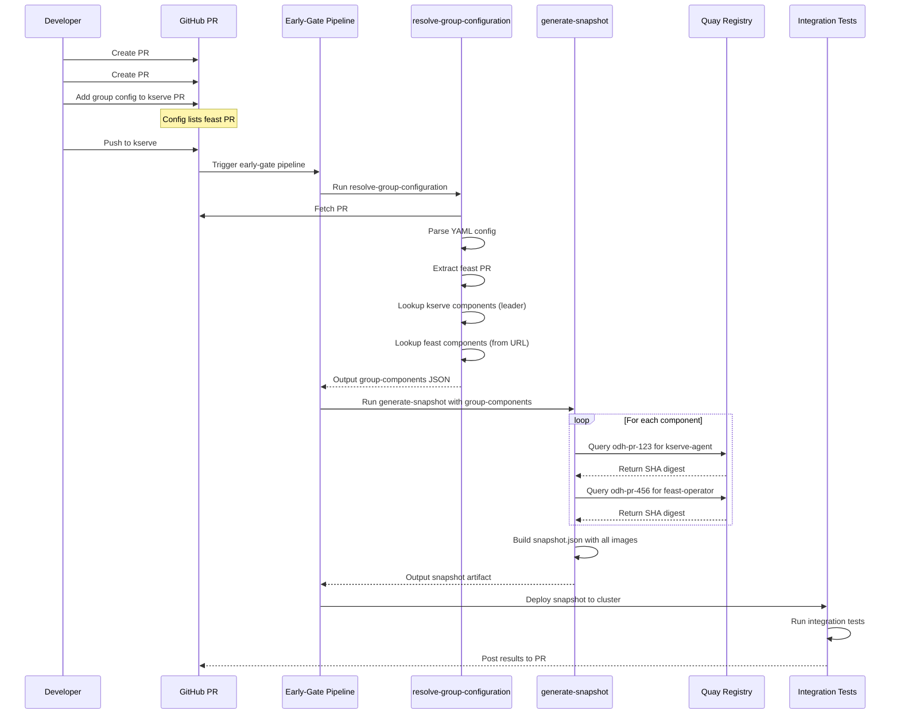

# Group Testing Complete Flow Explanation

## How PR Images Are Taken and Group Snapshots Created

### Complete Pipeline Flow



### Detailed Step-by-Step

#### 1. Developer Creates Group Config

**kserve PR #123 description:**
```markdown
## Summary
Add OAuth2 support to KServe API

## Group Testing
```yaml
# early-gate-group-config
repos:
  - https://github.com/opendatahub-io/feast/pull/456
```

## Test Plan
- [ ] KServe OAuth2 works
- [ ] Feast integration works
```

**Note:** Leader PR (kserve #123) is NOT in the list - it's implicit!

#### 2. Pipeline Triggers on Push

When developer pushes to kserve PR #123 branch:
- PipelinesAsCode detects push
- Reads labels: `REPO_NAME=kserve`, `PR_NUMBER=123`
- Launches early-gate pipeline

#### 3. resolve-group-configuration Task Runs

**Inputs:**
```yaml
params:
  PR_NUMBER: "123"
  REPO_NAME: "kserve"
  GITHUB_ORG: "opendatahub-io"
```

**Process:**
```bash
# Step 1: Fetch PR description
curl https://api.github.com/repos/opendatahub-io/kserve/pulls/123
# Returns: PR body with YAML config

# Step 2: Find marker and extract YAML
grep "# early-gate-group-config"
# Found! Extract YAML block

# Step 3: Parse YAML
repos:
  - https://github.com/opendatahub-io/feast/pull/456

# Step 4: ALWAYS add leader PR components first
# Lookup kserve in component_repo_map.json
{
  "kserve": {
    "kserve-agent-ci": "opendatahub/kserve-agent",
    "kserve-controller-ci": "opendatahub/kserve-controller"
  }
}

# Add PR metadata for leader (PR #123)
{
  "kserve-agent-ci": {
    "quay_path": "opendatahub/kserve-agent",
    "pr": "123"
  },
  "kserve-controller-ci": {
    "quay_path": "opendatahub/kserve-controller",
    "pr": "123"
  }
}

# Step 5: Parse collaborator URLs
# URL: https://github.com/opendatahub-io/feast/pull/456
# Extract: org=opendatahub-io, repo=feast, pr=456

# Step 6: Lookup feast components
{
  "feast": {
    "odh-feast-operator-ci": "opendatahub/feast-operator",
    "odh-feature-server-ci": "opendatahub/feature-server"
  }
}

# Add PR metadata for feast (PR #456)
{
  "odh-feast-operator-ci": {
    "quay_path": "opendatahub/feast-operator",
    "pr": "456"
  },
  "odh-feature-server-ci": {
    "quay_path": "opendatahub/feature-server",
    "pr": "456"
  }
}

# Step 7: Merge all components
# Final output in results.group-components:
```

**Output (group-components result):**
```json
{
  "kserve-agent-ci": {
    "quay_path": "opendatahub/kserve-agent",
    "pr": "123"
  },
  "kserve-controller-ci": {
    "quay_path": "opendatahub/kserve-controller",
    "pr": "123"
  },
  "odh-feast-operator-ci": {
    "quay_path": "opendatahub/feast-operator",
    "pr": "456"
  },
  "odh-feature-server-ci": {
    "quay_path": "opendatahub/feature-server",
    "pr": "456"
  }
}
```

#### 4. generate-snapshot Task Runs

**Inputs:**
```yaml
params:
  COMPONENTS: <group-components from previous step>
  CURRENT_PR_NUMBER: "123"
  fallback-tag: "odh-stable"
```

**Process:**
```bash
# For each component in group-components:

# Component 1: kserve-agent-ci
value = {"quay_path": "opendatahub/kserve-agent", "pr": "123"}
repo_path = "opendatahub/kserve-agent"
component_pr = "123"
TAG = "odh-pr-123"

# Query Quay
skopeo inspect docker://quay.io/opendatahub/kserve-agent:odh-pr-123
# Success! Get SHA digest

# Query Quay API for manifest
curl https://quay.io/api/v1/repository/opendatahub/kserve-agent/tag/?specificTag=odh-pr-123
# Returns: manifest_digest = sha256:abc123...

# Get git metadata
manifest_digest = "sha256:abc123..."
image_uri = "quay.io/opendatahub/kserve-agent@sha256:abc123..."
git_url = "https://github.com/opendatahub-io/kserve"
git_commit = "def456..."

# Add to snapshot
{
  "kserve-agent-ci": {
    "image": "quay.io/opendatahub/kserve-agent@sha256:abc123...",
    "image_tag": "odh-pr-123",
    "git.url": "https://github.com/opendatahub-io/kserve",
    "git.commit": "def456..."
  }
}

# Component 2: odh-feast-operator-ci
value = {"quay_path": "opendatahub/feast-operator", "pr": "456"}
repo_path = "opendatahub/feast-operator"
component_pr = "456"
TAG = "odh-pr-456"

# Query Quay
skopeo inspect docker://quay.io/opendatahub/feast-operator:odh-pr-456

# Case A: Image found
# → Get SHA digest, add to snapshot with odh-pr-456 tag

# Case B: Image NOT found (build in progress)
# → ⚠️ WARNING logged
# → Fallback to TAG = "odh-stable"
# → Get stable image SHA digest
# → Add to snapshot with odh-stable tag (with warning)

# Repeat for all components...
```

**Final Snapshot Output (snapshot.json):**
```json
{
  "kserve-agent-ci": {
    "image": "quay.io/opendatahub/kserve-agent@sha256:abc123...",
    "image_tag": "odh-pr-123",
    "git.url": "https://github.com/opendatahub-io/kserve",
    "git.commit": "def456..."
  },
  "kserve-controller-ci": {
    "image": "quay.io/opendatahub/kserve-controller@sha256:def789...",
    "image_tag": "odh-pr-123",
    "git.url": "https://github.com/opendatahub-io/kserve",
    "git.commit": "def456..."
  },
  "odh-feast-operator-ci": {
    "image": "quay.io/opendatahub/feast-operator@sha256:ghi012...",
    "image_tag": "odh-pr-456",
    "git.url": "https://github.com/opendatahub-io/feast",
    "git.commit": "jkl345..."
  },
  "odh-feature-server-ci": {
    "image": "quay.io/opendatahub/feature-server@sha256:mno678...",
    "image_tag": "odh-stable",
    "git.url": "https://github.com/opendatahub-io/feast",
    "git.commit": "main-branch-commit..."
  }
}
```

**Note:** In this example:
- kserve components use PR #123 images ✅
- feast-operator uses PR #456 image ✅
- feature-server fell back to stable ⚠️ (PR build not ready)

#### 5. Integration Tests Run

```bash
# Snapshot is deployed to test cluster
# Each component uses its specific image
# Tests run against the combined environment
# Results posted back to kserve PR #123
```

---

## Key Differences: With vs Without Leader PR in Config

### Option 1: **DON'T** include leader PR (RECOMMENDED)

**Config in kserve PR #123:**
```yaml
# early-gate-group-config
repos:
  - https://github.com/opendatahub-io/feast/pull/456
```

**Result:**
- Leader (kserve #123) components: **Automatically included** with PR #123 images
- Collaborator (feast #456) components: Included from config with PR #456 images
- **Cleaner config**: Only list collaborators

### Option 2: Include leader PR (EXPLICIT)

**Config in kserve PR #123:**
```yaml
# early-gate-group-config
repos:
  - https://github.com/opendatahub-io/kserve/pull/123  # explicit
  - https://github.com/opendatahub-io/feast/pull/456
```

**Result:**
- Same as Option 1 (leader components included either way)
- **More explicit**: Readers see all PRs in the group
- **Longer config**: Redundant since leader is implicit

---

## Summary of Changes to Early-Gate

### Files Modified

1. **NEW: `early-gate/tasks/resolve-group-configuration.yaml`**
   - Fetches PR descriptions from GitHub
   - Parses YAML config blocks
   - Resolves repos to components
   - **ALWAYS includes leader PR components**
   - Outputs `group-components` JSON

2. **MODIFIED: `early-gate/tasks/generate-snapshot-for-group-testing.yaml`**
   - Supports new component format with PR metadata
   - Handles per-component PR numbers
   - Queries correct PR-specific tags
   - Enhanced fallback and warning messages

### Component Flow

```
PipelinesAsCode Labels
  ├─ REPO_NAME=kserve
  └─ PR_NUMBER=123
       ↓
resolve-group-configuration
  ├─ Fetch PR #123 description
  ├─ Parse YAML config
  ├─ Add kserve components (pr: "123") ← AUTOMATIC
  └─ Add feast components (pr: "456") ← FROM CONFIG
       ↓
group-components JSON
  ├─ kserve-agent-ci: {quay_path: "...", pr: "123"}
  ├─ kserve-controller-ci: {quay_path: "...", pr: "123"}
  ├─ odh-feast-operator-ci: {quay_path: "...", pr: "456"}
  └─ odh-feature-server-ci: {quay_path: "...", pr: "456"}
       ↓
generate-snapshot
  ├─ Query quay.io/.../kserve-agent:odh-pr-123
  ├─ Query quay.io/.../kserve-controller:odh-pr-123
  ├─ Query quay.io/.../feast-operator:odh-pr-456
  └─ Query quay.io/.../feature-server:odh-pr-456
       ↓
snapshot.json (with SHA digests)
       ↓
Integration Tests
       ↓
Results posted to kserve PR #123
```

---

## Recommendation

**Use the implementation as-is**, which:
1. ✅ Automatically includes leader PR components
2. ✅ Users only list collaborator PRs in config (simpler)
3. ✅ No redundancy (leader PR link is optional)
4. ✅ Clear behavior: Leader + all config PRs = group snapshot
