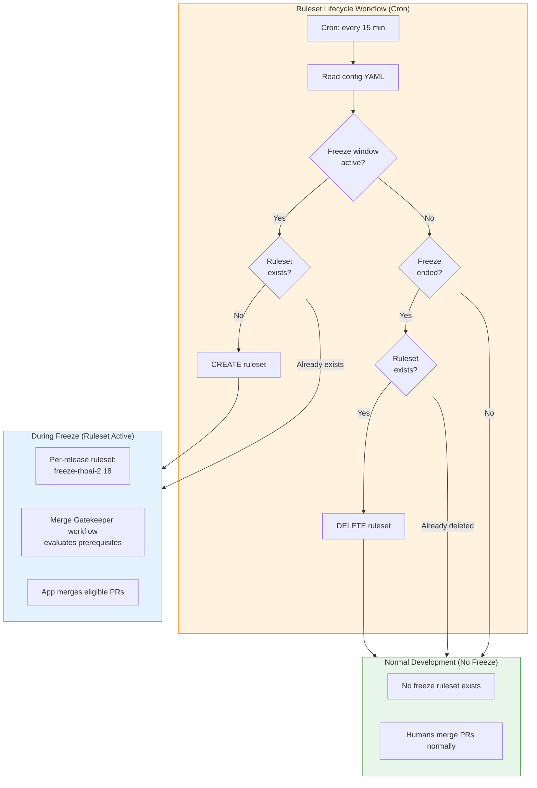
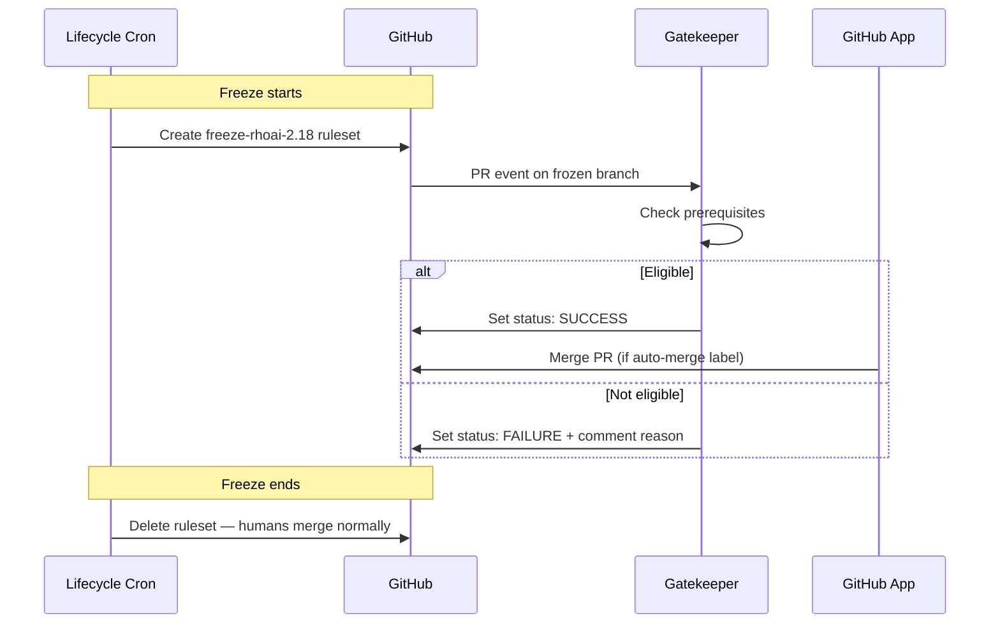

# Post-Code-Freeze Gatekeeper — Design Document

**A time-gated, per-release merge enforcement system for GitHub repositories.**

---

## Table of Contents

- [1. Problem Statement](#1-problem-statement)
- [2. Architecture Overview](#2-architecture-overview)
- [3. GitHub App](#3-github-app)
- [4. Ruleset Specification](#4-ruleset-specification)
- [5. Workflow Design](#5-workflow-design)
- [6. Configuration](#6-configuration)
- [7. Deployment](#7-deployment)
- [8. Edge Cases](#8-edge-cases)
- [9. Security Analysis](#9-security-analysis)
- [10. Quick Reference](#10-quick-reference)

---

## 1. Problem Statement

| # | Requirement | Constraint |
|---|------------|------------|
| R1 | **Block manual pushes** to given branches for a given time period | Time-configurable, per-repo, per-branch |
| R2 | **GitHub workflow decides** whether current time is in the restricted period | Time evaluation + CI status + labels + approvals |
| R3 | **During freeze**, all merges go through a GitHub App bot only | Bot is sole merge authority during freeze |
| R4 | **During freeze, nobody else can merge** — not even org admins. Outside freeze, normal human merge flow. | No human bypass during freeze |

### Why This is Hard

GitHub has no native time-based merge restrictions. Rulesets block pushes and require status checks, but have no concept of "only during these hours."

The key insight: **rulesets don't need to exist permanently**. We create them on-demand when a freeze starts and delete them when it ends — normal human merge flow during development, airtight bot-only enforcement during freeze.

---

## 2. Architecture Overview

### How It Works

1. **Outside freeze:** No freeze ruleset exists. Developers merge through the normal GitHub flow.
2. **Freeze starts:** The Lifecycle Workflow (cron every 15 min) creates a per-release ruleset (e.g., `freeze-rhoai-2.18`) that blocks all human merges and requires the `merge-gatekeeper` status check.
3. **During freeze:** The Merge Gatekeeper Workflow evaluates PRs against prerequisites. The GitHub App — the only entity on the bypass list — merges eligible PRs.
4. **Freeze ends:** The Lifecycle Workflow deletes the ruleset. Normal merge flow resumes.

> **Key Insight:** Enforcement is controlled by **ruleset existence**. No ruleset = humans merge freely. Ruleset exists = bot-only merges. The cron manages the transition.

---

## 3. GitHub App

Reuses the existing `ODH_DEVOPS_APP`. Required permissions: `contents:write`, `pull_requests:write`, `statuses:write`.

Tokens are generated fresh per workflow run via `getsentry/action-github-app-token@v2` and expire after 1 hour. The private key is stored only in GitHub Actions secrets — no human retains a copy. Fork PRs cannot access these secrets.

---

## 4. Ruleset Specification

Rulesets are **created on-demand** when a freeze starts and **deleted** when it ends. Each release gets its own ruleset.

> **Template:** [`post-code-freeze/ruleset.json`](../../post-code-freeze/ruleset.json)

### Naming Convention

| Release | Ruleset Name | Branch Pattern |
|---------|-------------|----------------|
| RHOAI 2.18 | `freeze-rhoai-2.18` | `refs/heads/release-2.18*`, `refs/heads/rhoai-2.18*` |
| RHOAI 2.19 | `freeze-rhoai-2.19` | `refs/heads/release-2.19*`, `refs/heads/rhoai-2.19*` |

### What the Ruleset Enforces

- Blocks direct pushes, branch creation/deletion, and force pushes
- Requires PRs with at least 1 approval
- Requires `merge-gatekeeper` status check (only settable by the App)
- Bypass list contains **only** the GitHub App (`bypass_mode: "always"`)
- Created with `enforcement: active` — no disabled state needed

The Lifecycle Workflow substitutes `name`, `conditions.ref_name.include`, and `bypass_actors[0].actor_id` from the config per release.

---

## 5. Workflow Design

Two workflows work together:

### Workflow 1: Ruleset Lifecycle (Cron)

Runs centrally in `odh-konflux-central`. On every cron tick (15 min), reads the config and for each release:
- **Freeze active + no ruleset** → creates the ruleset via `POST /repos/{owner}/{repo}/rulesets`
- **Freeze ended + ruleset exists** → deletes it via `DELETE /repos/{owner}/{repo}/rulesets/{id}`
- Otherwise → no action (idempotent)

Also supports `workflow_dispatch` for manual on-demand enforcement.

### Workflow 2: Merge Gatekeeper (PR Evaluation)

Runs per-repo when a freeze ruleset is active. Evaluates PRs on `pull_request`, `pull_request_review`, `schedule` (every 15 min), and `workflow_dispatch`.

### Workflow Files

| File | Purpose | Deploy To |
|------|---------|-----------|
| `workflows/ruleset-lifecycle.yml` | Creates/deletes per-release rulesets | `odh-konflux-central/.github/workflows/` |
| [`workflows/reusable-merge-gatekeeper.yml`](../../post-code-freeze/workflows/reusable-merge-gatekeeper.yml) | PR evaluation logic | `odh-konflux-central/.github/workflows/` |
| [`workflows/merge-gatekeeper.yml`](../../post-code-freeze/workflows/merge-gatekeeper.yml) | Caller workflow (per-repo) | Each target repo's `.github/workflows/` |

---

## 6. Configuration

> **Source file:** [`post-code-freeze/config/post-code-freeze-config.yaml`](../../post-code-freeze/config/post-code-freeze-config.yaml)

The config has two sections:

### Per-Release Freeze (drives Lifecycle Workflow)

The `releases` section defines when to create/delete rulesets:

| Field | Description |
|-------|-------------|
| `releases.<name>` | Release identifier → ruleset name `freeze-{name}` |
| `branch_patterns` | Branch refs for the ruleset (e.g., `refs/heads/release-2.18*`) |
| `freeze_start` / `freeze_end` | ISO 8601 UTC timestamps |
| `repos` | Which repositories get the freeze ruleset |

### Merge Gatekeeper (drives PR evaluation)

The existing `defaults`, `emergency_override`, and `repos` sections drive prerequisite checks (required labels, CI checks, approvals), recurring freeze windows, and emergency override authorization.

---

## 7. Deployment

1. **Verify App permissions** — ensure `ODH_DEVOPS_APP` has `statuses:write`
2. **Deploy Lifecycle Workflow** — `ruleset-lifecycle.yml` to `odh-konflux-central/.github/workflows/`
3. **Deploy Gatekeeper Caller** — `merge-gatekeeper.yml` to each target repo's `.github/workflows/`
4. **Secrets** — `ODH_DEVOPS_APP_ID` and `ODH_DEVOPS_APP_PRIVATE_KEY` (already org-wide)
5. **Configure releases** — add entries to `releases` in the config YAML
6. **Test** — add a test release with a near-future freeze, verify ruleset creation/deletion and merge blocking

Use `workflow_dispatch` on the Lifecycle Workflow for immediate enforcement without waiting for cron.

---

## 8. Edge Cases

| Scenario | Behavior |
|----------|----------|
| **Outside freeze** | No ruleset exists — humans merge normally |
| **Cron fails at freeze start** | Up to 15 min gap; self-heals on next cron run |
| **Cron fails at freeze end** | Merges blocked up to 15 min extra; self-heals or use `workflow_dispatch` |
| **Ruleset created mid-PR-review** | Merge button disables; PR waits for prerequisites or freeze end |
| **Freeze ends with queued PRs** | Ruleset deleted — humans merge normally, no bot needed |
| **Emergency during freeze** | Authorized user adds `emergency-override` label; gatekeeper verifies and bypasses freeze for that PR |
| **Multiple releases frozen simultaneously** | Each gets its own independent ruleset |
| **Renovate during freeze** | Blocked like any other PR; accumulates and merges when freeze ends |

---

## 9. Security Analysis

The threat model applies **during freeze** when a ruleset is active. Outside freeze, no enforcement exists.

| Attack Vector | Defense |
|--------------|---------|
| Direct push to frozen branch | Ruleset blocks — user not on bypass list |
| Merge via UI or API during freeze | Ruleset blocks — user not on bypass list, merge button inoperable |
| Org admin deletes freeze ruleset | Cron re-creates within 15 min; audit log alerts on `repository_ruleset.destroy` |
| Steal App private key | Key only in GH secrets; exfiltration requires modifying workflow files — blocked by the ruleset |
| Spoof `merge-gatekeeper` status | Status tied to App's `integration_id` — GitHub enforces matching |
| Cron fails to create ruleset | Self-heals within 15 min; manual `workflow_dispatch` for immediate enforcement |

### Residual Risks

1. **Org admin deletes ruleset** — GitHub doesn't allow locking out org owners. Mitigated by cron self-healing and audit log alerts. Use org-level rulesets for stronger protection.
2. **Brief gap at freeze transitions** — up to 15 min window. Acceptable tradeoff for normal-flow usability. Mitigated by announcing freeze windows in advance.

---

## 10. Quick Reference

| | Outside Freeze | During Freeze |
|---|---|---|
| **Ruleset** | None | `freeze-{release}` created on-demand |
| **Who merges** | Humans (normal flow) | GitHub App only |
| **Merge button** | Works normally | Disabled for humans |
| **Bot involvement** | None needed | Evaluates prerequisites, merges eligible PRs |
| **Emergency** | N/A | `emergency-override` label + authorized user |

**Key files:**
- Config: `config/post-code-freeze-config.yaml`
- Ruleset template: `post-code-freeze/ruleset.json`
- Lifecycle: `.github/workflows/ruleset-lifecycle.yml`
- Gatekeeper: `.github/workflows/merge-gatekeeper.yml`

### GitHub API Reference

| Operation | Endpoint | Used By |
|-----------|----------|---------|
| List rulesets | `GET /repos/{owner}/{repo}/rulesets` | Lifecycle Workflow |
| Create ruleset | `POST /repos/{owner}/{repo}/rulesets` | Lifecycle Workflow |
| Delete ruleset | `DELETE /repos/{owner}/{repo}/rulesets/{id}` | Lifecycle Workflow |
| Set commit status | `POST /repos/{owner}/{repo}/statuses/{sha}` | Gatekeeper Workflow |
| Merge PR | `PUT /repos/{owner}/{repo}/pulls/{number}/merge` | Gatekeeper (via App) |
