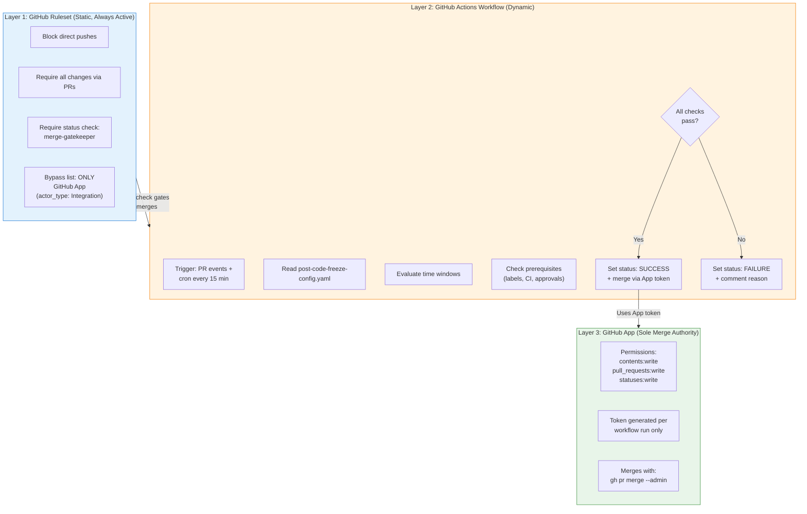
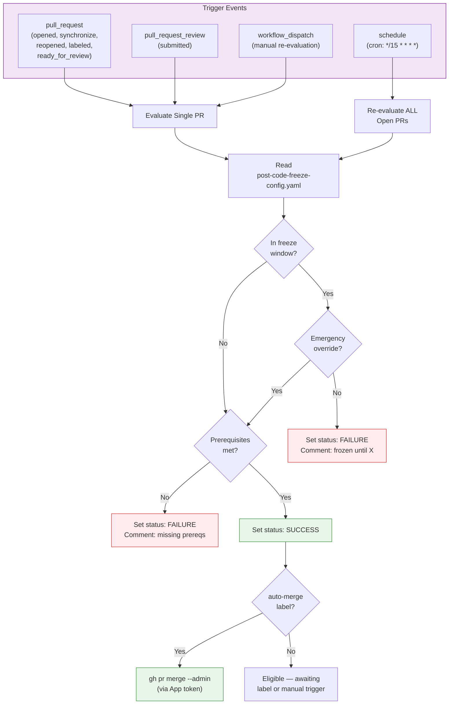
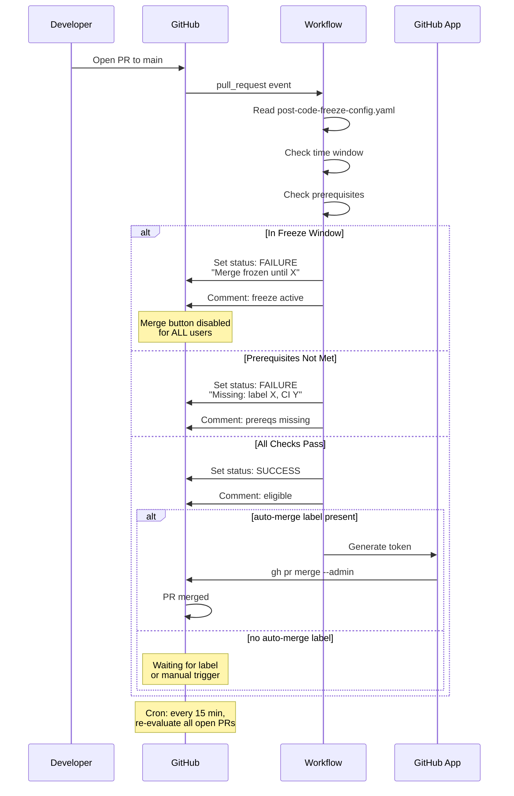
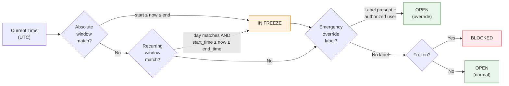
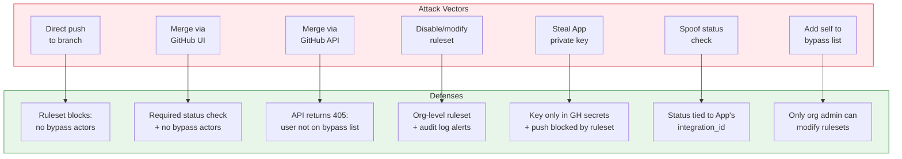

# Post-Code-Freeze Gatekeeper — Design Document

**A time-gated, bot-only merge enforcement system for GitHub repositories.**

---

## Table of Contents

- [1. Problem Statement](#1-problem-statement)
- [2. Architecture Overview](#2-architecture-overview)
- [3. GitHub App Setup](#3-github-app-setup)
- [4. Ruleset Specification](#4-ruleset-specification)
- [5. Workflow Design](#5-workflow-design)
- [6. Configuration Schema](#6-configuration-schema)
- [7. Deployment Guide](#7-deployment-guide)
- [8. Edge Cases](#8-edge-cases)
- [9. Security Analysis](#9-security-analysis)
- [10. Appendix: Quick Reference](#10-appendix-quick-reference)

---

## 1. Problem Statement

### Requirements

| # | Requirement | Constraint |
|---|------------|------------|
| R1 | **Block manual pushes** to given branches of a given repo for a given time period | Time-configurable, per-repo, per-branch |
| R2 | **GitHub workflow decides** whether current time is in the restricted period and checks prerequisites | Time evaluation + CI status + labels + approvals |
| R3 | **All changes via PRs only**, merged exclusively by a GitHub App bot from the workflow | Bot is the sole merge authority |
| R4 | **Nobody else can merge**, even with full admin access | No human bypass — not even org owners |

### Why This is Hard

GitHub does not natively support time-based merge restrictions. Repository Rulesets can block pushes and require status checks, but they have no concept of "only during these hours." The solution must combine static rulesets with dynamic workflow logic.

The hardest constraint is R4 — ensuring no human can merge. GitHub rulesets use an explicit **bypass list**. If we simply leave humans off the list, they cannot merge even outside freeze windows. We need the bot to be the ONLY entity that ever merges, and the bot itself must be controlled by time-aware logic.

---

## 2. Architecture Overview

### Three-Layer Defense-in-Depth

The solution uses three complementary layers. Each layer independently prevents unauthorized merges, and all three must be satisfied for a merge to succeed.



### How the Layers Interact

1. The **Ruleset** ensures that no human can push or merge. The merge button is disabled for everyone because the required `merge-gatekeeper` status check is controlled by the App.
2. The **Workflow** evaluates time windows and prerequisites, then reports the status check result. During freeze, it reports `failure` — during open windows with passing prereqs, it reports `success`.
3. The **App** is the only entity on the ruleset's bypass list. It merges only when the workflow explicitly instructs it to. No human possesses the App's token.

> **Key Insight:** The time-gating happens in Layer 2 (the workflow), not Layer 1 (the ruleset). The ruleset is static and always active. The workflow dynamically controls whether the status check passes, which in turn controls whether the App will merge.

---

## 3. GitHub App Setup

### Using the Existing App

The existing `ODH_DEVOPS_APP` (used by `odh-konflux-onboarder.yml` and `odh-early-gate-onboarder.yml`) can be reused.

### Required Permissions

| Permission | Level | Purpose |
|-----------|-------|---------|
| `contents` | `write` | Merge PRs (push to protected branch) |
| `pull_requests` | `write` | Comment on PRs, read PR metadata |
| `statuses` | `write` | Create/update the `merge-gatekeeper` commit status |
| `checks` | `write` | Optional: richer check run details |

### Token Generation Pattern

From the existing `odh-konflux-onboarder.yml:113-118`:

```yaml
- name: Generate GitHub App token
  id: app-token
  uses: getsentry/action-github-app-token@v2
  with:
    app_id: ${{ secrets.ODH_DEVOPS_APP_ID }}
    private_key: ${{ secrets.ODH_DEVOPS_APP_PRIVATE_KEY }}
```

Tokens are generated fresh per workflow run and expire after 1 hour. The private key is stored only in GitHub Actions secrets — no human should retain a copy outside the vault.

### Security Constraints

| Constraint | Rationale |
|-----------|-----------|
| Private key stored **only** in GitHub secrets | Prevents humans from generating tokens outside workflows |
| App installed only on target repos | Limits blast radius |
| No personal access tokens used | PATs are tied to humans who could bypass the system |
| Fork PRs cannot access secrets | `pull_request` events from forks use read-only `GITHUB_TOKEN` |

---

## 4. Ruleset Specification

A single ruleset applied to each target repository. The ruleset is **static** — it never needs to be modified for freeze windows.

### Complete Ruleset JSON

> **Source file:** [`post-code-freeze/ruleset.json`](../post-code-freeze/ruleset.json)
>
> Replace `<GITHUB_APP_INSTALLATION_ID>` with the actual App installation ID before applying.

### Field-by-Field Rationale

| Field | Value | Why |
|-------|-------|-----|
| `bypass_actors` | App only, `bypass_mode: "always"` | App must bypass its own status check to merge (avoids chicken-and-egg). Safe because App only acts when workflow instructs it. |
| `creation` | enabled | Prevents creating new branches matching the pattern (e.g., no one can create `release-*` without the App) |
| `deletion` | enabled | Prevents branch deletion |
| `non_fast_forward` | enabled | Prevents force pushes |
| `pull_request` | `required_approving_review_count: 1` | Ensures human review before the bot merges |
| `required_status_checks` | `merge-gatekeeper` | The workflow-controlled gate. No human can set this status — only the App's token can. |
| `strict_status_checks_policy` | `true` | Branch must be up-to-date with target before merge |

> **Why not `bypass_mode: "pull_request"`?** With `"pull_request"` mode, the App would still need to satisfy the `merge-gatekeeper` status check when merging. Since the App is the entity that sets the check, and the workflow has already verified all conditions, this creates a timing dependency. `"always"` mode is safe because the App never acts without the workflow's instruction.

---

## 5. Workflow Design

### Workflow Trigger & Flow



### Workflow Files

| File | Purpose | Deploy To |
|------|---------|-----------|
| [`post-code-freeze/workflows/reusable-merge-gatekeeper.yml`](../post-code-freeze/workflows/reusable-merge-gatekeeper.yml) | Reusable workflow with all evaluation logic | `odh-konflux-central/.github/workflows/` |
| [`post-code-freeze/workflows/merge-gatekeeper.yml`](../post-code-freeze/workflows/merge-gatekeeper.yml) | Caller workflow (lightweight, per-repo) | Each target repo's `.github/workflows/` |

The reusable workflow handles: freeze window evaluation, prerequisite checks (labels, CI, approvals, draft status), emergency override verification, status check reporting, auto-merge execution, and PR comment updates.

The caller workflow triggers on `pull_request`, `pull_request_review`, `schedule` (cron every 15 min), and `workflow_dispatch`.

### PR Lifecycle with Merge Gatekeeper



---

## 6. Configuration Schema

The configuration lives at `config/post-code-freeze-config.yaml` in `odh-konflux-central`, following the pattern of `config/early-gate-config.yaml`.

### Full Configuration Example

> **Source file:** [`post-code-freeze/config/post-code-freeze-config.yaml`](../post-code-freeze/config/post-code-freeze-config.yaml)
>
> Deploy to: `config/post-code-freeze-config.yaml` in `odh-konflux-central`

The configuration supports:
- **`defaults`** — global freeze windows and prerequisites (apply to all repos unless overridden)
- **`emergency_override`** — label name and list of authorized users who can bypass freezes
- **`repos.<name>.branches.<pattern>`** — per-repo, per-branch freeze windows and prerequisites
- **Branch matching:** exact match first, then wildcard `"*"`
- **Freeze window types:** `absolute` (date range) and `recurring` (day-of-week + time range)

### Freeze Window Evaluation Logic



---

## 7. Deployment Guide

### Step 1: Verify App Permissions

Ensure the `ODH_DEVOPS_APP` has `statuses:write`. Check at:
`https://github.com/organizations/<org>/settings/apps/<app-slug>/permissions`

### Step 2: Get the App's Installation ID

```bash
gh api "/repos/<org>/<repo>/installation" --jq '.id'
```

### Step 3: Apply the Ruleset

```bash
# Replace <INSTALL_ID> with the value from Step 2
gh api "/repos/<org>/<repo>/rulesets" \
  --method POST \
  --input ruleset.json
```

### Step 4: Add the Caller Workflow

Copy [`post-code-freeze/workflows/merge-gatekeeper.yml`](../post-code-freeze/workflows/merge-gatekeeper.yml) to `.github/workflows/merge-gatekeeper.yml` in the target repository.

### Step 5: Add Required Secrets

Ensure these secrets are available in the target repo (already available org-wide):
- `ODH_DEVOPS_APP_ID`
- `ODH_DEVOPS_APP_PRIVATE_KEY`

### Step 6: Test

1. Open a PR to a protected branch
2. Verify the `merge-gatekeeper` status check appears
3. Verify the merge button is disabled for humans
4. Add `auto-merge` label and verify the bot merges (outside freeze)
5. Test during a simulated freeze window

### Deployment Automation Workflow

A one-click workflow for applying rulesets across repos:

> **Source file:** [`post-code-freeze/workflows/deploy-post-code-freeze-ruleset.yml`](../post-code-freeze/workflows/deploy-post-code-freeze-ruleset.yml)
>
> Deploy to: `odh-konflux-central/.github/workflows/`

Accepts inputs: `target_repo`, `action` (create/update/delete), and `branch_patterns`. Automatically fetches the App installation ID and applies the ruleset via the GitHub API.

---

## 8. Edge Cases

| Scenario | What Happens | Resolution |
|----------|-------------|------------|
| **Freeze starts while PR is mid-review** | Next cron run (within 15 min) flips `merge-gatekeeper` to `failure`. Merge button disables. Comment updated. | PR waits until freeze ends. |
| **Freeze ends with queued PRs** | Next cron run sets status to `success` for eligible PRs. PRs with `auto-merge` label are merged sequentially. | If `strict_status_checks_policy` is true, only one merges at a time (others need rebase). Next cycle handles the rest. |
| **Emergency during freeze** | Authorized user adds `emergency-override` label. Workflow verifies the labeler is in `authorized_users` list. Freeze is bypassed for that PR only. | All other prerequisites still apply. Audit comment posted. |
| **Multiple PRs labeled auto-merge simultaneously** | Workflow processes them sequentially in the cron job. First merge succeeds; others become stale (need rebase if strict mode). | Next cron cycle re-evaluates and merges the next eligible one. |
| **Renovate auto-merge during freeze** | Renovate is NOT on the bypass list. Its PRs are subject to the same freeze. `merge-gatekeeper` blocks them. | Renovate PRs accumulate and are merged when freeze ends. To exempt Renovate, add its App ID to `bypass_actors`. |
| **Someone removes the `merge-gatekeeper` status** | Only the App's token can set this status (tied to `integration_id`). Humans can't spoof it. Even if deleted, the ruleset requires it — absent = failure. | Self-healing on next workflow run. |
| **App token expires mid-merge** | Tokens last 1 hour; entire workflow takes < 2 min. | Not a realistic risk. |
| **Race between status check and human clicking merge** | Human cannot merge — they are not on the bypass list. Even with green status, the ruleset blocks human merges. | The merge button literally does not work for humans. |
| **Conflict with existing branch protection** | Rulesets and branch protection rules coexist. Most restrictive wins. | Review and migrate existing rules before deploying. |

---

## 9. Security Analysis

### Threat Model



### Proof by Exhaustion

| # | Attack Vector | Blocked By | Residual Risk |
|---|--------------|-----------|---------------|
| 1 | **Direct push to branch** | Ruleset `creation`, `deletion`, `non_fast_forward` rules. User not on bypass list. | None — GitHub rejects the push. |
| 2 | **Merge via GitHub UI** | `merge-gatekeeper` status is `failure` during freeze. Even if `success`, user is not on bypass list — merge button is inoperable. | None — button is disabled or non-functional. |
| 3 | **Merge via GitHub API** (`PUT /repos/.../pulls/.../merge`) | Returns 405: authenticated user not on bypass list. Admin scope on PAT doesn't override rulesets. | None — API rejects the request. |
| 4 | **Org admin disables ruleset** | **This is the one real threat.** Org admin navigates to Settings > Rules > Rulesets and deletes it. | **Mitigations:** (a) Use org-level ruleset (only org owners can modify). (b) Enable audit log alerts on ruleset changes. (c) Scheduled workflow detects and restores tampered rulesets. |
| 5 | **Steal App private key** | Key stored only in GitHub encrypted secrets. Exfiltration requires pushing a modified workflow — blocked by the ruleset. Fork PRs don't have access to secrets. | None — circular dependency prevents exfiltration. |
| 6 | **Spoof the status check** | Status checks are tied to the App's `integration_id`. Only tokens generated from the App's private key can set the `merge-gatekeeper` context. | None — GitHub enforces `integration_id` matching. |
| 7 | **Add self to bypass list** | Only org admins can modify rulesets. Same as vector 4. | Same mitigation as vector 4. |

### Residual Risk Summary

The only genuine bypass path is an **org admin modifying the ruleset**. This is intentional — GitHub does not allow completely locking out org owners. Mitigations:

1. **Use an org-level ruleset** instead of repo-level (repo admins cannot modify org-level rulesets)
2. **Audit log monitoring** — alert on `repository_ruleset.update` and `repository_ruleset.destroy` events
3. **Automated restoration** — a scheduled workflow checks ruleset integrity and restores if tampered

---

## 10. Appendix: Quick Reference

```
┌─────────────────────────────────────────────────────────────────┐
│            POST-CODE-FREEZE GATEKEEPER — QUICK REFERENCE            │
├─────────────────────────────────────────────────────────────────┤
│                                                                 │
│  ARCHITECTURE: Three-layer defense-in-depth                     │
│    Layer 1: GitHub Ruleset (static, always active)              │
│    Layer 2: GitHub Actions Workflow (dynamic, time-aware)       │
│    Layer 3: GitHub App (sole merge authority)                   │
│                                                                 │
│  RULESET:                                                       │
│    - No direct pushes, require PRs, require status check        │
│    - ONLY GitHub App on bypass list (mode: always)              │
│    - No humans, no admins on bypass list                        │
│                                                                 │
│  WORKFLOW TRIGGERS:                                             │
│    - pull_request (opened, sync, labeled, etc.)                 │
│    - pull_request_review (submitted)                            │
│    - schedule (cron: */15 * * * *)                              │
│    - workflow_dispatch (manual)                                  │
│                                                                 │
│  FREEZE WINDOW TYPES:                                           │
│    - absolute: start_date / end_date (release freezes)          │
│    - recurring: days_of_week + time range (weekly patterns)     │
│                                                                 │
│  MERGE FLOW:                                                    │
│    1. Developer opens PR                                        │
│    2. Workflow evaluates time + prerequisites                   │
│    3. Sets merge-gatekeeper status (success/failure)            │
│    4. If success + auto-merge label → bot merges                │
│                                                                 │
│  EMERGENCY OVERRIDE:                                            │
│    1. Authorized user adds emergency-override label             │
│    2. Workflow verifies user is in authorized_users list        │
│    3. Freeze bypassed for that PR only                          │
│                                                                 │
│  CONFIG: config/post-code-freeze-config.yaml                        │
│  DEPLOY: .github/workflows/deploy-post-code-freeze-ruleset.yml     │
│                                                                 │
│  KEY CONSTRAINT:                                                │
│    No human can merge — not even org admins.                    │
│    Only risk: org admin modifies the ruleset itself.            │
│    Mitigation: org-level ruleset + audit log alerts.            │
│                                                                 │
└─────────────────────────────────────────────────────────────────┘
```

### GitHub API Reference

| Operation | Method | Endpoint |
|-----------|--------|----------|
| List rulesets | `GET` | `/repos/{owner}/{repo}/rulesets` |
| Create ruleset | `POST` | `/repos/{owner}/{repo}/rulesets` |
| Update ruleset | `PUT` | `/repos/{owner}/{repo}/rulesets/{id}` |
| Delete ruleset | `DELETE` | `/repos/{owner}/{repo}/rulesets/{id}` |
| Set commit status | `POST` | `/repos/{owner}/{repo}/statuses/{sha}` |
| List PR reviews | `GET` | `/repos/{owner}/{repo}/pulls/{number}/reviews` |
| Merge PR | `PUT` | `/repos/{owner}/{repo}/pulls/{number}/merge` |
