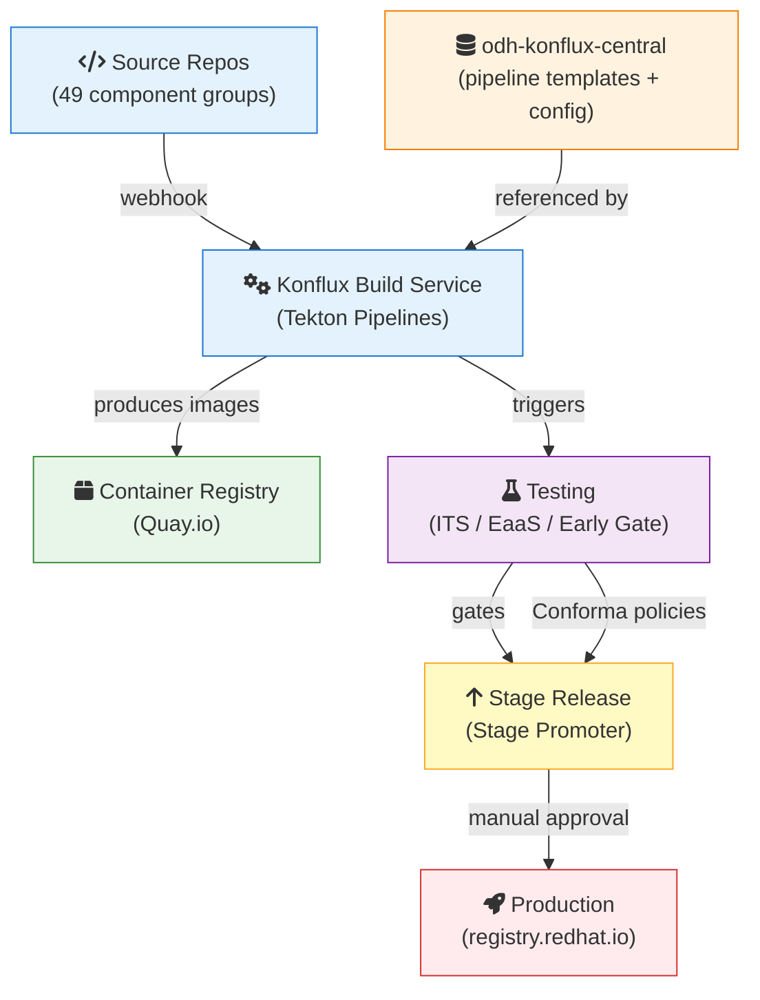
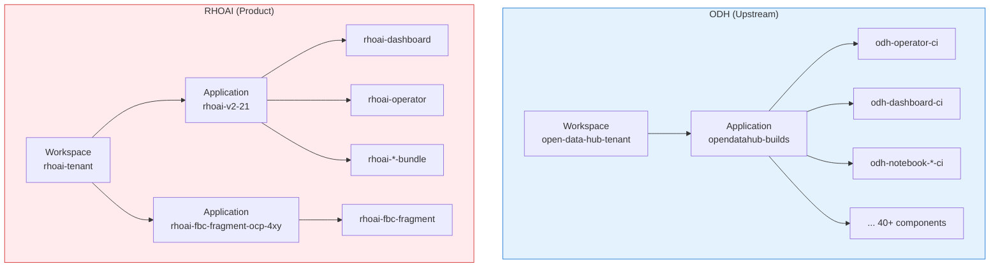
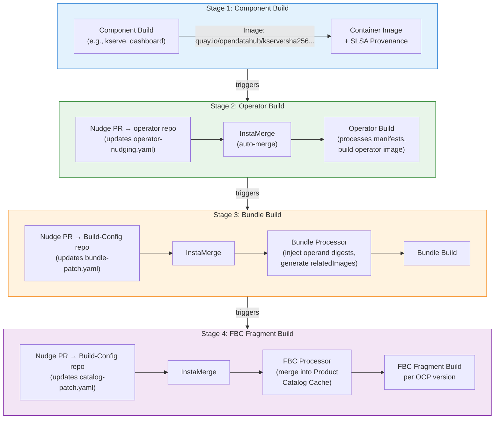
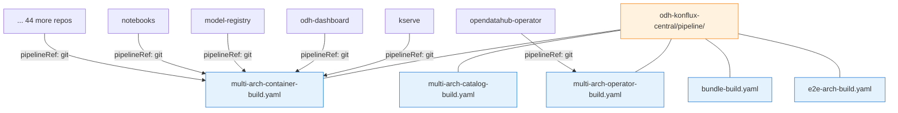
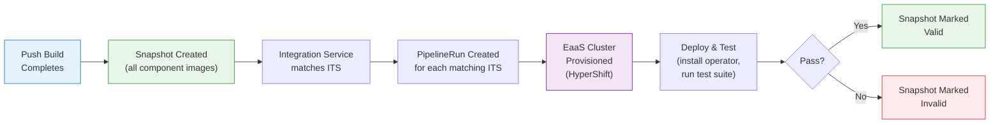
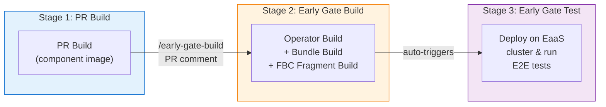
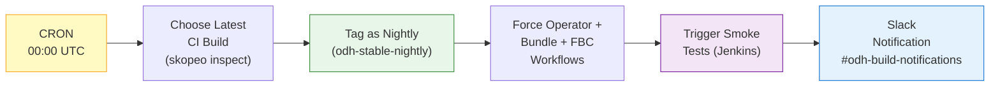
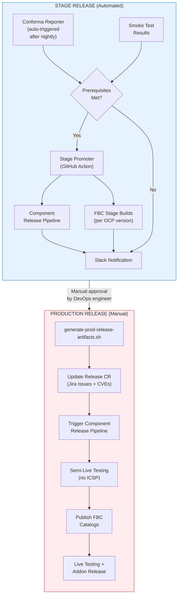
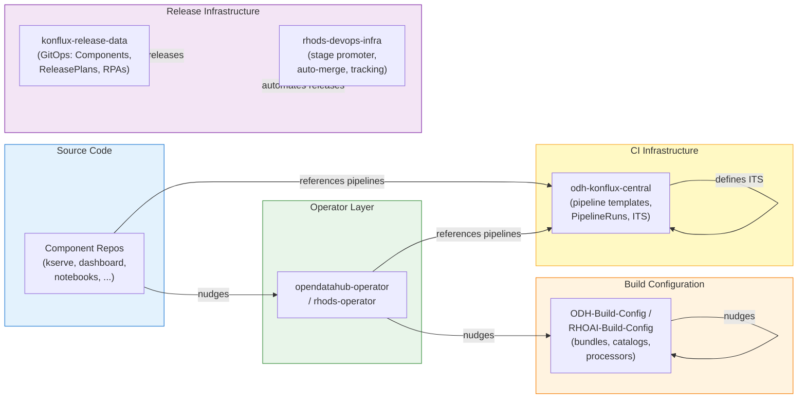

# How RHOAI Builds Software: An End-to-End Guide to the Konflux CI System

**From code push to production release — how 49 component groups, 5 pipeline templates, and a cascade of nudges produce signed, multi-arch container images.**

---

## How to Read This Document

This document is organized in three tiers. Stop at the depth you need:

| Tier | Who It's For | Sections | Reading Time |
|------|-------------|----------|-------------|
| **Bird's Eye** | Anyone curious about the system | [Section 0](#0-key-concepts-in-60-seconds) – [Section 1](#1-the-system-at-a-glance) | ~5 min |
| **Developer Guide** | Component developers building on RHOAI | [Section 2](#2-foundational-model) – [Section 5](#5-release--stage-to-production) | ~20 min |
| **Operations Reference** | DevOps engineers operating the system | [Section 6](#6-automation--dependency-management) – [Appendices](#appendix-a-glossary) | Reference |

---

## 0. Key Concepts in 60 Seconds

| Concept | One-Line Definition |
|---------|-------------------|
| **Konflux** | Kubernetes-native CI/CD platform built on Tekton, providing build, test, and release pipelines with supply chain security |
| **PipelineRun** | A single execution of a Tekton Pipeline — creating one starts the build |
| **Snapshot** | An immutable record of all component images in an Application at a point in time |
| **ITS** | IntegrationTestScenario — a Konflux CR that defines which test pipeline to run when a Snapshot is created |
| **FBC / FBCF** | File-Based Catalog / Fragment — OLM catalog content in YAML that describes which operator versions are available |
| **EaaS** | Environment as a Service — on-demand ephemeral OpenShift clusters for integration testing |
| **Conforma** | Artifact verifier and policy engine (formerly Enterprise Contract) enforcing SLSA v1.0 Build Level 3 |
| **Nudge** | Automated PR raised by a successful build to update image digests in the next downstream repository |

---

## 1. The System at a Glance

RHOAI's CI system is a **fully automated, event-driven pipeline** that transforms every code push into a signed, multi-arch container image — and cascades that change through the operator, bundle, and catalog layers until a complete, installable product catalog is produced. The entire flow is centrally managed from the `odh-konflux-central` repository.

### System Map



### By the Numbers

| Metric | Value |
|--------|-------|
| Component groups managed | 49 |
| PipelineRun definitions | 173 |
| Pipeline templates (shared) | 5 |
| Integration test pipelines | 25+ |
| Architectures supported | x86_64, ARM64, s390x, ppc64le |
| GitHub Actions workflows | 6 |
| Automated dependency updates | Renovate / MintMaker |

---

## 2. Foundational Model — Workspace, Application, Component

Konflux organizes resources in a three-level hierarchy. Think of it like a filing cabinet: the **Workspace** is the cabinet (tenant isolation), **Applications** are the drawers (logical groupings), and **Components** are the folders (individual build artifacts).

### Resource Hierarchy



### ODH vs RHOAI: Side-by-Side Comparison

| Aspect | ODH (Upstream) | RHOAI (Product) |
|--------|---------------|-----------------|
| **Tenant namespace** | `open-data-hub-tenant` | `rhoai-tenant` |
| **Konflux instance** | External (public) | Internal (Red Hat) |
| **Application naming** | `opendatahub-builds` | Version-specific: `rhoai-v2-21` |
| **Hermetic builds** | No (non-hermetic) | Yes (Cachi2 prefetch, network-isolated) |
| **Build cascade** | Commitless (test-comment triggers) | Standard (nudge PRs) |
| **Registry target** | `quay.io/opendatahub/` | `registry.redhat.io/rhoai/` |
| **Compliance** | Voluntary | Mandatory (SLSA L3, Conforma) |
| **FBC catalog** | Single (`opendatahub-operator-catalog`) | Per-OCP-version catalogs |

> **Key Insight:** ODH and RHOAI share the same pipeline templates and architecture but differ in security posture. RHOAI enforces hermetic builds and Conforma policies because production images must meet Red Hat's supply chain security standards.

### What is `odh-konflux-central`?

This repository is the **single source of truth** for all shared CI infrastructure. Instead of maintaining full pipeline definitions in each of the 49+ component repositories, every component references centralized pipeline templates here. This means:

- **One update** to a pipeline template propagates to all components
- **Consistent build standards** across the entire RHOAI/ODH ecosystem
- **Simplified onboarding** — new components use the same proven templates

---

## 3. Life of a Commit — The Build Chain

*A developer pushes code to the `kserve` repository. Here's what happens next.*

### 3.1 Code Push to Container Image

When code lands on the tracked branch, Pipelines as Code (PaC) detects the webhook event and creates a PipelineRun. The pipeline flows through these stages:

```mermaid
flowchart LR
    subgraph Init["Initialization"]
        T1["rhoai-init\n(validate cluster,\nset tags)"]
        T2["init\n(check rebuild\nneeded)"]
        T1 --> T2
    end

    subgraph Source["Source Retrieval"]
        T3["clone-repository\n(git-clone-oci-ta)"]
        T4["prefetch-dependencies\n(Cachi2)"]
        T3 --> T4
    end

    subgraph Build["Multi-Arch Build"]
        T5["build-images\n(buildah-remote\nmatrix: platforms)"]
        T6["build-image-index\n(OCI manifest list)"]
        T5 --> T6
    end

    subgraph Scans["Security & Compliance Scans"]
        S1["clair-scan\n(CVEs)"]
        S2["clamav-scan\n(malware)"]
        S3["sast-snyk-check"]
        S4["sast-shell-check"]
        S5["sast-unicode-check"]
        S6["rpms-signature-scan"]
        S7["deprecated-base-\nimage-check"]
    end

    subgraph Publish["Publish"]
        T7["apply-tags"]
        T8["push-dockerfile"]
        T9["build-source-image"]
    end

    T10["pipeline-success-\nindicator"]

    Init --> Source --> Build
    Build --> Scans
    Build --> Publish
    Scans --> T10
    Publish --> T10

    style Init fill:#e3f2fd,stroke:#1976d2
    style Source fill:#e3f2fd,stroke:#1976d2
    style Build fill:#e8f5e9,stroke:#388e3c
    style Scans fill:#fff3e0,stroke:#f57c00
    style Publish fill:#f3e5f5,stroke:#7b1fa2
```



After the pipeline completes, the `finally` block runs **show-sbom** (display software bill of materials) and **send-slack-notification** (on failure). On success, it also triggers **trigger-operator-build** to begin the downstream cascade.

### Pipeline Template Decision Guide

Which of the 5 centralized pipeline templates should your component use?

| Template | What It Builds | When to Use |
|----------|---------------|-------------|
| `multi-arch-container-build` | Standard container images | Most components (dashboard, notebooks, model-registry, etc.) |
| `multi-arch-operator-build` | Operator images | Operators that need manifest processing (opendatahub-operator) |
| `multi-arch-catalog-build` | FBC catalog images | File-Based Catalog fragments |
| `bundle-build` | OLM bundle images | Operator bundle images for OLM lifecycle |
| `e2e-arch-build` | Architecture-specific test images | E2E test runner images |

> **Key Insight — Multi-Arch Builds:** The `build-images` task uses a **matrix strategy** — it fans out across platforms (x86_64, ARM64, etc.) and builds each architecture on dedicated remote VMs provisioned by the multi-platform-controller. The results are then merged into a single OCI manifest list by `build-image-index`.

### 3.2 The Nudge Cascade

A single code push triggers a **chain reaction** that propagates through four layers until a complete, installable product catalog is produced:



> **Watch Out — ODH vs RHOAI Cascade:** For ODH builds, the operator build uses a **commitless flow** — instead of nudging via PR, it posts a `/test <pipeline-name> branch:<branch>` comment on GitHub and passes manifests via OCI artifacts. This reduces unnecessary commits to the operator repository.

**How Nudging Works:**
1. A successful build task raises a **Pull Request** in the downstream repo, updating an image digest file (e.g., `operator-nudging.yaml`)
2. **InstaMerge** — a custom GitHub workflow — detects the nudging PR, auto-resolves any rebase/merge conflicts, and merges it instantly
3. The merge triggers the next build in the cascade

### 3.3 Centralized Pipeline Reference Model

All 49 component groups reference the same 5 pipeline templates via a **git resolver**, pointing to `odh-konflux-central`:



### Anatomy of a PipelineRun (Annotated)

Here's the actual `odh-dashboard-push.yaml` — the file that lives in each component's directory under `pipelineruns/`:

```yaml
apiVersion: tekton.dev/v1
kind: PipelineRun
metadata:
  annotations:
    pipelinesascode.tekton.dev/on-cel-expression: >-     # ① CEL trigger: only on push to target branch
      event == "push" && target_branch == "$$TARGET_BRANCH$$"
    pipelinesascode.tekton.dev/max-keep-runs: "3"
  labels:
    appstudio.openshift.io/application: opendatahub-builds  # ② Application grouping
    appstudio.openshift.io/component: odh-dashboard-ci       # ③ Component identity
  name: odh-dashboard-on-push
  namespace: open-data-hub-tenant                            # ④ Tenant namespace
spec:
  params:
  - name: git-url
    value: '{{source_url}}'                                  # ⑤ Templated by PaC
  - name: output-image
    value: quay.io/opendatahub/odh-dashboard:$$OUTPUT_IMAGE_TAG$$  # ⑥ Output image
  pipelineRef:
    resolver: git                                            # ⑦ Git resolver
    params:
    - name: url
      value: https://github.com/opendatahub-io/odh-konflux-central.git
    - name: pathInRepo
      value: pipeline/multi-arch-container-build.yaml        # ⑧ Centralized pipeline
  taskRunTemplate:
    serviceAccountName: build-pipeline-odh-dashboard         # ⑨ Per-component RBAC
```

| Callout | What It Does |
|---------|-------------|
| ① | CEL expression that gates this PipelineRun — only fires on `push` events to the target branch |
| ② ③ | Labels linking this run to its Konflux Application and Component |
| ④ | Tenant namespace for resource isolation |
| ⑤ | `{{source_url}}` and `{{revision}}` are templated by Pipelines as Code at runtime |
| ⑥ | Output image with a tag template variable |
| ⑦ ⑧ | **The key pattern** — git resolver pointing to the centralized pipeline in `odh-konflux-central` |
| ⑨ | Per-component ServiceAccount for fine-grained RBAC |

---

## 4. Testing — Five Layers of Confidence

RHOAI uses five complementary testing layers, each catching different classes of issues at different points in the lifecycle:

| Layer | Scope | Trigger | Cluster Needed? | Typical Time |
|-------|-------|---------|-----------------|-------------|
| **PR Build** | Single component | Pull request opened | No | ~15 min |
| **Integration Test (ITS)** | Component + application | Post-merge build completes | Yes (EaaS) | ~30-60 min |
| **Early Gate** | Feature branch E2E | PR comment `/early-gate-build` | Yes (EaaS) | ~60-90 min |
| **Nightly + Smoke** | Full product catalog | Daily CRON (00:00 UTC) | Yes (Jenkins) | ~2-4 hours |
| **Conforma / EC** | Supply chain compliance | Every build + release gate | No | ~5-10 min |

### 4.1 PR Builds (Pre-Merge)

Every pull request triggers a `pull-request` PipelineRun that builds the component image and runs all security scans. The image is pushed with a PR-specific tag (e.g., `on-pr-{{revision}}`), giving reviewers a testable artifact before merge. PR builds use the same centralized pipeline template as push builds.

### 4.2 Integration Test Scenarios (ITS)

After a push build completes, Konflux creates a **Snapshot** — an immutable record of all component images in the Application. The Integration Service then matches the Snapshot against registered ITS resources and creates a PipelineRun for each match.



**ITS Context Types:**

ITS resources use `contexts` to control when they fire:

| Context | When It Runs |
|---------|-------------|
| `application` | Every Snapshot (default) |
| `component` | Only for builds of specific components |
| `component_<name>` | Only when a specific named component updates |
| `push` | Only for post-merge (push) Snapshots |
| `pull_request` | Only for pre-merge (PR) Snapshots |
| `group` | Only for group Snapshots (monorepo multi-component) |
| `override` | Only for manually created override Snapshots |

**Group Testing:** For monorepos like `kserve` or `kubeflow` that produce multiple components from one repository, Konflux creates a **Group Snapshot** combining all newly built images. The Group ITS waits for all component builds to complete before deploying them together for coordinated testing.

### 4.3 Early Gate (Feature-Branch E2E Validation)

Early Gate allows developers to run full end-to-end tests on feature branches **before** merging to stable. It's a three-stage pipeline:



**How to trigger:** Comment `/early-gate-build` on a PR. The system combines the PR's component image with stable versions of all other components, builds the operator/bundle/FBC stack, and runs the full test suite.

> **Key Insight:** Early Gate catches integration bugs that PR builds can't — because it tests the component in the context of the full product, not in isolation.

### 4.4 Conforma / Enterprise Contract

Conforma is the **release gate** that enforces Red Hat's supply chain security standards:

| Policy | What It Checks |
|--------|---------------|
| `trusted_task.trusted` | All build tasks are from the approved Tekton task catalog |
| Hermetic build | Build ran in a network-isolated environment (RHOAI only) |
| CVE scan | No critical/high CVEs (via Clair) |
| Malware scan | No viruses detected (via ClamAV) |
| RPM signatures | All RPMs are signed by Red Hat |
| SLSA provenance | In-toto attestation generated by Tekton Chains |
| Base image | Base image is not deprecated |

Conforma runs automatically against every build and is a **mandatory gate** for RHOAI releases. Teams can request temporary, time-bound policy exceptions via `volatileConfig` blocks in the GitOps configuration.

### 4.5 Nightly Builds & Smoke Tests



> **Key Insight:** Nightlies are **not separate builds** — they simply tag the latest successful CI build at midnight UTC with `odh-stable-nightly`. There is no difference in content between a CI build and a nightly build. A CRON workflow manages the tagging sequence and triggers downstream smoke tests.

---

## 5. Release — Stage to Production



### 5.1 Stage Release — The Stage Promoter

The **Stage Promoter** is a one-click GitHub Action workflow that automates the entire stage promotion:

1. **Gate-keeping** — Checks that Conforma and smoke tests are green
2. **Component release** — Triggers the Konflux component release pipeline
3. **PCC validation** — Validates and regenerates the Product-Catalog-Cache
4. **FBC builds** — Generates stage catalogs and triggers FBC stage builds for all supported OCP versions
5. **Retries** — Supports configurable retries (default: 3) for transient Konflux failures
6. **Notifications** — Sends granular Slack notifications for each step (success or failure)

**Input parameters:** Release branch (e.g., `rhoai-2.23.0`), RHOAI version, FBC fragment image URI (defaults to latest nightly), build type (nightly/RC).

### 5.2 Production Release — Safety-Gated Manual Process

Production releases are **fully automated in execution but manually triggered** for safety. A DevOps engineer runs the following sequence (order matters):

| Step | Action | Purpose |
|------|--------|---------|
| 1 | Run `generate-prod-release-artifacts.sh` | Pulls stage FBC images, verifies sync, generates Release CRs |
| 2 | Update Release CR with Jira issues/CVEs | Adds fixed issue list for release notes |
| 3 | `oc apply` Component Release CR | Triggers component image push to `registry.redhat.io` |
| 4 | Semi-live testing | Verify installation works without ICSP (images are live but catalog isn't yet) |
| 5 | `oc apply` FBC Release CRs (per OCP version) | Publishes catalogs to OperatorHub |
| 6 | Live testing + addon release | Final validation and managed-tenants promotion |

> **Watch Out:** The `generate-prod-release-artifacts.sh` script performs extensive cross-validation — it verifies that component snapshots and FBC snapshots are completely in sync across all OCP versions before generating Release CRs.

---

## 6. Automation & Dependency Management

### GitHub Actions Dashboard

| Workflow | Trigger | Purpose |
|----------|---------|---------|
| `generate-component-map.yml` | Push to `pipelineruns/**`, daily CRON | Auto-syncs `config/component_repo_map.json` from PipelineRun definitions |
| `yaml-lint.yaml` | Push, PR | Validates YAML syntax and Kubeconform schema compliance |
| `odh-konflux-onboarder.yml` | Manual dispatch | Generates PipelineRun YAMLs and registers new components |
| `odh-early-gate-onboarder.yml` | Manual dispatch | Onboards a component repository to the early gate system |
| `build-integration-images.yml` | Manual dispatch | Builds integration test container images |
| Renovate (`renovate.json`) | Automated | Updates base image digests and Tekton task references |

### Renovate / MintMaker

**MintMaker** (built on Renovate) continuously monitors all repositories and proactively opens PRs to:

- **Update base image digests** in Dockerfiles when new images are published
- **Bump Tekton task references** so builds always use tasks from Conforma's approved catalog
- **Update RPM lockfiles** to pick up security patches

These PRs are auto-merged, which triggers the build cascade — meaning a CVE fix in a base image automatically propagates through the entire system without human intervention.

### InstaMerge

**InstaMerge** is a custom GitHub workflow that prevents nudging PRs from piling up:

1. Detects PRs that match the nudging pattern (image digest updates)
2. Automatically resolves rebase/merge conflicts
3. Instantly merges the PR
4. The merge triggers the next downstream build

---

## 7. Repository Ecosystem



### Repository Reference

| Repository | Role | What It Contains |
|-----------|------|-----------------|
| **Component repos** (e.g., `odh-dashboard`, `kserve`) | Source code | Application code, Dockerfile, `.tekton/` PipelineRuns |
| **opendatahub-operator** / **rhods-operator** | Operator | Operator code, `operator-nudging.yaml` with image digests |
| **ODH-Build-Config** / **RHOAI-Build-Config** | Build configuration | Bundle configs, catalog definitions, processor workflows |
| **odh-konflux-central** / **konflux-central** | CI infrastructure | Pipeline templates, PipelineRun definitions, ITS, early gate |
| **konflux-release-data** | Release configuration | GitOps Kustomize overlays defining Components, ReleasePlans, RPAs |
| **rhods-devops-infra** | DevOps automation | Stage promoter, release helpers, tracking tools, auto-merge bots |

---

## 8. Onboarding a New Component

Use the `odh-konflux-onboarder` GitHub Action for automated onboarding. Here's the checklist:

- [ ] **Create Quay repository** for the component image (e.g., `quay.io/opendatahub/<component>`)
- [ ] **Run the onboarder workflow** — provide component name, source repo URL, Dockerfile path, and target branch
- [ ] **Verify generated PipelineRuns** — check `pipelineruns/<component>/` for `push.yaml` and `pull-request.yaml`
- [ ] **Add Component to GitOps** — update `gitops/opendatahub-ci-components.yaml` with the new Component CR
- [ ] **Configure integration tests** (if needed) — add ITS definition to `gitops/integration-testing-prerequisites.yaml`
- [ ] **Set up nudging** (if applicable) — configure `build-nudges-ref` annotation on the Component CR
- [ ] **Onboard to konflux-release-data** — add Component and ReleasePlanAdmission definitions
- [ ] **Configure InstaMerge** — set up auto-merge for nudging PRs in downstream repos
- [ ] **Verify first build** — push to the tracked branch and monitor the PipelineRun in Konflux UI

> **Deep Dive:** For RHOAI downstream onboarding, additional steps are needed: creating a delivery repo in the Red Hat container catalog, configuring hermetic build parameters, and adding the component to the RHOAI application in `konflux-release-data`.

---

## Appendix A: Glossary

| Term | Definition |
|------|-----------|
| **BVT** | Build Verification Test — basic post-install checks confirming operator deployment and core functionality |
| **CasC** | Configuration as Code — managing Konflux resources via GitOps (Kustomize overlays in `konflux-release-data`) |
| **Conforma** | Artifact verifier and policy engine (formerly Enterprise Contract / EC) |
| **CR** | Custom Resource — a Kubernetes API object backed by a CRD |
| **DSC** | DataScienceCluster — the RHOAI top-level CR that enables and configures platform components |
| **EaaS** | Environment as a Service — on-demand ephemeral OpenShift clusters for testing |
| **FBC / FBCF** | File-Based Catalog / Fragment — OLM catalog content describing available operator versions |
| **HyperShift** | OpenShift hosted-control-plane architecture enabling fast ephemeral cluster provisioning |
| **IDMS** | Image Digest Mirror Set — OpenShift CR that redirects image pulls by digest |
| **InstaMerge** | Custom GitHub workflow that auto-merges nudging PRs |
| **ITS** | IntegrationTestScenario — Konflux CR defining test pipelines triggered by Snapshots |
| **MintMaker** | Konflux's Renovate-based dependency update service |
| **Nudge** | Automated PR raised after a successful build to update image digests in downstream repos |
| **OLM** | Operator Lifecycle Manager — OpenShift framework for operator installation and updates |
| **PaC** | Pipelines as Code — Tekton extension for git-driven pipeline execution |
| **PCC** | Product Catalog Cache — aggregated catalog data used to generate FBC fragments |
| **PipelineRun** | A single execution of a Tekton Pipeline |
| **RPA** | ReleasePlanAdmission — Konflux CR defining release pipeline and destination in the release workspace |
| **Snapshot** | Immutable record of all component images in an Application at a point in time |
| **SLSA** | Supply-chain Levels for Software Artifacts — framework for supply chain integrity |
| **Trusted Artifacts** | OCI-based mechanism for sharing data between pipeline tasks (replaces PVCs) |

---

## Appendix B: Quick Reference Card

```
┌─────────────────────────────────────────────────────────────────┐
│                RHOAI KONFLUX CI — QUICK REFERENCE               │
├─────────────────────────────────────────────────────────────────┤
│                                                                 │
│  BUILD CHAIN:  Code Push → Component → Operator → Bundle → FBC │
│  PIPELINES:    5 templates in odh-konflux-central/pipeline/     │
│  COMPONENTS:   49 groups in odh-konflux-central/pipelineruns/   │
│                                                                 │
│  TESTING LAYERS:                                                │
│    1. PR Build ............ pre-merge, ~15 min                  │
│    2. ITS ................. post-merge, EaaS cluster, ~30-60m   │
│    3. Early Gate .......... /early-gate-build on PR, ~60-90m    │
│    4. Nightly + Smoke ..... daily 00:00 UTC + Jenkins           │
│    5. Conforma ............ every build + release gate           │
│                                                                 │
│  RELEASE FLOW:                                                  │
│    Stage: Stage Promoter (automated, one-click)                 │
│    Prod:  Manual trigger by DevOps (safety-gated)               │
│                                                                 │
│  KEY REPOS:                                                     │
│    odh-konflux-central .... pipelines, PipelineRuns, ITS        │
│    konflux-release-data ... GitOps Components, ReleasePlans     │
│    rhods-devops-infra ..... stage promoter, release helpers     │
│    ODH/RHOAI-Build-Config . bundles, catalogs, processors       │
│                                                                 │
│  DEPENDENCY UPDATES:  Renovate/MintMaker + InstaMerge           │
│  NUDGE PR AUTO-MERGE: InstaMerge GitHub workflow                │
│                                                                 │
└─────────────────────────────────────────────────────────────────┘
```

---

## Appendix C: "Where Does My YAML Live?" Navigator

| I want to... | Look in... |
|---|---|
| Add a new component's build pipelines | `pipelineruns/<component>/` |
| Modify a shared pipeline template | `pipeline/<template>.yaml` |
| Register a new Konflux Component CR | `gitops/opendatahub-ci-components.yaml` |
| Add an integration test pipeline | `integration-tests/<component>/` |
| Register an IntegrationTestScenario | `gitops/integration-testing-prerequisites.yaml` |
| Configure early gate for a component | `config/early-gate-config.yaml` |
| See the component → repo mapping | `config/component_repo_map.json` |
| Onboard a new component (automated) | GitHub Actions → `odh-konflux-onboarder.yml` |
| Check/modify YAML linting rules | `.yamllint` |
| Update Renovate configuration | `.github/renovate.json` |
| Read architecture decisions | `doc/adr/` |
| Debug an integration test | `doc/contributing-konflux-testing-rhoai.md` |
