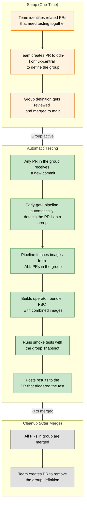

# Early-Gate Group Testing — Design Approach

**Version:** 2.0  
**Status:** Design Review  
**Date:** 2026-06-02

---

## What Is Group Testing?

Group testing allows multiple related pull requests from different repositories to be tested together in a single early-gate validation run, before any of them are merged.

Without group testing, each PR is tested in isolation with stable images for all other components. This can miss integration issues when multiple PRs need to work together.

With group testing, you can validate that a set of related PRs work correctly as a group, catching integration problems early.

---

## The Problem We're Solving

### Current Limitation

Today, early-gate tests one PR at a time. If you have related changes across multiple repositories, each PR is validated separately using stable versions of everything else.

**Example scenario:**

You're updating the KServe API and need to update Feast to work with the new API:

1. You create **kserve PR #123** (API changes)
2. You create **feast PR #456** (adapter updates for new API)
3. Early-gate tests each PR separately:
   - kserve PR #123: Tests new KServe + **old Feast** (stable) → ✅ Passes
   - feast PR #456: Tests **old KServe** (stable) + new Feast → ✅ Passes
4. Both PRs merge
5. Production: new KServe + new Feast → ❌ **Breaks!**

The integration between the two new versions was never tested together before merge.

### What We Need

A way to tell early-gate: "Test these PRs together as a group before merging any of them."

---

## How Group Testing Works

### High-Level Flow



### Central Configuration

Group definitions are stored in a central configuration file in the odh-konflux-central repository, similar to how component mappings are stored in `component_repo_map.json`.

**File location:**
```
odh-konflux-central/config/earlygate-group-configuration.yaml
```

**What a group definition looks like:**
```
Group name: kserve-feast-integration
Description: KServe API changes with Feast adapter updates
Repositories in group:
  - opendatahub-io/kserve, PR #123
  - opendatahub-io/feast, PR #456
```

### Automatic Detection

When any PR triggers an early-gate pipeline:

1. **Pipeline extracts** the repository name and PR number from the trigger
2. **Pipeline checks** the central configuration file
3. **If the PR is in a group** → Pipeline resolves all PRs in that group and tests them together
4. **If the PR is not in a group** → Pipeline uses normal single-PR behavior (unchanged)

No manual trigger is needed. The pipeline automatically detects groups.

### Snapshot Generation

For each component in the group:

1. **Try to use the PR image** tagged with the PR number (e.g., `odh-pr-123`)
2. **If the PR image is not available yet** (build still running) → Fall back to the latest stable image
3. **Emit a clear warning** if fallback was used

This non-blocking approach means you can start testing before all builds complete. The pipeline continues with the images that are ready and uses stable versions for the rest.

---

## User Workflow

### Step 1: Create Your PRs

Create pull requests in the repositories you're changing, just like normal:

- kserve PR #123
- feast PR #456

Each PR will trigger its component build as usual.

### Step 2: Define the Group

Create a pull request to `odh-konflux-central` that adds your group to the configuration file:

**What you add:**
```
Group name: kserve-feast-integration
Repositories:
  - opendatahub-io/kserve, PR 123
  - opendatahub-io/feast, PR 456
```

This PR goes through normal review and gets merged.

### Step 3: Test Automatically

Once the group definition is merged, every time you push to **either PR**:

- kserve PR #123 receives a commit → Early-gate tests with **kserve #123 + feast #456**
- feast PR #456 receives a commit → Early-gate tests with **kserve #123 + feast #456**

Both PRs are now tested together, automatically.

### Step 4: Review Results

Test results appear as a comment on whichever PR triggered the pipeline.

**If all images are available:**
```
✅ Early-Gate Test: PASSED

Tested with group: kserve-feast-integration
  - kserve PR #123 ✓
  - feast PR #456 ✓

All smoke tests passed with combined changes.
```

**If some builds weren't ready:**
```
✅ Early-Gate Test: PASSED (with warnings)

Tested with group: kserve-feast-integration
  - kserve PR #123 ✓
  - feast PR #456 ⚠️ (build not ready, used odh-stable)

⚠️ Warning: feast components used stable images because 
   the PR build was not available yet.
```

### Step 5: Cleanup After Merge

After all PRs in the group are merged, create another PR to `odh-konflux-central` to remove the group definition.

---

## Key Design Decisions

### Why Central Configuration?

We considered two options:

| Approach | Description | Decision |
|----------|-------------|----------|
| **Central config** ✅ | One file in odh-konflux-central defines all groups | **Chosen** |
| Per-PR config | Each PR has its own config file in its branch | Not chosen |

**Why central?**
- All active groups are visible in one place
- Easy to discover what's currently being tested together
- Follows the same pattern as `component_repo_map.json`
- Only one file to maintain instead of many

**Trade-off:**
- Teams need to create a PR to odh-konflux-central to add/update groups
- But this provides a review step and clear audit trail

### Why Automatic Detection?

We considered two options:

| Approach | Description | Decision |
|----------|-------------|----------|
| **Automatic** ✅ | Pipeline always checks if PR is in a group | **Chosen** |
| Manual trigger | Developers add a comment to trigger group testing | Not chosen |

**Why automatic?**
- Simpler for users (no commands to remember)
- Reliable (no risk of forgetting to trigger)
- Works consistently every time

### Why Non-Blocking Fallback?

We considered two options:

| Approach | Description | Decision |
|----------|-------------|----------|
| **Non-blocking** ✅ | Use stable images if PR build not ready | **Chosen** |
| Blocking | Wait for all builds or fail | Not chosen |

**Why non-blocking?**
- Teams can start testing immediately
- Don't wait for slow builds
- Clear warnings show what fell back
- Still valuable to test partial groups

**Trade-off:**
- May test with some stable images instead of all PR images
- But warnings make this very clear

---

## Example Scenarios

### Scenario 1: Simple Two-Repo Integration

**Need:** KServe API change requires updating Feast integration.

**Group definition:**
```
Group: kserve-feast-api-v2
  - kserve PR #123
  - feast PR #456
```

**Result:**
- Both PRs tested together
- Integration validated before merge
- Either PR's push triggers test with both changes

### Scenario 2: Large Multi-Component Refactor

**Need:** Authentication system update across 5 repositories.

**Group definition:**
```
Group: auth-refactor-2024
  - opendatahub-operator PR #111
  - kubeflow PR #222
  - notebook-controller PR #333
  - odh-dashboard PR #444
  - model-mesh PR #555
```

**Result:**
- All 5 PRs tested together
- Complete end-to-end validation
- Warning displayed about longer test runtime (5+ repos)

### Scenario 3: Testing Before All Builds Complete

**Group:**
```
  - data-science-pipelines PR #789
  - model-mesh PR #234
```

**Situation:**
- DSP build: ✅ Complete (`odh-pr-789` image available)
- Model Mesh build: 🔄 Still running (no `odh-pr-234` image yet)

**What happens:**
- Pipeline uses DSP PR image: `odh-pr-789`
- Pipeline falls back for Model Mesh: `odh-stable`
- Test runs with partial group
- Clear warning: "model-mesh components using stable images"

**Benefit:** Testing starts immediately, not blocked waiting for builds.

---

## What Changes?

### For Component Repositories

**Nothing changes** unless you explicitly enable group testing:

- Normal single-PR flow continues to work exactly as before
- PRs not in any group use the existing behavior
- No configuration needed in component repositories

### For odh-konflux-central

**One new file added:**
```
config/earlygate-group-configuration.yaml
```

This file contains all group definitions, similar to `component_repo_map.json`.

### For Early-Gate Pipeline

**One task is modified:**
- The task that generates the snapshot now checks the central configuration
- If the PR is in a group, it resolves all group members
- If not, it behaves exactly as before

**Everything else stays the same:**
- Operator build
- Bundle build
- FBC build
- Test execution
- Results posting

---

## Benefits

### For Development Teams

✅ **Catch integration issues early** — Before merge, not in staging  
✅ **Confidence in cross-repo changes** — Test them together first  
✅ **Faster debugging** — See which combination of PRs breaks  
✅ **No complex manual testing** — Automated group validation  

### For the Project

✅ **Fewer broken main branches** — Integration tested before merge  
✅ **Reduced staging failures** — Catch issues in early-gate instead  
✅ **Clear audit trail** — Central config shows what was tested together  
✅ **Flexible group sizes** — Support simple 2-repo and complex 7+ repo groups  

---

## Trade-offs and Considerations

### Additional Coordination Needed

- Teams must agree which PRs belong in a group
- All PRs in a group should be genuinely related
- Unrelated PRs in the same group create confusing test results

### Longer Test Runtimes

- More components = more images to fetch
- Large groups (7+ repos) may take twice as long as single-PR tests
- Pipeline emits warnings for large groups to set expectations

### Configuration Maintenance

- Teams must create PRs to odh-konflux-central to add/update groups
- Groups should be removed after PRs merge (cleanup step)
- Forgetting to clean up leaves stale groups in the config

### Potential for Confusion

- Developers might forget their PR is in a group
- Test results include changes from other PRs, which may be unexpected
- Good communication within teams is important

---

## Rollout Plan

### Phase 1: Create Infrastructure

1. Add central configuration file to odh-konflux-central
2. Update the snapshot generation task
3. Create documentation (user guide)

### Phase 2: Pilot with 2-3 Groups

- Work with 2-3 teams to try group testing
- Gather feedback on workflow and pain points
- Refine documentation and warnings

### Phase 3: General Availability

- Announce feature to all teams
- Provide configuration template
- Document best practices

### Phase 4: Optional Enhancements

Based on user feedback, potentially add:
- Automatic notifications to all PRs in a group when tests complete
- Dashboard showing active groups
- Metrics on group testing usage

---

## Summary

Group testing allows related PRs from different repositories to be validated together before merge, catching integration issues that single-PR testing would miss.

**How it works:**
1. Teams define groups in a central configuration file
2. Pipeline automatically detects when a PR is in a group
3. All PRs in the group are tested together
4. Results posted to the PR that triggered the test

**Key principles:**
- ✅ Central configuration for visibility
- ✅ Automatic detection (no manual triggers)
- ✅ Non-blocking fallback (graceful degradation)
- ✅ 100% backward compatible
- ✅ Reuses existing pipeline infrastructure

**What doesn't change:**
- Single-PR testing continues to work exactly as before
- No changes needed in component repositories
- Operator, bundle, and FBC builds work the same way

---

**Status:** ✅ Ready for Review

**Questions to answer:**
- Does this approach solve the integration testing problem?
- Is the workflow (add group → test automatically → cleanup) acceptable?
- Are the trade-offs (coordination, maintenance) worth the benefits?
- Should we proceed with implementation?
