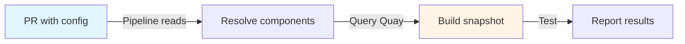
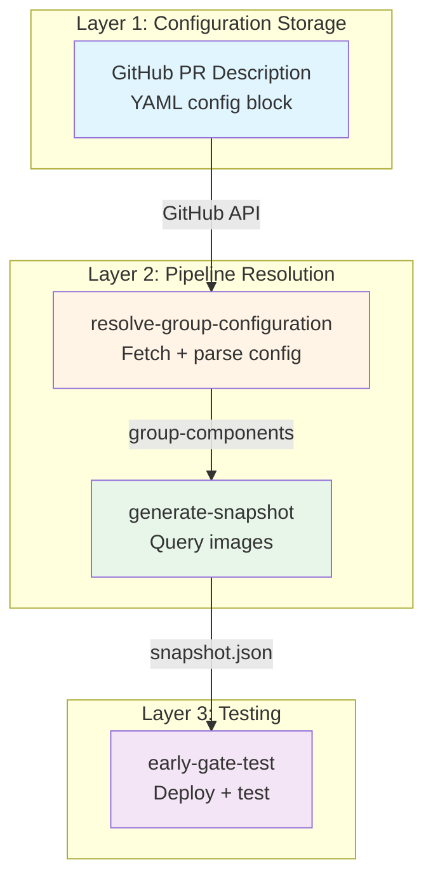
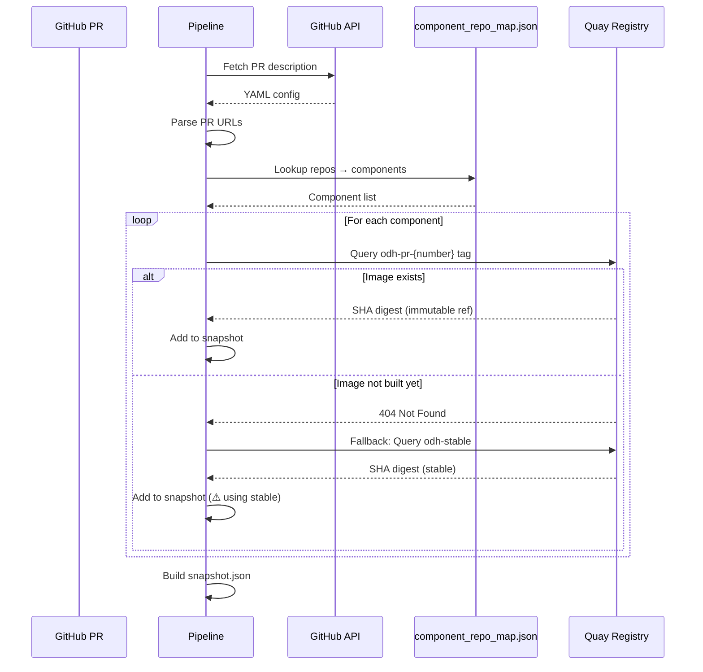
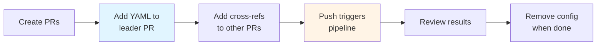
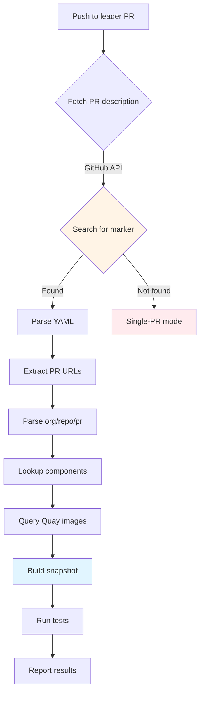
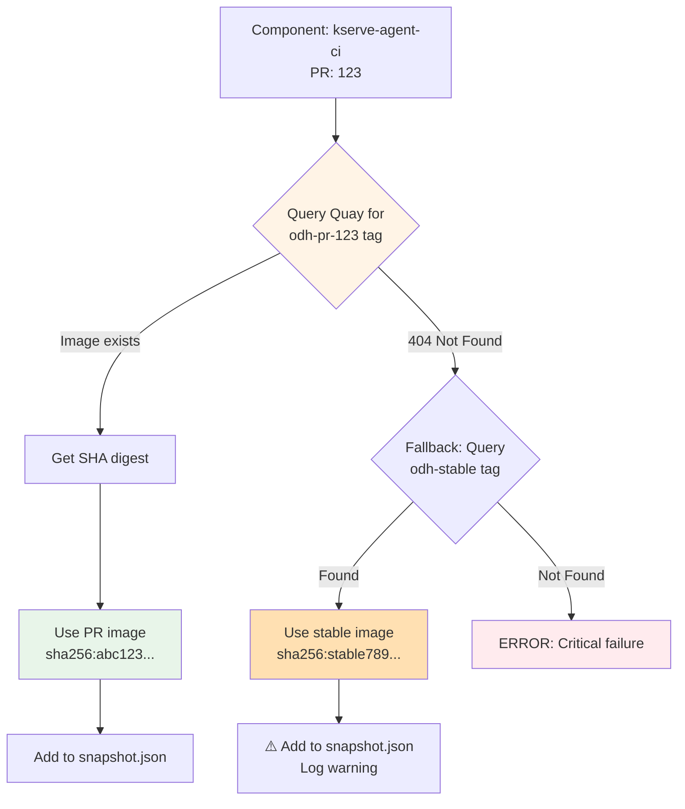
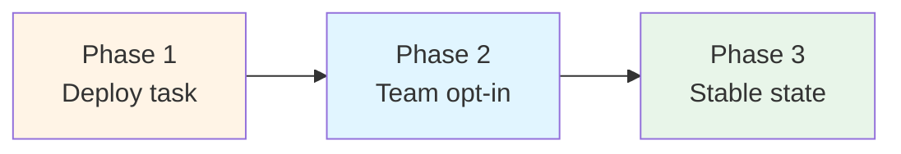

# 🎯 Early-Gate Group Testing Design
**PR-Attached Configuration for Multi-Component Integration Testing**

---

## Table of Contents

1. [Problem Statement](#1-problem-statement)
2. [Architecture Overview](#2-architecture-overview)
3. [Configuration Schema](#3-configuration-schema)
4. [Workflow](#4-workflow)
5. [Image Availability & Snapshot Resolution](#5-image-availability--snapshot-resolution)
6. [Examples & Use Cases](#6-examples--use-cases)
7. [Error Handling](#7-error-handling)
8. [Deployment Strategy](#8-deployment-strategy)
9. [Appendix: Quick Reference](#9-appendix-quick-reference)

---

## 1. Problem Statement

### Requirements

| ID | Requirement | Constraint |
|---|---|---|
| **R1** | Test multiple related PRs together as a cohesive unit | PRs may be in different repositories |
| **R2** | Self-service model without approval gates | Teams manage groups independently |
| **R3** | Configuration visible to PR reviewers | Must be in PR description/comments |
| **R4** | Automatic lifecycle management | Config removed when PR closes/merges |
| **R5** | Backward compatible with single-PR testing | Zero impact on existing workflows |

### Solution Approach

**PR-Attached Configuration**: Teams attach a YAML configuration block directly to the leader PR's description. The early-gate pipeline detects this configuration, resolves the specified PR URLs to component images, and builds a combined snapshot for testing.



### Key Benefits

- ✅ No central maintenance burden
- ✅ Configuration co-located with code
- ✅ Reviewers see which PRs are grouped
- ✅ Automatic cleanup on PR lifecycle end
- ✅ Graceful fallback to single-PR mode

---

## 2. Architecture Overview

### Three-Layer Design



### Component Resolution Flow



### Data Transformation

| Stage | Input | Output |
|-------|-------|--------|
| **URL Parsing** | `github.com/opendatahub-io/kserve/pull/123` | `{org: opendatahub-io, repo: kserve, pr: 123}` |
| **Component Lookup** | `component_repo_map.json["kserve"]` | `{"kserve-agent-ci": "...", "kserve-controller-ci": "..."}` |
| **Metadata Merge** | Components + PR number | `{"kserve-agent-ci": {"quay_path": "...", "pr": "123"}}` |
| **Image Resolution** | Component metadata | `quay.io/.../kserve-agent:odh-pr-123 → sha256:abc...` |

---

## 3. Configuration Schema

### YAML Format

Configuration is embedded in PR descriptions as a YAML code block:

````yaml
# early-gate-group-config
repos:
  - https://github.com/opendatahub-io/kserve/pull/123
  - https://github.com/opendatahub-io/feast/pull/456
````

### Schema Specification

| Field | Type | Required | Description |
|-------|------|----------|-------------|
| `# early-gate-group-config` | Comment marker | ✅ Yes | Pipeline detection identifier |
| `repos` | Array of strings | ✅ Yes | GitHub PR URLs (min 1 entry) |

### URL Format

```
https://github.com/{org}/{repo}/pull/{number}
                └───┬───┘ └─┬──┘      └──┬──┘
                  org    repo         pr_num
```

**Validation:**
- Must start with `https://github.com/`
- PR number must be numeric
- Organization typically `opendatahub-io`

### PR Description Template

````markdown
## Summary
This PR updates the KServe API to support OAuth2 authentication.

## Group Testing
This PR is tested together with related changes:

```yaml
# early-gate-group-config
repos:
  - https://github.com/opendatahub-io/kserve/pull/123
  - https://github.com/opendatahub-io/feast/pull/456
```

## Test Plan
- [ ] Unit tests pass
- [ ] Integration tests with Feast
````

---

## 4. Workflow

### Team Workflow



**Steps:**
1. Create configuration YAML locally (reference only)
2. Paste into leader PR description
3. Optionally add cross-references in collaborator PRs
4. Pipeline runs automatically on push

### Pipeline Execution Flow



### Pipeline Steps

| Step | Action | Artifacts |
|------|--------|-----------|
| 1 | Extract PR metadata from PipelinesAsCode labels | `REPO_NAME`, `PR_NUMBER` |
| 2 | Fetch PR description via GitHub API | PR body text |
| 3 | Search for `# early-gate-group-config` marker | Config block or null |
| 4 | Parse YAML, extract PR URLs | List of URLs |
| 5 | Parse each URL → extract org/repo/pr | Structured metadata |
| 6 | Download `component_repo_map.json` | Component mappings |
| 7 | Lookup components for each repo | Component list per repo |
| 8 | Merge components with PR numbers | `group-components` JSON |
| 9 | Query Quay for each component's PR image | Image digests |
| 10 | Build `snapshot.json` with all images | Snapshot artifact |
| 11 | Run early-gate tests with snapshot | Test results |
| 12 | Post results to leader PR | PR check status |

---

## 5. Image Availability & Snapshot Resolution

### Overview

When the pipeline builds a snapshot for group testing, it must resolve the **latest built image** for each PR in the group. This section explains how the pipeline queries Quay registry and handles scenarios where PR images may not be available yet.

### Image Tagging Convention

Each PR build in the early-gate pipeline produces container images tagged with:

```
quay.io/<org>/<component>:odh-pr-{number}
```

**Example:**
- PR #123 in kserve repo → `quay.io/opendatahub/kserve-agent:odh-pr-123`
- PR #456 in feast repo → `quay.io/opendatahub/feast-operator:odh-pr-456`

### Image Availability Check Logic

For each component in the group configuration, the pipeline performs the following checks:



### Resolution Strategy

| Scenario | Image Tag Query | Result | Action |
|----------|----------------|--------|--------|
| **PR build complete** | `odh-pr-123` exists | ✅ Found | Use PR image (immutable SHA digest) |
| **PR build in progress** | `odh-pr-123` not found | ⚠️ Not ready | Fallback to `odh-stable` + log warning |
| **Stable fallback available** | `odh-stable` exists | ✅ Found | Use stable image + warning in test logs |
| **Both missing** | Neither tag exists | ❌ Critical | Pipeline fails (component not testable) |

### Immutable Image References

All images in the snapshot use **SHA digest references** instead of tags to ensure reproducibility:

**Tag reference (mutable):**
```
quay.io/opendatahub/kserve-agent:odh-pr-123
```

**SHA reference (immutable):**
```
quay.io/opendatahub/kserve-agent@sha256:abc123def456...
```

The pipeline:
1. Queries image by tag (`odh-pr-123`)
2. Extracts SHA digest from manifest
3. Stores SHA digest in `snapshot.json`
4. Testing uses SHA reference (guarantees same image is tested)

### Snapshot JSON Structure

Example snapshot with multiple PR images:

```json
{
  "kserve-agent-ci": {
    "image": "quay.io/opendatahub/kserve-agent@sha256:abc123...",
    "image_tag": "odh-pr-123",
    "git.url": "https://github.com/opendatahub-io/kserve",
    "git.commit": "abc123def456..."
  },
  "feast-operator-ci": {
    "image": "quay.io/opendatahub/feast-operator@sha256:def456...",
    "image_tag": "odh-pr-456",
    "git.url": "https://github.com/opendatahub-io/feast",
    "git.commit": "789abc012def..."
  },
  "notebook-controller-ci": {
    "image": "quay.io/opendatahub/notebook-controller@sha256:stable789...",
    "image_tag": "odh-stable",
    "git.url": "https://github.com/opendatahub-io/notebook-controller",
    "git.commit": "main-branch-commit..."
  }
}
```

**Note:** In this example:
- `kserve-agent-ci` and `feast-operator-ci` use PR-specific builds
- `notebook-controller-ci` fell back to `odh-stable` (PR build not ready)

### Build Timing Considerations

**Common scenarios:**

| Scenario | Behavior |
|----------|----------|
| All PR builds complete before group test triggers | ✅ Optimal - all PRs tested with their latest code |
| Some PR builds still in progress | ⚠️ Those components use `odh-stable`, test proceeds with partial group |
| Leader PR build triggers immediately after push | ⚠️ Collaborator PR images may not be ready - fallback to stable |

**Best practice:** Teams should ensure all PR builds in the group have completed before triggering the leader PR's group test. This can be achieved by:
- Waiting for PR check status to show green builds
- Re-triggering the leader PR pipeline after collaborator builds complete
- Using `/test` comment to manually trigger pipeline

### Warning Messages

When fallback occurs, the pipeline logs warnings:

```
⚠️  WARNING: Component 'feast-operator-ci' does not have PR image for tag odh-pr-456
   Quay query returned: 404 Not Found
   Reason: PR build may still be in progress
   Action: Falling back to odh-stable tag
   Impact: Group test will use stable image instead of PR #456 code
```

These warnings appear in:
- Pipeline task logs
- Test result summaries
- PR check status details

---

## 6. Examples & Use Cases

### Example 1: Two-Component Integration

**Scenario:** KServe API changes require Feast adapter updates.

**Configuration:**
````markdown
## Group Testing
```yaml
# early-gate-group-config
repos:
  - https://github.com/opendatahub-io/kserve/pull/123
  - https://github.com/opendatahub-io/feast/pull/456
```
````

**Pipeline behavior:**
1. Push to kserve #123 triggers pipeline
2. Detects group config → resolves both repos
3. Builds snapshot with images from PR #123 + #456
4. Runs integration tests
5. Reports to kserve #123

---

### Example 2: Multi-Service Refactor

**Scenario:** Authentication refactor across 3 services.

**Configuration:**
````markdown
## Group Testing
```yaml
# early-gate-group-config
repos:
  - https://github.com/opendatahub-io/opendatahub-operator/pull/111
  - https://github.com/opendatahub-io/kubeflow/pull/222
  - https://github.com/opendatahub-io/notebook-controller/pull/333
```
````

**Pipeline behavior:**
- Resolves components from all 3 repos
- Builds snapshot with 3 PR images
- Runs end-to-end auth flow tests
- Reports to operator #111

---

### Example 3: Single PR (No Config)

**Scenario:** Standard PR without grouping.

**PR description:** (No YAML config block)

**Pipeline behavior:**
1. Searches for config marker → not found
2. **Falls back to single-PR mode**
3. Resolves components for current repo only
4. Business as usual

---

## 6. Error Handling

### Graceful Degradation Principle

> **Core principle:** Every error (except missing `component_repo_map.json`) falls back to **single-PR mode**, ensuring pipelines never fail due to group testing issues.

### Error Scenarios

| Error | Detection | Fallback Action | Status |
|-------|-----------|-----------------|--------|
| No config marker | Marker absent in PR body | Single-PR mode | ✅ Continue |
| Invalid YAML | Parse error | Single-PR mode | ✅ Continue |
| Invalid PR URL | Regex mismatch | Skip entry, process others | ✅ Continue |
| Non-existent PR | GitHub API 404 | Skip entry, process others | ✅ Continue |
| Repo not in map | Lookup returns null | Skip repo, merge others | ✅ Continue |
| GitHub API error | Fetch failure | Single-PR mode | ✅ Continue |
| **component_repo_map.json missing** | **Download fails** | **Cannot proceed** | ❌ **Fail** |
| Quay image missing | Image query error | Use `odh-stable` tag | ✅ Continue |

### Logging Standards

**Warnings (non-critical):**
```
⚠️  WARNING: <Description>
   <Details>
   Action: Falling back to single-PR mode
```

**Errors (critical):**
```
ERROR: <Description>
  <Details>
  Cannot continue - pipeline failed
```

**Info:**
```
No group configuration found for this PR
Using single-PR mode (repo: kserve, pr: 123)
```

### Partial Success Handling

Pipeline continues if:
- Some PR URLs are invalid (processes valid ones)
- Some repos not in component map (uses others)
- Some images missing from Quay (falls back to stable)

Pipeline fails only if:
- Component map unavailable (critical dependency)

---

## 7. Deployment Strategy

### Deployment Phases



**Phase 1: Deploy updated task**
- Update `resolve-group-configuration.yaml`
- Maintains backward compatibility
- Zero impact on existing PRs

**Phase 2: Team opt-in**
- Teams add configs to PRs as needed
- No coordination required
- Independent adoption

**Phase 3: Stable state**
- Single-PR and group modes coexist
- Teams choose based on needs
- No breaking changes

### Backward Compatibility

**Single-PR mode (default):**
- PRs without config work exactly as before
- Pipeline searches for marker → not found → single-PR mode
- No behavioral change

**Existing task compatibility:**
- `generate-snapshot-for-group-testing.yaml` unchanged
- Already supports per-component PR numbers
- Handles both object and string formats

### Implementation Scope

**Modified:**
- ✅ `early-gate/tasks/resolve-group-configuration.yaml`

**Unchanged:**
- ✅ `early-gate/tasks/generate-snapshot-for-group-testing.yaml`
- ✅ All pipeline YAML files
- ✅ `config/component_repo_map.json`

---

## 8. Appendix: Quick Reference

### Quick Start Template

````markdown
## Group Testing
```yaml
# early-gate-group-config
repos:
  - https://github.com/opendatahub-io/<repo1>/pull/<pr1>
  - https://github.com/opendatahub-io/<repo2>/pull/<pr2>
```
````

### Configuration Rules

1. ✅ Marker: `# early-gate-group-config` (required)
2. ✅ Field: `repos` (array, ≥1 entry)
3. ✅ URLs: Valid GitHub PR format
4. ✅ Syntax: Valid YAML

### URL Pattern

```
https://github.com/opendatahub-io/kserve/pull/123
                    └────┬────┘ └──┬──┘      └┬┘
                      org      repo        pr
```

### Pipeline Flow Summary

```
┌─────────────────────────────────────────────┐
│ 1. Fetch PR description (GitHub API)       │
│ 2. Extract YAML block                      │
│ 3. Parse repos → URLs                      │
│ 4. Extract org/repo/pr from URLs           │
│ 5. Lookup components (map)                 │
│ 6. Merge components with PR metadata       │
│ 7. Query Quay for images                   │
│ 8. Build snapshot.json                     │
│ 9. Run tests                               │
│ 10. Report results                         │
└─────────────────────────────────────────────┘
```

### Next Steps

- [ ] Design review and approval
- [ ] Implement `resolve-group-configuration.yaml` updates
- [ ] Test with sample PRs
- [ ] Document in CONTRIBUTING.md
- [ ] Announce to ODH teams

---

**Document prepared by:** MohammadiIram  
**Last updated:** 2026-06-04
