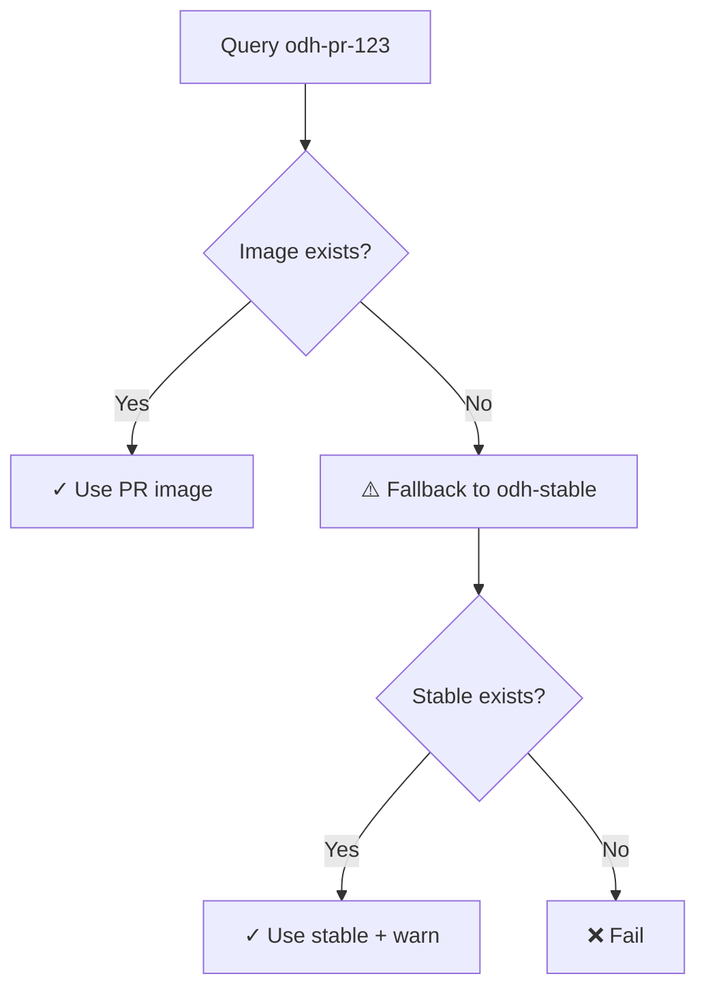

# Implementation Summary: Group Testing PR-Attached Configuration

**Status:** ✅ Implementation Complete  
**Date:** 2026-06-04  
**Design Doc:** [DESIGN-group-testing-pr-attachment.md](DESIGN-group-testing-pr-attachment.md)

---

## Overview

This implementation enables PR-attached group testing configuration for the early-gate pipeline. Teams can now test multiple related PRs together by embedding a YAML configuration block directly in the leader PR's description.

---

## Changes Made

### 1. New Task: `resolve-group-configuration.yaml`

**Location:** `early-gate/tasks/resolve-group-configuration.yaml`

**Purpose:** Fetches PR descriptions from GitHub, parses group testing configuration, and resolves components.

**Key Features:**
- ✅ Fetches PR description via GitHub API
- ✅ Searches for `# early-gate-group-config` marker
- ✅ Parses YAML configuration block
- ✅ Extracts PR URLs and validates format
- ✅ Resolves repos to components using `component_repo_map.json`
- ✅ Graceful fallback to single-PR mode on any error
- ✅ GitHub authentication support (when available)

**Parameters:**
```yaml
params:
  - PR_NUMBER: Pull request number
  - REPO_NAME: Repository name
  - GITHUB_ORG: GitHub organization (default: opendatahub-io)
```

**Results:**
```yaml
results:
  - group-components: Resolved components JSON with PR metadata
  - has-group-config: "true" if group config found, "false" otherwise
```

**Component Output Format:**
```json
{
  "kserve-agent-ci": {
    "quay_path": "opendatahub/kserve-agent",
    "pr": "123"
  },
  "feast-operator-ci": {
    "quay_path": "opendatahub/feast-operator",
    "pr": "456"
  }
}
```

---

### 2. Updated Task: `generate-snapshot-for-group-testing.yaml`

**Location:** `early-gate/tasks/generate-snapshot-for-group-testing.yaml`

**Changes:**

#### A. New Parameter
```yaml
- name: CURRENT_PR_NUMBER
  description: Current PR number (for components without explicit PR metadata)
  type: string
  default: ""
```

#### B. Enhanced Component Format Support
The task now handles **two formats**:

**Old format (backward compatible):**
```json
{"component": "path"}
```

**New format (group testing):**
```json
{
  "component": {
    "quay_path": "path",
    "pr": "123"
  }
}
```

#### C. PR-Specific Image Resolution
```bash
# For new format: use component's specific PR number
TAG="odh-pr-${component_pr}"

# For old format: use default PR number
TAG="odh-pr-${DEFAULT_PR_NUMBER}"
```

#### D. Enhanced Warning Messages
```
⚠️  WARNING: Component 'feast-operator-ci' does not have PR image for tag odh-pr-456
   Quay query returned: 404 Not Found
   Reason: PR build may still be in progress
   Action: Falling back to odh-stable tag
   Impact: Group test will use stable image instead of PR code
```

---

## Backward Compatibility

✅ **Fully backward compatible** with existing single-PR workflows:

| Scenario | Behavior |
|----------|----------|
| PR without group config | Falls back to single-PR mode |
| Existing pipelines | Work exactly as before |
| Component map format | Supports both string and object formats |
| Error handling | All errors fall back to single-PR mode |

---

## Usage Example

### Team Workflow

**1. Create PRs in multiple repos:**
- kserve PR #123
- feast PR #456

**2. Add configuration to leader PR (kserve #123) description:**

````markdown
## Summary
This PR updates the KServe API to support OAuth2 authentication.

## Group Testing
This PR is tested together with related changes:

```yaml
# early-gate-group-config
repos:
  - https://github.com/opendatahub-io/kserve/pull/123
  - https://github.com/opendatahub-io/feast/pull/456
```

## Test Plan
- [ ] Unit tests pass
- [ ] Integration tests with Feast
````

**3. Pipeline execution:**
- Push to kserve #123 triggers pipeline
- `resolve-group-configuration` detects config
- Resolves components from both repos
- `generate-snapshot` queries:
  - `quay.io/opendatahub/kserve-agent:odh-pr-123`
  - `quay.io/opendatahub/feast-operator:odh-pr-456`
- Builds snapshot with both PR images
- Runs integration tests
- Reports results to kserve #123

---

## Error Handling

### Graceful Degradation Matrix

| Error | Detection | Fallback | Status |
|-------|-----------|----------|--------|
| No config marker | Marker absent | Single-PR mode | ✅ Continue |
| Invalid YAML | Parse error | Single-PR mode | ✅ Continue |
| Invalid PR URL | Regex mismatch | Skip entry | ✅ Continue |
| Non-existent PR | GitHub API 404 | Skip entry | ✅ Continue |
| Repo not in map | Lookup null | Skip repo | ✅ Continue |
| GitHub API error | Fetch failure | Single-PR mode | ✅ Continue |
| **component_repo_map.json missing** | **Download fails** | **N/A** | ❌ **Fail** |
| Quay image missing | Image query error | Use `odh-stable` | ✅ Continue |

---

## Image Availability Handling

### Resolution Strategy



**Best Practice:** Ensure all PR builds complete before triggering group tests.

---

## Testing Checklist

- [ ] Single PR without config (backward compatibility)
- [ ] Single PR with invalid config (fallback)
- [ ] Group config with 2 repos
- [ ] Group config with invalid PR URL
- [ ] Group config with non-existent PR
- [ ] PR image missing (fallback to stable)
- [ ] GitHub API authentication
- [ ] GitHub API unauthenticated (rate limit warning)

---

## Pipeline Integration

To integrate into a pipeline, add the following steps:

```yaml
tasks:
  - name: resolve-group-config
    taskRef:
      name: resolve-group-configuration
    params:
      - name: PR_NUMBER
        value: $(params.pr-number)
      - name: REPO_NAME
        value: $(params.repo-name)
    workspaces:
      - name: basic-auth
        workspace: github-auth

  - name: generate-snapshot
    runAfter: [resolve-group-config]
    taskRef:
      name: trigger-group-testing
    params:
      - name: COMPONENTS
        value: $(tasks.resolve-group-config.results.group-components)
      - name: CURRENT_PR_NUMBER
        value: $(params.pr-number)
      - name: ociStorage
        value: $(params.oci-storage)
    workspaces:
      - name: basic-auth
        workspace: quay-auth
```

---

## Dependencies

### Required Tools in Container Image
- `curl` - GitHub API and Quay queries
- `jq` - JSON parsing and manipulation
- `yq` or `python3 + yaml` - YAML parsing
- `skopeo` - Image inspection
- `grep`, `awk`, `sed` - Text processing

### External Dependencies
- GitHub API (rate limited without auth)
- Quay Registry API
- `component_repo_map.json` (critical - pipeline fails if missing)

---

## Security Considerations

### GitHub Authentication
- Reads token from workspace `basic-auth/.git-credentials`
- Falls back to unauthenticated API (rate limited)
- Tokens never logged or exposed

### Input Validation
- PR URLs validated with regex
- Only accepts `https://github.com/` URLs
- PR numbers must be numeric
- YAML parsing errors caught gracefully

---

## Performance Characteristics

### API Calls per Execution

**Single-PR mode:**
- 0 GitHub API calls (marker not found)
- N Quay API calls (N = number of components)

**Group testing mode (2 PRs, 4 components each):**
- 1 GitHub API call (fetch PR description)
- ~8 Quay API calls (2 queries per component: tag + manifest)

**Rate Limits:**
- GitHub API: 60 req/hr (unauthenticated), 5000 req/hr (authenticated)
- Quay API: No documented limit

---

## Next Steps

### Required for Production
1. [ ] Add `resolve-group-configuration` to pipeline YAML
2. [ ] Wire up results between tasks
3. [ ] Test with real PRs
4. [ ] Update CONTRIBUTING.md with usage instructions
5. [ ] Announce to ODH teams

### Optional Enhancements
- [ ] Add PR comment summarizing group members
- [ ] Cross-reference comments in collaborator PRs
- [ ] Metrics collection (group test frequency, success rates)
- [ ] Dashboard for active group configurations

---

## Files Changed

```
early-gate/
├── tasks/
│   ├── resolve-group-configuration.yaml    [NEW]
│   └── generate-snapshot-for-group-testing.yaml    [MODIFIED]
└── docs/
    ├── DESIGN-group-testing-pr-attachment.md
    └── IMPLEMENTATION-group-testing-pr-attachment.md    [NEW]
```

**Diffstat:**
```
 early-gate/tasks/generate-snapshot-for-group-testing.yaml | 50 ++++++++++++---
 early-gate/tasks/resolve-group-configuration.yaml         | 298 +++++++++++++++++++
 2 files changed, 337 insertions(+), 11 deletions(-)
```

---

**Implementation completed by:** MohammadiIram  
**Review status:** Pending review  
**Deployment target:** early-gate pipeline (Konflux)
