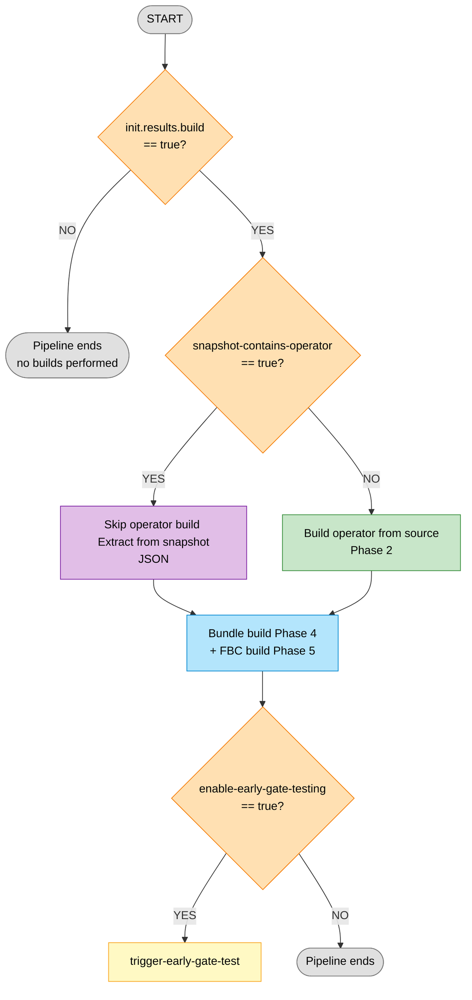
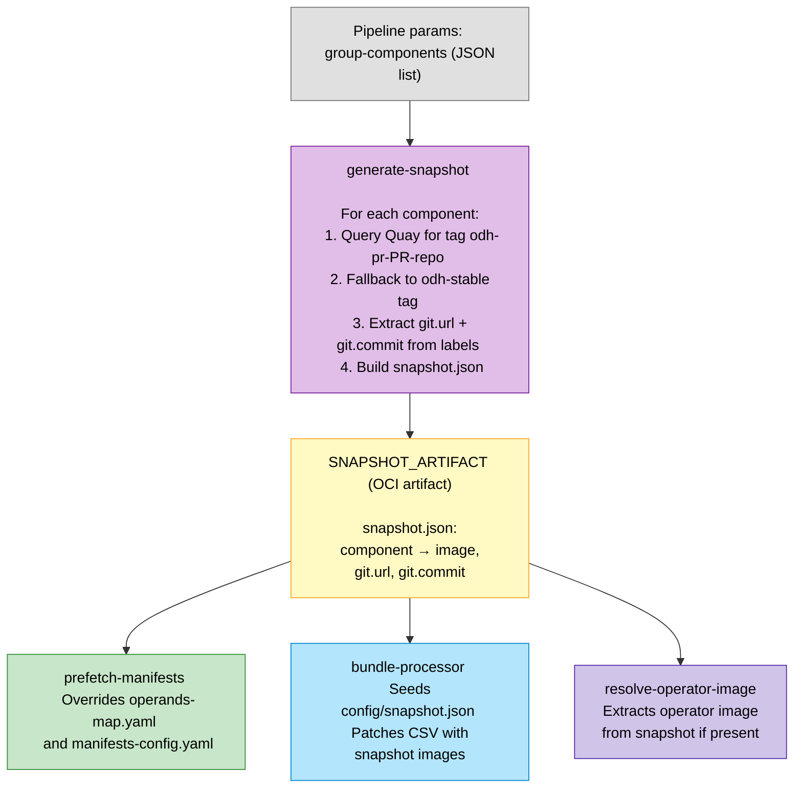
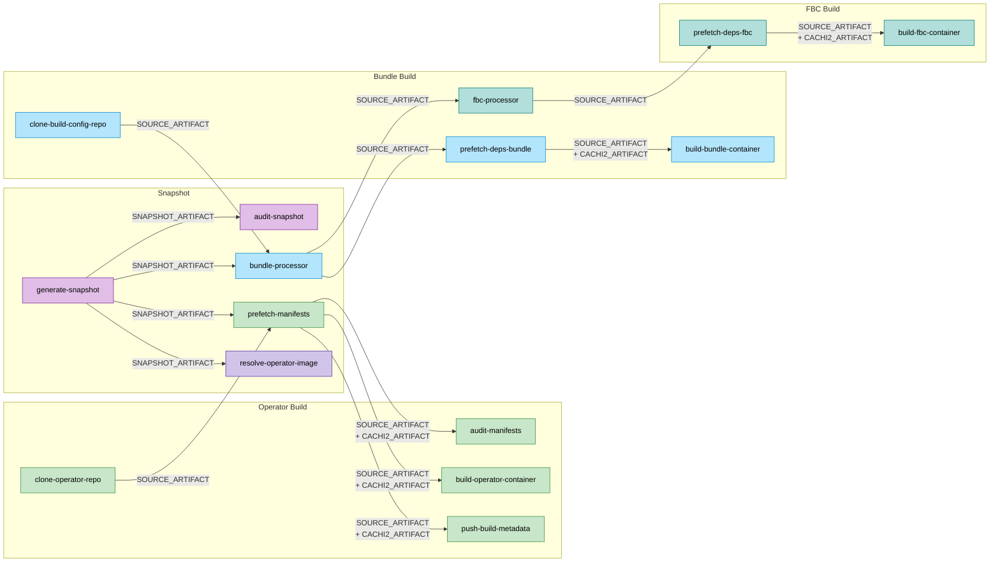

# Early Gate Build Pipeline — Design Document

There are two variants of this pipeline sharing the same design:

| Pipeline | Tekton Name | Source | Triggered By |
|----------|-------------|--------|--------------|
| **Component pipeline** | `early-gate-component-pipeline` | `e2e-early-gate/early-gate-component-pipeline.yaml` | Component PR (e.g., feast, model-mesh) |
| **Operator pipeline** | `early-gate-operator-pipeline` | `e2e-early-gate/early-gate-operator-pipeline.yaml` | Operator PR |

Both pipelines follow the same structure described in this document. The only difference is which repository triggers them — component PRs trigger the component pipeline, and operator PRs trigger the operator pipeline.

---

## 1. Purpose

This Tekton pipeline sequentially builds three OLM artifacts in a single pipeline run:

| Artifact | Image | Description |
|----------|-------|-------------|
| **Operator** | `opendatahub-operator` | The ODH/RHOAI operator container |
| **Bundle** | `opendatahub-operator-bundle` | OLM operator bundle with CSV and CRDs |
| **FBC (File-Based Catalog)** | `opendatahub-operator-catalog` | OLM catalog fragment for the target OCP version |

It replaces the previous multi-pipeline + GitHub-workflow chain with a single Tekton pipeline for quick feature-branch validation before pushing to stable branches. It supports **group testing** — when multiple component PRs are tested together, a snapshot mechanism ensures all builds use the correct PR images.

---

## 2. Workflow Diagram

```mermaid
flowchart TD
    A[rhoai-init]:::init --> B[init]:::init
    B --> C[generate-snapshot]:::snapshot
    C --> D[audit-snapshot]:::snapshot

    D --> E{snapshot-contains- <br /> operator?}:::decision

    E -- "false" --> F[clone-operator-repo]:::build
    F --> G[prefetch-manifests]:::build
    G --> H[audit-manifests]:::build
    H --> I[build-operator-container]:::build
    I --> J[apply-tags-operator]:::build
    J --> K[push-build-metadata]:::build

    E -- "true" --> L[resolve-operator-image]:::merge
    K --> L

    L --> M[clone-build-config-repo]:::bundle
    M --> N[bundle-processor]:::bundle
    N --> O[prefetch-deps-bundle]:::bundle
    O --> P[build-bundle-container]:::bundle
    P --> Q[apply-tags-bundle]:::bundle

    Q --> R[fbc-processor]:::fbc
    R --> S[prefetch-deps-fbc]:::fbc
    S --> T[build-fbc-container]:::fbc

    T --> U[apply-tags-fbc]:::fbc
    T --> V[validate-fbc]:::fbc

    U --> W{enable-early-gate- <br /> testing?}:::decision
    V --> W

    W -- "true" --> X[trigger-early-gate-test]:::trigger
    W -- "false" --> Y([Pipeline ends]):::skip

    classDef init fill:#bbdefb,stroke:#1976d2,color:#000
    classDef snapshot fill:#e1bee7,stroke:#7b1fa2,color:#000
    classDef decision fill:#ffe0b2,stroke:#f57c00,color:#000
    classDef build fill:#c8e6c9,stroke:#388e3c,color:#000
    classDef merge fill:#d1c4e9,stroke:#512da8,color:#000
    classDef bundle fill:#b3e5fc,stroke:#0288d1,color:#000
    classDef fbc fill:#b2dfdb,stroke:#00796b,color:#000
    classDef trigger fill:#fff9c4,stroke:#f9a825,color:#000
    classDef skip fill:#e0e0e0,stroke:#757575,color:#000
```

---

## 3. Decision Tree

There are three key decision points that control which tasks execute:

### Decision 1 — `init.results.build`

Controls whether any builds happen at all. Determined by the standard Konflux `init` task. When `false`, only snapshot generation and audit run.

**Tasks gated:** `clone-operator-repo`, `build-operator-container`, `clone-build-config-repo`, `build-bundle-container`, `build-fbc-container`

### Decision 2 — `snapshot-contains-operator`

Controls whether the operator is built from source or extracted from a pre-existing snapshot image. The `audit-snapshot` task checks if the snapshot JSON contains an entry for `odh-operator-ci` with an image from `quay.io/opendatahub/opendatahub-operator`.

**Tasks gated:** `clone-operator-repo`, `prefetch-manifests`, `audit-manifests`, `build-operator-container`, `apply-tags-operator`, `push-build-metadata`

### Decision 3 — `enable-early-gate-testing`

Controls whether the downstream test pipeline is triggered after all images are built. Defaults to `true`.

**Tasks gated:** `trigger-early-gate-test`

---

## 4. Execution Phases

### Phase 0: Initialization

| Task | Purpose |
|------|---------|
| `rhoai-init` | Initialize RHOAI pipeline context. Produces `mandatory-tag`, `unique-tag`, `build-url`. |
| `init` | Standard Konflux init. Produces `build` result (true/false). |

### Phase 1: Group Snapshot

| Task | Purpose |
|------|---------|
| `generate-snapshot` | Queries Quay API for each component's image digest matching `odh-pr-{PR}` tag (fallback: `odh-stable`). Produces `SNAPSHOT_ARTIFACT` (OCI artifact containing `snapshot.json`). |
| `audit-snapshot` | Parses snapshot, extracts PR metadata, determines `snapshot-contains-operator` flag. |

### Phase 2: Operator Build (conditional)

Runs only when `snapshot-contains-operator == false`.

| Task | Purpose |
|------|---------|
| `clone-operator-repo` | Clones operator source into OCI Trusted Artifact. |
| `prefetch-manifests` | Runs `operator-processor.py` to process operator YAMLs. Applies snapshot overrides to `operands-map.yaml` — replaces image URIs for components present in snapshot. Prefetches all operand manifests via git sparse-checkout. |
| `audit-manifests` | Lists prefetched manifests for debugging/validation. |
| `build-operator-container` | Buildah build of operator image (non-hermetic, uses Cachi2 manifests). Timeout: **8 hours**. |
| `apply-tags-operator` | Tags operator image with mandatory-tag, unique-tag, and `odh-pr-{revision}`. |
| `push-build-metadata` | Pushes operator manifests and config to `odh-build-metadata` repo under `components/odh-operator/{digest}/`. |

### Phase 3: Operator Image Resolution

| Task | Purpose |
|------|---------|
| `resolve-operator-image` | **Merges the two paths.** If operator was in snapshot: extracts image URL/digest/git info from `snapshot.json`. If operator was built: uses build task results. Always runs. |

### Phase 4: Bundle Build

Runs when `init.build == true`.

| Task | Purpose |
|------|---------|
| `clone-build-config-repo` | Clones `ODH-Build-Config` into OCI Trusted Artifact. |
| `bundle-processor` | Seeds `config/snapshot.json` with resolved operator image. Runs `bundle-processor.py -op bundle-patch` to patch the CSV with snapshot-based component images. |
| `prefetch-dependencies-bundle` | Cachi2 dependency prefetch for bundle. |
| `build-bundle-container` | Buildah build of bundle image (non-hermetic). |
| `apply-tags-bundle` | Tags bundle image. |

### Phase 5: FBC Build

Runs after bundle build completes.

| Task | Purpose |
|------|---------|
| `fbc-processor` | Runs `fbc-processor.py` to extract snapshot images, render FBC semver template via `opm`, and patch catalog YAML. |
| `prefetch-dependencies-fbc` | Cachi2 dependency prefetch for FBC. |
| `build-fbc-container` | Buildah build of FBC image (**hermetic** — strict isolation). |
| `apply-tags-fbc` | Tags FBC image. |
| `validate-fbc` | Validates FBC image structure (runs in parallel with `apply-tags-fbc`). |

### Phase 6: Test Trigger (conditional)

| Task | Purpose |
|------|---------|
| `trigger-early-gate-test` | Triggers the downstream `early-gate-test-pipeline` (runs only when `enable-early-gate-testing == true`). |

---

## 5. Snapshot Override Mechanism

The snapshot system enables **group testing** — when multiple component PRs are validated together, each build uses the correct PR-specific images for all components in the group.

### How It Works

**`prefetch-manifests`** — Replaces image URIs in `operands-map.yaml` for matching components; updates `git.commit` in `manifests-config.yaml`.

**`bundle-processor`** — Seeds `config/snapshot.json` with the resolved operator image; runs bundle-patch to inject all snapshot images into the CSV.

**`resolve-operator-image`** — When the operator itself is in the snapshot, extracts its image and git info directly from `snapshot.json` instead of relying on build results.

---

## 6. Artifact Flow

All inter-task data passes through **OCI Trusted Artifacts** for auditability and tamper-resistance.

---

## 7. Pipeline Results

These results are available to downstream consumers (Konflux integration tests, Tekton Chains attestation):

| Result | Source | Description |
|--------|--------|-------------|
| `OPERATOR_IMAGE_URL` | `resolve-operator-image` | Operator image URL (from build or snapshot) |
| `OPERATOR_IMAGE_DIGEST` | `resolve-operator-image` | Operator image SHA256 digest |
| `BUNDLE_IMAGE_URL` | `build-bundle-container` | Bundle image URL |
| `BUNDLE_IMAGE_DIGEST` | `build-bundle-container` | Bundle image SHA256 digest |
| `CATALOG_IMAGE_URL` | `build-fbc-container` | FBC catalog image URL |
| `CATALOG_IMAGE_DIGEST` | `build-fbc-container` | FBC catalog image SHA256 digest |
| `CHAINS-GIT_URL` | `resolve-operator-image` | Operator source git URL (provenance) |
| `CHAINS-GIT_COMMIT` | `resolve-operator-image` | Operator source git commit (provenance) |

---

## 8. Parameters Reference

### General

| Parameter | Default | Description |
|-----------|---------|-------------|
| `git-url` | *(required)* | Source repository URL |
| `revision` | `""` | Source revision |
| `expected-cluster` | `""` | Expected cluster for execution |
| `pipeline-type` | `pull-request` | `push` or `pull-request` |
| `image-expires-after` | `7d` | Image tag expiration |
| `group-components` | `""` | JSON list of components for group snapshot |

### Operator Build

| Parameter | Default | Description |
|-----------|---------|-------------|
| `operator-git-url` | `https://github.com/opendatahub-io/opendatahub-operator` | Operator source repo |
| `operator-revision` | `main` | Operator branch/commit |
| `operator-output-image` | `quay.io/opendatahub/opendatahub-operator:odh-pr` | Output image for operator |
| `operator-dockerfile` | `Dockerfiles/rhoai.Dockerfile` | Dockerfile path |
| `operator-path-context` | `.` | Build context |
| `operator-build-args` | `["BUILD_TYPE=CI"]` | Build arguments |
| `operator-additional-tags` | `[]` | Extra tags for operator image |
| `build-version-tag` | `odh-stable` | Tag for fetching component images |
| `utils-repo-branch` | `odh` | Branch for prefetch-operand-manifests utils |
| `build-metadata-repo` | `opendatahub-io/odh-build-metadata` | Repo for pushing manifests |
| `fetch-git-tags` | `false` | Fetch all git tags during clone |
| `clone-depth` | `1` | Git clone depth |

### Build-Config (Bundle + FBC)

| Parameter | Default | Description |
|-----------|---------|-------------|
| `build-config-git-url` | `https://github.com/opendatahub-io/ODH-Build-Config` | Build-Config repo |
| `build-config-revision` | `main` | Build-Config branch |
| `bundle-output-image` | `quay.io/opendatahub/opendatahub-operator-bundle:odh-pr` | Output image for bundle |
| `bundle-dockerfile` | `bundle/Dockerfile` | Bundle Dockerfile |
| `bundle-build-args-file` | `bundle/bundle_build_args.map` | Bundle build args file |
| `catalog-output-image` | `quay.io/opendatahub/opendatahub-operator-catalog:odh-pr` | Output image for FBC |
| `catalog-dockerfile` | `Dockerfile` | FBC Dockerfile |
| `catalog-path-context` | `catalog/v4.20` | FBC build context |
| `catalog-build-args-file` | `catalog/catalog_build_args.map` | FBC build args file |
| `openshift-version` | `v4.20` | Target OCP version |

### Utils

| Parameter | Default | Description |
|-----------|---------|-------------|
| `utils-repo-url` | `https://github.com/red-hat-data-services/RHOAI-Konflux-Automation.git` | Utils repo |
| `utils-repo-ref` | `odh` | Utils repo branch |
| `quay-tag` | `odh-stable` | Quay tag for image lookups |
| `enable-early-gate-testing` | `true` | Trigger test pipeline after build |

---

## 9. Build Isolation

| Artifact | Hermetic | Reason |
|----------|----------|--------|
| Operator | No | Requires Cachi2 manifests from external repos |
| Bundle | No | Go dependencies need network access during prefetch |
| FBC | **Yes** | Strict isolation — all dependencies pre-resolved |

---

## 10. Image Tagging Strategy

All three built images receive these tags:

| Tag | Source | Example |
|-----|--------|---------|
| `mandatory-tag` | `rhoai-init.results.mandatory-tag` | Cluster-specific tag |
| `unique-tag` | `rhoai-init.results.unique-tag` | Unique pipeline run tag |
| `odh-pr-{revision}` | Pipeline param | `odh-pr-abc123` |
| Additional tags | `operator-additional-tags` param | *(operator only)* |

Image expiration defaults to **7 days**. Intermediate Cachi2 artifacts expire in **1 hour**.
