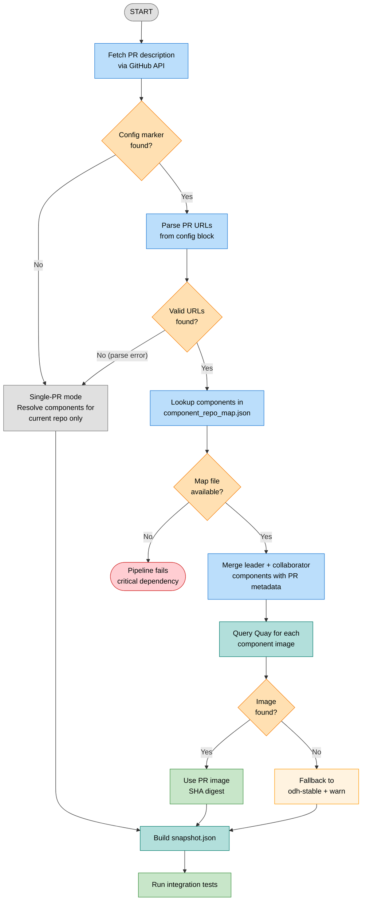
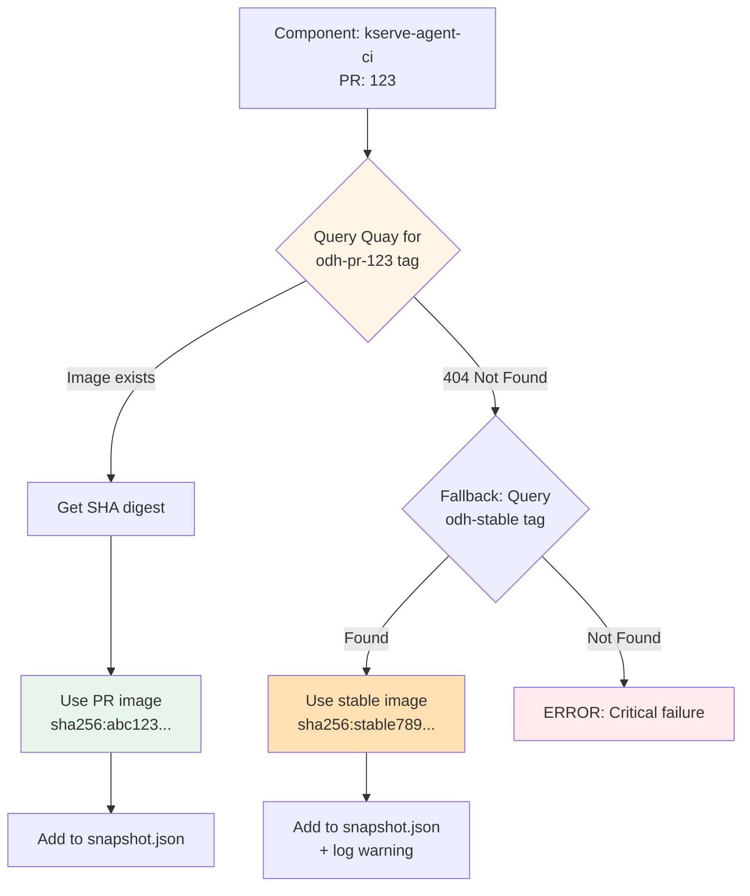
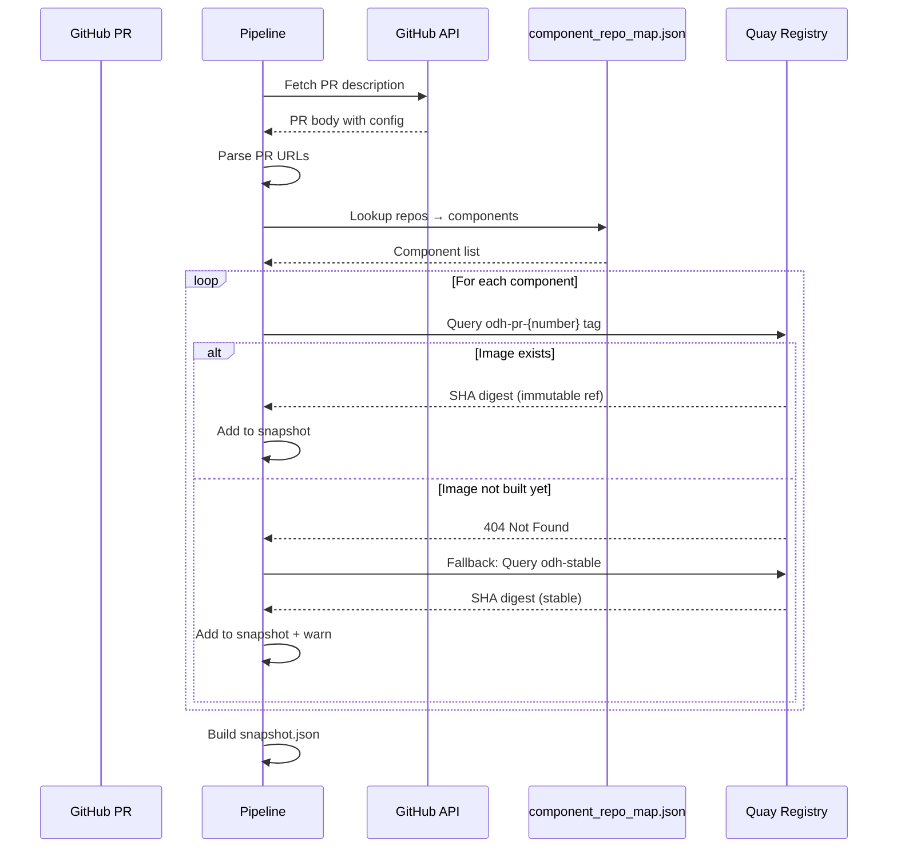
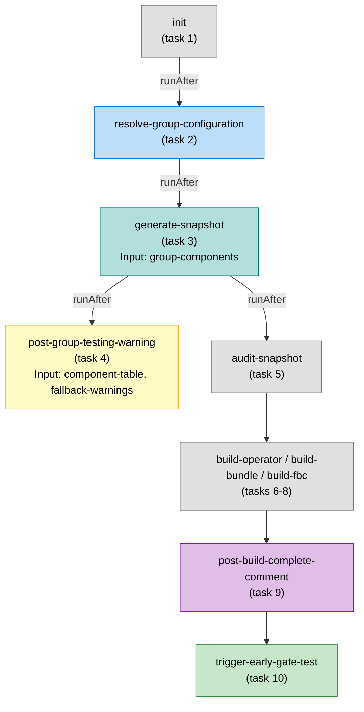
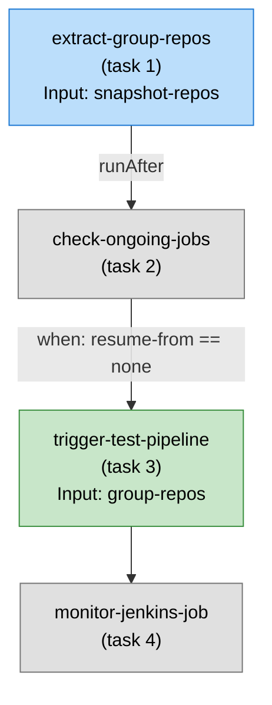

# Early Gate Group Testing — Design Document

**Feature name:** PR-Attached Group Testing  
**Pipelines:** `early-gate-component-pipeline`, `early-gate-operator-pipeline`, `early-gate-test-pipeline`

---

## 1. Purpose

This feature enables coordinated testing of multiple related PRs across repositories by embedding a group configuration directly in a PR description. When a developer needs to test changes that span repositories (e.g., kserve + feast), they list the related PR URLs in a config block in their "leader" PR description. The pipeline detects this configuration, resolves all specified PRs to their component images, and builds a combined snapshot for integration testing.

The design is **self-service** (no approval gates), **backward compatible** (PRs without config work exactly as before), and **gracefully degrading** (errors fall back to single-PR mode).

---

## 2. Workflow Diagram

```mermaid
flowchart TD
    PUSH["Push to leader PR"] --> INIT["init task<br/>Extract REPO_NAME, PR_NUMBER<br/>from PipelinesAsCode labels"]:::init

    INIT --> RESOLVE["resolve-group-configuration<br/><br/>Fetch PR description (GitHub API)<br/>Search for config marker<br/>Parse PR URLs<br/>Lookup components in repo map<br/>Merge with PR metadata"]:::resolve

    RESOLVE --> SNAPSHOT["generate-snapshot<br/><br/>For each component:<br/>Query Quay for odh-pr-{number}<br/>Fallback to odh-stable if missing<br/>Build snapshot.json with SHA digests"]:::snapshot

    SNAPSHOT --> WARNING["post-group-testing-warning<br/><br/>Build markdown table with PR links<br/>Post summary comment to PR<br/>Show fallback warnings if any"]:::warning

    WARNING --> AUDIT["audit-snapshot"]:::existing

    AUDIT --> BUILD["build-operator-container<br/>build-bundle-container<br/>build-fbc-container"]:::existing

    BUILD --> POST["post-build-complete-comment<br/><br/>Post consolidated build results<br/>Include snapshot and test info"]:::post

    POST --> TEST["trigger-early-gate-test<br/><br/>Extract group repos<br/>Trigger test pipeline<br/>Pass group repos to Jenkins"]:::test

    classDef init fill:#e0e0e0,stroke:#757575,color:#000
    classDef resolve fill:#bbdefb,stroke:#1976d2,color:#000
    classDef snapshot fill:#b2dfdb,stroke:#00796b,color:#000
    classDef warning fill:#fff9c4,stroke:#f9a825,color:#000
    classDef existing fill:#e0e0e0,stroke:#757575,color:#000
    classDef post fill:#e1bee7,stroke:#7b1fa2,color:#000
    classDef test fill:#c8e6c9,stroke:#388e3c,color:#000
```



---

## 3. Decision Tree



---

## 4. Execution Phases

### Phase 1: Resolve Group Configuration

**Task:** `resolve-group-configuration`
**Source:** `early-gate/tasks/resolve-group-configuration.yaml`

Fetches the PR description from GitHub, searches for the group config marker, parses collaborator PR URLs, and resolves all repos to their component images.

**Process:**

1. Extract `REPO_NAME` and `PR_NUMBER` from PipelinesAsCode labels
2. Fetch PR description via GitHub API (authenticated if token available, unauthenticated fallback)
3. Search for `## Early Gate Testing` heading (or any heading containing "earlygate")
4. Extract PR URLs from the config block (stops at next `##` heading)
5. Automatically include leader PR components
6. For each collaborator URL, parse `org/repo/pr` and lookup components in `component_repo_map.json`
7. Merge all components with PR metadata into `group-components` JSON

**Parameters:**

| Parameter | Default | Description |
|-----------|---------|-------------|
| `PR_NUMBER` | *(required)* | Pull request number |
| `REPO_NAME` | *(required)* | Repository name |
| `GITHUB_ORG` | `opendatahub-io` | GitHub organization |

**Results:**

| Result | Description |
|--------|-------------|
| `group-components` | Resolved components JSON with PR metadata |
| `has-group-config` | `"true"` if group config found, `"false"` otherwise |

**Component Output Format:**

```json
{
  "kserve-agent-ci": {
    "quay_path": "opendatahub/kserve-agent",
    "pr": "123"
  },
  "feast-operator-ci": {
    "quay_path": "opendatahub/feast-operator",
    "pr": "456"
  }
}
```

---

### Phase 2: Generate Snapshot

**Task:** `generate-snapshot-for-group-testing`
**Source:** `early-gate/tasks/generate-snapshot-for-group-testing.yaml`

Queries Quay registry for each component's PR-specific image and builds a combined snapshot with immutable SHA digest references.



**Image Resolution Strategy:**

| Scenario | Image Tag Query | Result | Action |
|----------|----------------|--------|--------|
| PR build complete | `odh-pr-{number}` exists | Found | Use PR image (immutable SHA digest) |
| PR build in progress | `odh-pr-{number}` not found | Not ready | Fallback to `odh-stable` + log warning |
| Stable fallback available | `odh-stable` exists | Found | Use stable image + warning in test logs |
| Both missing | Neither tag exists | Critical | Pipeline fails (component not testable) |

**Component Format Support (backward compatible):**

| Format | Example | Usage |
|--------|---------|-------|
| Old (string) | `{"component": "path"}` | Single-PR mode |
| New (object) | `{"component": {"quay_path": "path", "pr": "123"}}` | Group testing mode |

**Snapshot JSON Structure:**

```json
{
  "kserve-agent-ci": {
    "image": "quay.io/opendatahub/kserve-agent@sha256:abc123...",
    "image_tag": "odh-pr-123",
    "git.url": "https://github.com/opendatahub-io/kserve",
    "git.commit": "abc123def456..."
  },
  "feast-operator-ci": {
    "image": "quay.io/opendatahub/feast-operator@sha256:def456...",
    "image_tag": "odh-pr-456",
    "git.url": "https://github.com/opendatahub-io/feast",
    "git.commit": "789abc012def..."
  }
}
```

---

### Phase 3: Post Group Testing Warning

**Task:** `post-group-testing-warning`
**Source:** `early-gate/tasks/post-group-testing-warning.yaml`

Builds a markdown table summarizing the group test and posts it as a PR comment. Only shows warnings when actual fallbacks occurred or repos were skipped.

**Summary table includes:**
- PR numbers (clickable links)
- Components from each PR
- Tags used (`odh-pr-XXX` or `odh-stable`)
- Status (ready or fallback)
- Image digests

---

### Phase 4: Post Build Complete Comment

**Task:** `post-build-complete-comment`
**Source:** `early-gate/tasks/post-build-complete-comment.yaml`

Posts a consolidated build results comment to the PR after the build phase completes. Includes snapshot information and test configuration.

---

### Phase 5: Extract Group Repos and Trigger Tests

**Task:** `extract-group-repos`
**Source:** `early-gate/tasks/extract-group-repos.yaml`

Extracts the list of repositories from the group components JSON for passing to the test pipeline trigger.

**Task:** `trigger-test-pipeline`
**Source:** `early-gate/tasks/trigger-test-pipeline.yaml`

Triggers the early-gate test pipeline via GitHub Actions workflow dispatch, passing group repos so Jenkins runs tests for all components in the group.

---

## 5. Configuration Schema

### PR Description Format

Configuration is embedded in PR descriptions under an `## Early Gate Testing` heading:

```markdown
## Early Gate Testing
https://github.com/opendatahub-io/kserve/pull/123
https://github.com/opendatahub-io/feast/pull/456
```

### Detection Rules

| Rule | Detail |
|------|--------|
| Marker | Any `##` heading containing "earlygate" or "early gate" (case-insensitive) |
| URL format | `https://github.com/{org}/{repo}/pull/{number}` |
| Block end | Next `##` heading |
| Formatting | URLs can have bullets, dashes, or whitespace prefix |

### URL Parsing

```
https://github.com/opendatahub-io/kserve/pull/123
                   └────┬────┘ └──┬──┘      └┬┘
                     org       repo         pr
```

---

## 6. Data Flow

### Component Resolution



### Data Transformation

| Stage | Input | Output |
|-------|-------|--------|
| URL Parsing | `github.com/opendatahub-io/kserve/pull/123` | `{org: opendatahub-io, repo: kserve, pr: 123}` |
| Component Lookup | `component_repo_map.json["kserve"]` | `{"kserve-agent-ci": "...", "kserve-controller-ci": "..."}` |
| Metadata Merge | Components + PR number | `{"kserve-agent-ci": {"quay_path": "...", "pr": "123"}}` |
| Image Resolution | Component metadata | `quay.io/.../kserve-agent:odh-pr-123 → sha256:abc...` |

---

## 7. Task Dependency Graph

### Component/Operator Pipeline



### Test Pipeline



---

## 8. Error Handling and Resilience

### Graceful Degradation Principle

Every error (except missing `component_repo_map.json`) falls back to **single-PR mode**, ensuring pipelines never fail due to group testing issues.

### resolve-group-configuration

| Failure | Behavior |
|---------|----------|
| No config marker in PR description | Single-PR mode (expected for non-group PRs) |
| Invalid/unparseable config | Single-PR mode + warning logged |
| Invalid PR URL format | Skip entry, process remaining valid URLs |
| Non-existent PR (GitHub API 404) | Skip entry, process others |
| Repo not in component_repo_map.json | Skip repo + warning, merge others |
| GitHub API error / rate limit | Single-PR mode + warning |
| **component_repo_map.json missing** | **Pipeline fails (critical dependency)** |

### generate-snapshot-for-group-testing

| Failure | Behavior |
|---------|----------|
| PR image not found on Quay (`odh-pr-{number}`) | Fallback to `odh-stable` tag + warning |
| Stable image also missing | Pipeline fails for that component |
| Quay API error | Retry, then fail |

### post-group-testing-warning

| Failure | Behavior |
|---------|----------|
| No group config detected | Task skipped (no comment posted) |
| GitHub API error posting comment | Warning logged, pipeline continues |

### Warning Format

```
⚠️  WARNING: Component 'feast-operator-ci' does not have PR image for tag odh-pr-456
   Quay query returned: 404 Not Found
   Reason: PR build may still be in progress
   Action: Falling back to odh-stable tag
   Impact: Group test will use stable image instead of PR code
```

---

## 9. Design Decisions

### PR-Attached vs Central Configuration

**Chosen:** PR-Attached Configuration

| Aspect | PR-Attached (chosen) | Central Config (alternative) |
|--------|---------------------|------------------------------|
| Config location | Leader PR description | `config/earlygate-group-configuration.yaml` in OKC repo |
| Setup | Self-service, no PR to OKC needed | Requires PR to OKC, must be reviewed and merged |
| Visibility | Config visible to PR reviewers | Centralized, discoverable in one place |
| Lifecycle | Automatic cleanup when PR closes | Manual cleanup via PR to OKC |
| Discovery | Distributed across PR descriptions | Single file lists all active groups |

**Rationale:**
- Self-service model with no approval gates
- Configuration co-located with the code change
- Automatic lifecycle management (config goes away when PR closes/merges)
- Zero coordination overhead for teams

### Leader PR Auto-Inclusion

Users only list collaborator PRs in config. The PR where config is added is automatically included.

**Rationale:** Simpler for users, less error-prone, avoids redundant self-references.

### Simple Text Format (No YAML)

Config is just a heading + URLs, no YAML parsing needed.

**Rationale:** Easier to use, fewer syntax errors for developers.

### Graceful Fallback

If a PR image isn't ready, use `odh-stable` and warn instead of failing.

**Rationale:** Tests can still run with partial group coverage. Users can re-trigger later when all builds are ready.

---

## 10. Backward Compatibility

### 100% Backward Compatible

| Scenario | Behavior |
|----------|----------|
| PR without group config | Single-PR mode (no change from before) |
| `enable-group-testing=false` | Group config ignored, single-PR mode |
| Existing pipeline parameters | No changes required |
| Snapshot format | Unchanged (same JSON structure) |
| Downstream tasks | Unaffected |

### Component Format Support

The `generate-snapshot` task supports both formats:

| Format | Example | Mode |
|--------|---------|------|
| String (legacy) | `{"component": "quay/path"}` | Single-PR |
| Object (new) | `{"component": {"quay_path": "quay/path", "pr": "123"}}` | Group testing |

---

## 11. Parameters Reference

### resolve-group-configuration

| Parameter | Default | Description |
|-----------|---------|-------------|
| `PR_NUMBER` | *(required)* | Pull request number (from PipelinesAsCode labels) |
| `REPO_NAME` | *(required)* | Repository name (from PipelinesAsCode labels) |
| `GITHUB_ORG` | `opendatahub-io` | GitHub organization |

### generate-snapshot-for-group-testing

| Parameter | Default | Description |
|-----------|---------|-------------|
| `COMPONENTS` | *(required)* | Group components JSON from resolve task |
| `CURRENT_PR_NUMBER` | `""` | Current PR number (fallback for legacy format) |
| `fallback-tag` | `odh-stable` | Tag to use when PR image not found |
| `ociStorage` | *(required)* | OCI storage path for snapshot artifact |
| `ociArtifactExpiresAfter` | `7d` | Snapshot artifact expiration |

### Secret Configuration

| Parameter | Default | Description |
|-----------|---------|-------------|
| `pr-token-secret-name` | `odh-github-secret` | K8s secret for GitHub API token |
| `pr-token-secret-key` | `commenter-token` | Key within the secret |

---

## 12. Performance Characteristics

### API Calls per Execution

**Single-PR mode (no config):**
- 1 GitHub API call (fetch PR description, marker not found)
- N Quay API calls (N = number of components in repo)

**Group testing mode (2 PRs, 4 components each):**
- 1 GitHub API call (fetch PR description)
- ~8 Quay API calls (2 queries per component: tag check + manifest)

**Rate Limits:**
- GitHub API: 60 req/hr (unauthenticated), 5000 req/hr (authenticated)
- Quay API: No documented limit

---

## 13. Security Considerations

### GitHub Authentication
- Reads token from workspace `basic-auth/.git-credentials`
- Falls back to unauthenticated API (rate limited)
- Tokens never logged or exposed

### Input Validation
- PR URLs validated with regex
- Only accepts `https://github.com/` URLs
- PR numbers must be numeric
- Config parsing errors caught gracefully (no injection risk)
