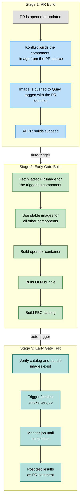
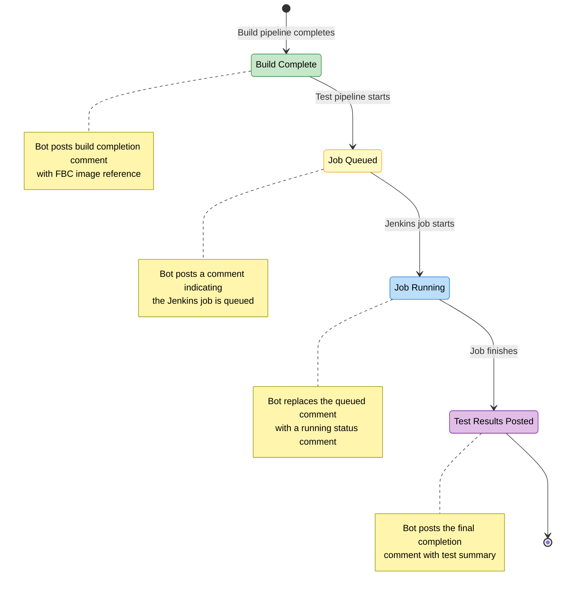
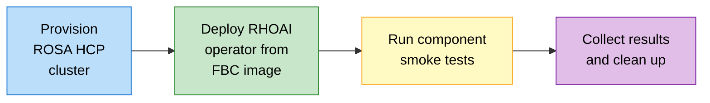

# Early Gate — User Guide

Early gate is a pre-merge e2e build & smoke testing infrastructure for ODH. It validates that a pull request does not break core functionality by building a complete set of OLM artifacts (operator, bundle, and FBC catalog) using the PR's latest images and running smoke tests against them — all before the PR is merged.

---

## 1. How It Works

When you open a pull request on an onboarded component or operator repository, the early gate infrastructure runs a three-stage pipeline chain:



**For component PRs** (e.g., feast, model-mesh, kserve): the build pipeline uses the PR's component image while keeping all other components at their latest stable versions.

**For operator PRs**: the build pipeline builds the operator directly from the PR's source code.

---

## 2. Triggering Early Gate Tests

### Automatic Triggers

Early gate pipelines are triggered automatically:

1. When all PR build pipelines succeed on a PR, the **early gate build pipeline** is triggered automatically.
2. When the early gate build pipeline completes successfully, the **early gate test pipeline** is triggered automatically.

No manual action is needed for the standard flow.

### Manual Triggers (PR Comments)

You can manually trigger each stage by commenting on the PR:

| Command | What It Does |
|---------|--------------|
| `/early-gate-build` | Triggers the early gate build pipeline (operator + bundle + FBC) |
| `/early-gate-test` | Triggers the early gate test pipeline (smoke tests) |

These commands are useful when:
- You want to re-run tests after a transient failure
- You want to trigger tests without waiting for all PR builds to complete
- A previous run was interrupted

---

## 3. What Each Stage Does

### Stage 1: PR Build

The standard Konflux pull request build pipeline. It compiles and builds a container image from the PR source code, pushes it to Quay with a PR-specific tag, and runs basic checks. This is the same build pipeline that runs for all PRs — nothing early-gate-specific happens here.

### Stage 2: Early Gate Build Pipeline

Builds a complete set of OLM artifacts using the PR's latest images:

1. **Operator image** — built from source (operator PRs) or fetched from the PR's existing image (component PRs)
2. **OLM Bundle** — operator bundle containing the CSV and CRDs, patched with the PR's component images
3. **FBC Catalog** — a File-Based Catalog fragment for the target OpenShift version

All three images are pushed to Quay and tagged with the PR identifier.

There are two variants of this pipeline:
- `early-gate-component-pipeline` — triggered by component PRs
- `early-gate-operator-pipeline` — triggered by operator PRs

Both follow the same structure; the difference is which repository triggers them.

### Stage 3: Early Gate Test Pipeline

Orchestrates smoke testing through Jenkins:

1. **Verify prerequisites** — confirms the catalog and bundle images exist on Quay
2. **Trigger Jenkins job** — dispatches a GitHub Actions workflow that starts a Jenkins smoke test
3. **Monitor to completion** — polls the Jenkins job status until it finishes
4. **Post results** — fetches the test summary and posts a completion comment on the PR

The test pipeline is **idempotent** — if it is interrupted and re-run, it detects the in-progress Jenkins job from the previous run and resumes monitoring it instead of triggering a duplicate.

---

## 4. PR Comments and Status Updates

The bot posts comments on your PR to keep you informed of the testing progress.

### During Testing

As the test progresses, the bot posts status comments showing the current phase (queued, running). These intermediate comments are automatically cleaned up once the next phase begins.

### Build Completion Comment

When the early gate build pipeline (Stage 2) completes successfully, the bot posts a build completion comment with the FBC image reference:

> :white_check_mark: **Early Gate Build - Complete**
>
> | Field | Value |
> |-------|-------|
> | **Status** | :white_check_mark: SUCCESS |
> | **FBC Image** | quay.io/opendatahub/opendatahub-operator-catalog:odh-pr-73-feast@sha256:b904ea... |

This comment confirms that the operator, bundle, and FBC catalog images were built successfully and provides the fully qualified FBC image reference (with digest) that will be used for testing.

### Test Completion Comment

When testing finishes, a permanent completion comment is posted with the test results:

**All tests passed:**

> :white_check_mark: **Early Gate Test - Complete**
>
> | Field | Value |
> |-------|-------|
> | **Job URL** | /job/devops/job/early-gate-tests/42/ |
> | **Status** | :white_check_mark: SUCCESS |
> | **FBC Tag** | odh-pr-73-feast |
>
> **Test Summary**
>
> | Passed | Failed | Skipped | Total |
> |--------|--------|---------|-------|
> | 15 | 0 | 2 | 17 |

**Tests failed:**

> :x: **Early Gate Test - Complete**
>
> | Field | Value |
> |-------|-------|
> | **Job URL** | /job/devops/job/early-gate-tests/42/ |
> | **Status** | :x: FAILED - 3 test(s) failed |
>
> **Test Summary**
>
> | Passed | Failed | Skipped | Total |
> |--------|--------|---------|-------|
> | 12 | **3** | 2 | 17 |

### Comment Lifecycle



---

## 5. Re-running Tests

| Scenario | What to Do |
|----------|------------|
| Tests failed due to a real issue | Push a fix to the PR — the entire flow restarts automatically |
| Tests failed due to a transient/infra issue | Comment `/early-gate-test` to re-run just the test stage |
| Build failed or needs to be re-triggered | Comment `/early-gate-build` to re-run the build + test stages |
| Pipeline was interrupted mid-run | Simply re-trigger — the test pipeline detects the existing Jenkins job and resumes monitoring it |

Re-running is always safe. The test pipeline will not trigger duplicate Jenkins jobs.

---

## 6. How Tests Run on Your PR

When the early gate test pipeline triggers a Jenkins job, the following stages execute:



### Cluster

A fresh **ROSA HCP** cluster is provisioned on AWS for each test run.

| Property | Value |
|----------|-------|
| **Platform** | ROSA HCP (AWS, us-west-2) |
| **OpenShift version** | 4.20-latest (configurable) |
| **Lifetime** | Deleted immediately after tests (default) |

The cluster is a dedicated, isolated environment — no test run shares a cluster with another.

### RHOAI Deployment

The RHOAI operator is deployed from the **FBC catalog image built in Stage 2** (the early gate build pipeline). This image is installed using the **`odh-stable`** subscription channel, ensuring the PR's component images are what gets tested.

The deployment flow:
1. The FBC image tag (e.g., `odh-pr-73-feast`) is resolved to a full Quay URI via the [Tracer](https://github.com/red-hat-data-services/rhods-devops-infra) tool
2. A `CatalogSource` is created pointing to this FBC image
3. The RHOAI operator is installed via CLI using the `odh-stable` channel
4. An identity provider and external DNS are configured
5. Cluster and operator health checks verify everything is ready

### Smoke Tests

The Jenkins job determines which tests to run based on the component's configuration:

- **Component mapping:** your repository's Konflux component key (from [`component_repo_map.json`](https://github.com/opendatahub-io/odh-konflux-central/blob/main/config/component_repo_map.json)) is mapped to a test configuration that defines which smoke tests to execute.
- **Quality gate:** the `early-gate` quality gate is used, which typically maps to smoke-level tests (e.g., `-m smoke` for pytest components, or `FeatureStoreANDSmoke` for Robot Framework components).
- **Test runners:** depending on your component's configuration, tests run either via **Robot Framework** (ods-ci) or as **containerized pytest/gotestsum jobs** (shift-left). The runner is determined by the `metadata.earlyGateTestRunner` field in your component's config — `ods-ci` for Robot, `shiftleft` (the default) for containers.
- **PR test images:** the pipeline automatically checks if a `pr-<N>` tag exists in Quay for your component's test image. If found, it uses that PR-tagged image instead of the default `latest` tag, allowing you to test with updated test code from your PR.

### Troubleshooting Test Failures

When an early gate test fails, the pipeline collects several types of diagnostic information to help you identify the root cause. Understanding what is available and how to access it will speed up your debugging.

Start by checking the **completion comment** on your PR. Click the **Job URL** to open the Jenkins build page. The Jenkins build status tells you what category of failure occurred:

#### Review Test Results

Test results are available in multiple formats from the Jenkins build page:

| Artifact | Where to Find It | What It Contains |
|----------|-------------------|------------------|
| **JUnit Test Report** | Jenkins build page → *Tests* | Per-test pass/fail/skip with error messages and stack traces |
| **ReportPortal** | Link in Jenkins build description | Interactive test report with historical comparison and defect classification |

#### Use Must-Gather for Deeper Diagnostics

**Must-gather** collects comprehensive OpenShift cluster diagnostics when tests fail. This is the single most useful artifact for debugging failures that involve operator behavior, resource state, or cluster-level issues.

> **We strongly recommend that all component teams enable `--collect-must-gather` in their test configuration.** Without it, diagnosing operator-level or cluster-level failures requires manual intervention that is no longer possible after the test cluster is deleted.

**How to enable must-gather:**

Add `--collect-must-gather` to your component's `image.args` in its configuration file:

```yaml
# In your component's main.yaml
# e.g. resources/configs/components-testing/components/<your-component>/main.yaml
merge:
  image:
    args: [
        --collect-must-gather,
        -o junit_suite_name=<your-component>,
        tests/<your-test-path>/
    ]
```

## 7. Group Testing (Multi-PR)

Group testing allows you to test multiple PRs from different repositories together in a single early gate run. This validates cross-component changes as a cohesive set before any of them are merged.

### How It Works

One PR acts as the **leader** — it contains the group testing configuration in its description and receives the test results. Other PRs in the group are **collaborators**.

When the leader PR's early gate build pipeline runs, it:
1. Reads the group testing configuration from the leader PR description
2. Fetches PR-specific images for each collaborator from Quay
3. Builds a combined snapshot with all PR images (falling back to stable images for any components whose PR build hasn't completed yet)
4. Runs smoke tests against the combined set
5. Posts a group testing summary and test results on the leader PR

### Configuring Group Testing

Add an `## Early Gate Testing` section to your **leader PR description** listing collaborator PR URLs:

```markdown
## Early Gate Testing
https://github.com/opendatahub-io/feast/pull/456
https://github.com/opendatahub-io/notebook-controller/pull/789
```

**Rules:**
- The heading must contain "early gate" (case-insensitive) — e.g., `## Early Gate Testing`, `## earlygate`, `## Early-Gate Config`
- List one collaborator PR URL per line under the heading
- The leader PR is automatically included — don't list it
- Only `opendatahub-io` organization PRs are supported
- The config block ends at the next `##` heading
- Formatting is flexible — bullets, dashes, and whitespace are all accepted

### Example

**In kserve PR #123 description:**

```markdown
## Summary
This PR updates the KServe API to support OAuth2 authentication.

## Early Gate Testing
https://github.com/opendatahub-io/feast/pull/456

## Test Plan
- [ ] Unit tests pass
- [ ] Integration tests with Feast
```

This tests kserve PR #123 images together with feast PR #456 images. All other components use their latest stable versions.

### Group Testing PR Comment

When a group test runs, the bot posts a summary comment on the leader PR showing which components are included and whether PR images or stable fallbacks were used:

> **Group Testing Summary**
>
> Testing multiple PRs together:
>
> | PR | Component | Tag | Status | Digest |
> |---|---|---|---|---|
> | [#123](https://github.com/opendatahub-io/kserve/pull/123) | kserve-controller | odh-pr-123 | PR build ready | sha256:abc... |
> | [#456](https://github.com/opendatahub-io/feast/pull/456) | feast-operator | odh-pr-456 | PR build ready | sha256:def... |

If any collaborator's PR build hasn't completed, the pipeline falls back to the stable image for that component and the comment includes a warning to re-trigger after builds finish.

### Best Practices

- Add the config to the **leader PR** only — don't add it to multiple PRs in the group
- Add cross-references in collaborator PRs (e.g., "Part of group: kserve#123")
- Ensure all PR builds have completed before triggering the group test
- Remove the config section when done or when the PR closes

### Group Testing Troubleshooting

| Issue | Solution |
|-------|----------|
| Config not detected | Ensure the heading contains "early gate" (case-insensitive) and URLs are on separate lines in the PR **description** (not a comment) |
| Invalid repo warning | The collaborator repo is not onboarded for early gate — the pipeline continues with valid repos only |
| PR image not found | Collaborator PR builds may not have completed — pipeline falls back to stable images and logs a warning. Re-trigger with `/retest` after builds finish |
| Format help comment posted | The pipeline detected text that looks like a group testing config but couldn't parse it — check the format guidance in the comment |

---

## 8. Onboarding a Repository to Early Gate

To enable early gate on a new repository, use the **ODH Early Gate Onboarder** workflow in the `odh-konflux-central` repository.

### How to Onboard

1. Navigate to the [ODH Early Gate Onboarder workflow](https://github.com/opendatahub-io/odh-konflux-central/actions/workflows/odh-early-gate-onboarder.yml)
2. Click **Run workflow**
3. Fill in the required inputs:

| Input | Description | Example |
|-------|-------------|---------|
| **Repository name** | The component/operator repository to onboard (without `opendatahub-io/` prefix) | `kserve`, `model-mesh`, `feast` |
| **Target branch** | The branch in the component repo where early-gate should run | `main`, `v2.0`, `release-1.x` |

### What the Workflow Does

The onboarder workflow automates the complete setup:

1. **Copies pipeline files** to the component repository:
   - `.tekton/early-gate-ci-build.yaml` — early gate build pipeline
   - `.tekton/early-gate-ci-test.yaml` — early gate test pipeline
   - Creates a PR in the component repository with these files

2. **Updates the early-gate configuration**:
   - Adds the repository to `config/early-gate-config.yaml` in `odh-konflux-central`
   - Sets `early-gate-enabled: true`
   - Adds `additional-branches` if the target branch is not `main` or `master`
   - Creates a PR in `odh-konflux-central` with the config update

### Configuration Format

**For repositories using main/master branch:**
```yaml
repositories:
  my-component:
    early-gate-enabled: true
```

**For repositories using other branches:**
```yaml
repositories:
  my-component:
    early-gate-enabled: true
    additional-branches:
      - v2.0
```

### Re-running the Workflow

If you run the onboarder workflow for a repository that's already configured:
- The workflow detects the existing entry
- Shows the current configuration
- Exits without creating duplicate PRs

### Initial Onboarding Period

> **Note:** During the initial rollout phase (first few weeks), the DevTestOps team will handle repository onboarding to ensure proper setup and validate the automated workflow. If you need to onboard a new repository, please reach out to the DevTestOps team.

### Request to Enable Early Gate

Teams who want to enable early gate on their repository should add their request to the [Early Gate Onboarding Tracker](https://docs.google.com/spreadsheets/d/1p73COhgYIOz6oGz-YnTpJX3qd7YxyW2nh0QE7dXMmFI/edit?usp=sharing) spreadsheet. Please raise a request in the #rhoai-devtestops-requests slack channel. This helps the DevTestOps team track and prioritize onboarding requests.

---

## 9. Pros and Cons

### Pros

- **Early Detection of Integration Issues** — Catches breaking changes before merge, reducing the risk of broken main branches and preventing downstream failures
- **Faster Feedback Loop** — Developers get test results within their PR review cycle, eliminating the need to wait for post-merge CI to discover issues
- **Increased Confidence in Merges** — PRs that pass early gate have been validated against the full operator and component stack, reducing merge anxiety
- **Reduced Debugging Time** — Issues are caught in the context of the specific PR that caused them, making root cause analysis faster and easier

### Cons

- **Cloud Infrastructure Costs** — Each early gate run provisions a dedicated ROSA HCP cluster for testing, which incurs AWS infrastructure costs that scale with PR volume
- **Resource Contention** — High PR volume can lead to queued test runs and resource contention, potentially delaying feedback for some PRs

---

## 10. Limitations

- **ODH repos only** — early gate currently supports only ODH repository builds. RHDS and RHOAI builds are not supported yet.
- **Single architecture only** — early gate currently supports x86 architecture only.
- **Group testing is leader-only** — group testing configuration must be added to a single leader PR. There is no way to automatically sync group configs across multiple PRs.
- **Only configured branches supported** — early gate build & test are by default enabled only for main/master branch, and can be requested to cover any additional branches required for a repo. Need to limit the infra to only few branches to contain the cloud cost.

---

## 11. Future Plans

- **Konflux Integration Test Scenarios (ITS)** — the current early gate test execution relies on Jenkins for smoke test orchestration. A future iteration will migrate test execution to Konflux Integration Test Scenarios (ITS), bringing the entire early gate pipeline — build and test — fully within the Konflux platform.

- **Mandatory Early Gate Tests** — early gate tests will be made mandatory for all ODH repositories, enforced as a required check that must pass before a PR can be merged.

- **Automated Upgrade Testing** — enable upgrade testing as part of the early gate test suite, validating that the PR's changes do not break upgrade paths from previous versions.

---

## 12. FAQ

### What is early gate and why should I care?

Early gate is a pre-merge testing system that validates your PR doesn't break ODH before it's merged. It builds a complete operator + bundle + catalog with your changes and runs smoke tests against a real cluster. This catches integration issues early, before they hit main, saving you from post-merge debugging.

### How long does an early gate test take?

A full early gate run (build + test) typically takes 60-90 minutes. The build pipeline (stage 2) takes ~15-20 minutes, and the test pipeline (stage 3) takes ~45-70 minutes, which includes cluster provisioning, operator deployment, and smoke test execution.

### What should I do if my early gate test fails?

First, check the Jenkins job URL in the completion comment to see which specific tests failed. If the failure is due to your changes, push a fix to the PR — early gate will automatically re-run. If it's a transient/infrastructure issue, comment `/early-gate-test` to re-run just the test stage without rebuilding. See [Section 6: Troubleshooting Test Failures](#troubleshooting-test-failures) for a detailed debugging guide.

### Can I skip early gate tests?

No. Early gate tests are required for all onboarded repositories. They run automatically when your PR builds succeed. However, you can re-trigger specific stages using `/early-gate-build` or `/early-gate-test` commands if needed.

### Does early gate work for all repositories?

Early gate currently supports ODH repositories only (not RHDS/RHOAI builds yet). Your repository must be onboarded first — see [Section 8: Onboarding a Repository to Early Gate](#8-onboarding-a-repository-to-early-gate) for details. During the initial rollout, the DevTestOps team handles onboarding.

### How much does early gate cost to run?

Each early gate run provisions a dedicated ROSA HCP cluster on AWS, which incurs infrastructure costs. The cluster is deleted immediately after tests complete (default). The exact cost depends on cluster size and test duration, but is typically in the range of cloud development/testing costs.

### Can I test multiple PRs together?

Yes! Use **group testing** to test PRs from multiple repositories together in a single early gate run. Add an `## Early Gate Testing` section to one PR's description (the "leader") listing the other PR URLs. See [Section 7: Group Testing](#7-group-testing-multi-pr) for details.

### Where can I find more technical details?

For detailed technical documentation about the early gate pipelines:

- **[Early Gate Build Pipeline Design](early-gate-build-pipeline-design.md)** — architecture, implementation details, and build flow for the early gate build pipeline (stage 2)
- **[Early Gate Test Pipeline Design](early-gate-test-pipeline-design.md)** — architecture, implementation details, and test orchestration for the early gate test pipeline (stage 3)
- **[Group Testing Design](DESIGN-group-testing-pr-attachment.md)** — design and architecture for multi-PR group testing

### How do I enable must-gather diagnostics for my tests?

If your component uses the shift-left runner (opendatahub-tests framework), add `--collect-must-gather` to your component's `image.args` in its configuration file. This is strongly recommended for all components.
