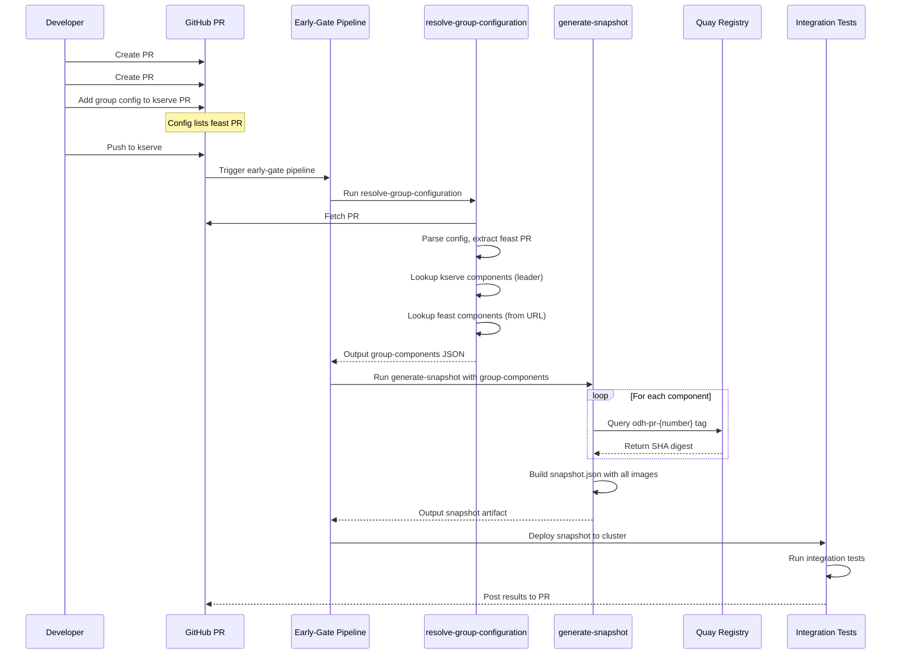

# Group Testing User Guide

**Feature:** PR-Attached Group Testing for Early Gate  
**Pipeline:** `early-gate-component-pipeline` / `early-gate-operator-pipeline`

---

## Overview

Group testing lets you test multiple related PRs together in the early-gate pipeline. Add a simple config to your PR description, and the pipeline automatically builds a combined snapshot with images from all grouped PRs and runs integration tests against it.

---

## Quick Start

Copy this into your **leader PR description**:

```markdown
## Early Gate Testing
https://github.com/opendatahub-io/COLLABORATOR_REPO/pull/COLLABORATOR_PR_NUMBER
```

**Replace:**
- `COLLABORATOR_REPO` with the collaborator repository name
- `COLLABORATOR_PR_NUMBER` with the collaborator PR number

**Important:**
- Only list collaborator PRs (other repos' PRs) - one URL per line
- The leader PR (the one with this config) is automatically included
- Don't include the leader PR link - it's redundant

---

## Complete Example

**In kserve PR #123 description:**

```markdown
## Summary
This PR updates the KServe API to support OAuth2 authentication.

## Early Gate Testing
https://github.com/opendatahub-io/feast/pull/456

## Dependencies
- Depends on Feast PR #456 for OAuth2 client library
- Both PRs must merge together

## Test Plan
- [ ] Unit tests pass
- [ ] Integration tests with Feast
- [ ] OAuth2 flow end-to-end test
```

**What gets tested:**
- kserve #123 - automatically included (leader PR)
- Feast #456 - from config above (collaborator PR)

---

## Multi-Component Example

For changes spanning 3+ repositories:

```markdown
## Early Gate Testing
https://github.com/opendatahub-io/opendatahub-operator/pull/111
https://github.com/opendatahub-io/kubeflow/pull/222
https://github.com/opendatahub-io/notebook-controller/pull/333
```

---

## Configuration Rules

1. **Required heading:** `## Early Gate Testing` (or any heading containing "earlygate", case-insensitive)
2. **PR URLs:** One per line under the heading (bullets/dashes optional, flexible formatting)
3. **URL format:** `https://github.com/opendatahub-io/REPO/pull/NUMBER`
4. **Config block ends at:** Next `##` heading
5. Only PRs from `opendatahub-io` organization are supported
6. PRs from repos not configured for early-gate will trigger a warning

**Flexible formatting examples (all work):**
```markdown
## Early Gate Testing
https://github.com/opendatahub-io/kserve/pull/123
- https://github.com/opendatahub-io/feast/pull/456
  - https://github.com/opendatahub-io/notebook/pull/789
```

---

## How It Works



### Step-by-Step

1. **Developer adds config** to leader PR description listing collaborator PR URLs
2. **Push triggers pipeline** - PipelinesAsCode detects push and launches early-gate pipeline
3. **resolve-group-configuration** fetches PR description from GitHub API, finds the config marker, extracts collaborator PR URLs, and looks up components for each repo in `component_repo_map.json`
4. **generate-snapshot** queries Quay for each component's PR-specific image (`odh-pr-{number}`), falls back to `odh-stable` if not ready
5. **Integration tests** run with the combined snapshot
6. **Results posted** back to the leader PR as a comment with a summary table

---

## Image Resolution

For each component in the group, the pipeline resolves images as follows:

| Scenario | Image Tag | Action |
|----------|-----------|--------|
| PR build complete | `odh-pr-{number}` found | Use PR image (immutable SHA digest) |
| PR build in progress | `odh-pr-{number}` not found | Fallback to `odh-stable` + log warning |
| Both missing | Neither tag exists | Pipeline fails for that component |

All images use **SHA digest references** for reproducibility.

**Best practice:** Ensure all PR builds in the group have completed before triggering the leader PR's group test. Re-trigger with `/test` after collaborator builds complete.

---

## PR Comment Summary

After the build phase, the pipeline posts a summary comment on the leader PR showing:

- PR numbers (clickable links)
- Components from each PR
- Tags used (`odh-pr-XXX` or `odh-stable`)
- Status (ready or fallback)
- Image digests

Warnings appear only when:
- Some components fell back to stable (PR builds not ready)
- Some repos not configured for early-gate (invalid repos skipped)

---

## Best Practices

### DO
- Add config to the **leader PR** (the one you want results on)
- Add cross-references in collaborator PRs: "Part of group: kserve#123"
- Ensure all PR builds complete before triggering group test
- Remove config when done (or when PR closes)

### DON'T
- Add config to multiple PRs in the group (choose one leader)
- Include PRs from outside `opendatahub-io` org (not supported)
- Include the leader PR's own URL in the config (it's automatic)

---

## Triggering the Pipeline

The group test runs automatically when you push to the **leader PR**.

**Manual trigger:**
```
/test
```

**Check status:**
- GitHub PR checks show "early-gate-test" status
- Pipeline logs show which components are included

---

## Troubleshooting

### Config not detected?
- Check for heading containing "Early Gate Testing" or "earlygate"
- Verify URLs are on separate lines under the heading
- Ensure config is in PR description (not a comment)
- Config block ends at next `##` heading

### Invalid repo warning?
- "Repo X is not configured for early-gate testing and was skipped"
- The PR's repository is not in the early-gate system
- Pipeline continues with valid repos only

### PR image not found?
- Check that PR builds have completed
- Look for warning in pipeline logs
- Pipeline falls back to `odh-stable` image
- Re-trigger after builds complete

### Test failed?
- Check which images were used (PR or stable fallback)
- Verify all PRs are ready
- Re-trigger after builds complete

---

## Example Workflow

### Day 1: Create PRs
```bash
gh pr create --repo opendatahub-io/kserve --title "Add OAuth2 support"
# -> PR #123

gh pr create --repo opendatahub-io/feast --title "Update OAuth2 client"
# -> PR #456
```

### Day 2: Add Group Config
Edit kserve PR #123 description to add:

```markdown
## Early Gate Testing
https://github.com/opendatahub-io/feast/pull/456
```

### Day 3: Push Triggers Test
```bash
git push  # to kserve branch
# -> Pipeline runs with both PR images
```

### Day 4: Merge
```bash
# After tests pass, merge both PRs
gh pr merge 123
gh pr merge 456
# Config auto-removed when PR closes
```

---

## FAQ

**Q: Which PR should have the config?**
A: The one you want test results on (the "leader"). Usually the first or most critical PR.

**Q: Should I include the leader PR's link in the config?**
A: No. The leader PR is automatically included. Only list collaborator PRs.

**Q: Can I test PRs from different orgs?**
A: Not yet. All PRs must be in `opendatahub-io` organization.

**Q: What if one PR's image isn't built yet?**
A: Pipeline falls back to `odh-stable` for that component and logs a warning.

**Q: Do I need approval to use this?**
A: No. Self-service. Just add the config and push.

**Q: Does this affect other PRs?**
A: No. Only the leader PR runs group tests. Other PRs run normally.
