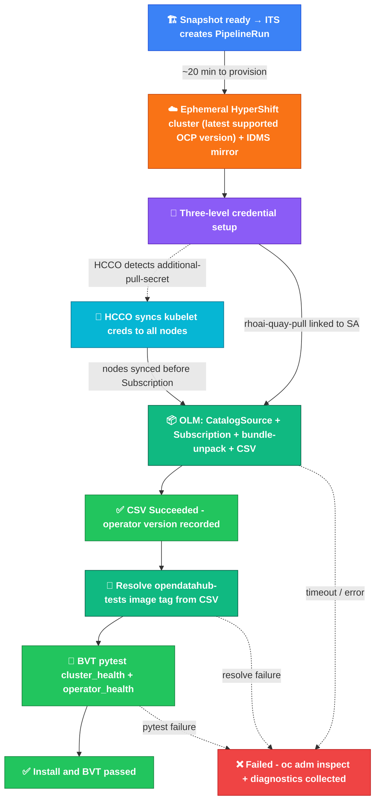

# olminstall Integration Test Scenario

End-to-end Konflux integration test for [ODH](../../doc/contributing-konflux-testing-rhoai.md#odh)/[RHOAI](../../doc/contributing-konflux-testing-rhoai.md#rhoai) operator installation via [OLM](../../doc/contributing-konflux-testing-rhoai.md#olm). Provisions an ephemeral [HyperShift](../../doc/contributing-konflux-testing-rhoai.md#hypershift) cluster using Konflux [EaaS](../../doc/contributing-konflux-testing-rhoai.md#eaas) ([provisioning docs](https://konflux.pages.redhat.com/docs/users/testing/cluster-provisioning.html#methods)), installs the operator from the [FBCF](../../doc/contributing-konflux-testing-rhoai.md#fbc--fbcf) catalog image in the Konflux [Snapshot](../../doc/contributing-konflux-testing-rhoai.md#snapshot), verifies the [CSV](../../doc/contributing-konflux-testing-rhoai.md#csv) reaches `Succeeded`, then runs [BVT](../../doc/contributing-konflux-testing-rhoai.md#bvt) (`opendatahub-tests` `cluster_health` and `operator_health` markers).

**Terms and abbreviations:** [BVT](../../doc/contributing-konflux-testing-rhoai.md#bvt), [CSV](../../doc/contributing-konflux-testing-rhoai.md#csv), [EaaS](../../doc/contributing-konflux-testing-rhoai.md#eaas), [FBC / FBCF](../../doc/contributing-konflux-testing-rhoai.md#fbc--fbcf), [HyperShift](../../doc/contributing-konflux-testing-rhoai.md#hypershift), [IDMS](../../doc/contributing-konflux-testing-rhoai.md#idms), [OLM](../../doc/contributing-konflux-testing-rhoai.md#olm), [Snapshot](../../doc/contributing-konflux-testing-rhoai.md#snapshot), [ITS](../../doc/contributing-konflux-testing-rhoai.md#its), [full glossary](../../doc/contributing-konflux-testing-rhoai.md#terms-and-abbreviations) ([DBus](../../doc/contributing-konflux-testing-rhoai.md#dbus), [DSC](../../doc/contributing-konflux-testing-rhoai.md#dsc), [HCCO](../../doc/contributing-konflux-testing-rhoai.md#hcco), [MCO](../../doc/contributing-konflux-testing-rhoai.md#mco), …).

## Pipeline flow



The `BUILD` node is the entry point for both **automatic** and **manual** runs (see [Triggering](#triggering) and the [contributing guide](../../doc/contributing-konflux-testing-rhoai.md)).

## What it does

1. **Parses the snapshot** — extracts the [FBCF](../../doc/contributing-konflux-testing-rhoai.md#fbc--fbcf) `containerImage` for the configured `FBCF_COMPONENT_NAME`.
2. **provision-eaas-space** — reserves an [EaaS](../../doc/contributing-konflux-testing-rhoai.md#eaas) environment using the `provision-eaas-space` step action from [konflux-ci/build-definitions](https://github.com/konflux-ci/build-definitions) (`main`).
3. **provision-cluster** — shallow-clones `SCRIPTS_REPO_*` (so helpers are on disk), queries EaaS for supported versions via `konflux-ci/build-definitions` step actions, writes the version prefix with [`helpers/resolve_ocp_prefix.py`](helpers/resolve_ocp_prefix.py), resolves the latest patch, then provisions an ephemeral [HyperShift](../../doc/contributing-konflux-testing-rhoai.md#hypershift) cluster (AWS, `m5.2xlarge` by default) using [`helpers/create_eaas_cluster.py`](helpers/create_eaas_cluster.py). Configures an [IDMS](../../doc/contributing-konflux-testing-rhoai.md#idms) mirror: `registry.redhat.io/rhoai` → `quay.io/rhoai`.
4. **install-operator** — clones two repos and runs scripts against the provisioned cluster:
   - [opendatahub-io/odh-konflux-central](https://github.com/opendatahub-io/odh-konflux-central) (`SCRIPTS_REPO_URL` / `SCRIPTS_REPO_REVISION`): provides [`helpers/patch_cluster_pull_secret.py`](helpers/patch_cluster_pull_secret.py) and [`helpers/install_and_verify.py`](helpers/install_and_verify.py).
   - olminstall repo (`OLMINSTALL_REPO_URL` / `OLMINSTALL_REPO_REVISION`): provides the `resources/install-rhods-operator.yaml` template (Namespace + OperatorGroup + Subscription) and `utils/oc_wait.sh` / `utils/oc_approve.sh` utilities. This avoids re-implementing tested [OLM](../../doc/contributing-konflux-testing-rhoai.md#olm) install logic.
   - `patch_cluster_pull_secret.py`: merges `quay.io/rhoai` credentials into the cluster pull secret, creates an `additional-pull-secret` in `kube-system` for [HCCO](../../doc/contributing-konflux-testing-rhoai.md#hcco) node sync (see [Auth strategy](#auth-strategy-for-idms-mirrors)), and creates `rhoai-quay-pull` in `openshift-marketplace`.
   - `install_and_verify.py`: creates the CatalogSource (using the [FBCF](../../doc/contributing-konflux-testing-rhoai.md#fbc--fbcf) image — the part not covered by olminstall), waits for [HCCO](../../doc/contributing-konflux-testing-rhoai.md#hcco) to sync credentials to all nodes, then delegates Subscription creation, InstallPlan approval, and [CSV](../../doc/contributing-konflux-testing-rhoai.md#csv) wait to olminstall's resources and utilities.
5. **parse-pipeline-tests** — runs in parallel with snapshot parsing / provisioning and **must finish before install-operator** (when **`PRODUCT`** is **`rhoai`** or **`odh`**); clones `SCRIPTS_REPO_*` to `/workspace/repo`, runs [`helpers/write_pipeline_test_flags.py`](helpers/write_pipeline_test_flags.py) with param `TESTS` (default `bvt,smoke`) and [`olminstall-tests-config.yaml`](olminstall-tests-config.yaml) to set Tekton results (`RUN_SMOKE`, `RUN_BVT`, `RUN_TIER1`, …). Any phase with `requiredInSelection: true` in that file must appear in `TESTS` (none are required in the default catalog). OLM install runs only when **`PRODUCT`** is not **`none`**; **`TESTS`** selects optional post-install phases (`smoke` placeholder, `bvt`, `tier1` placeholder) independently.
6. **smoke-placeholder** _(when `smoke` is in `TESTS`)_ — no-op step reserved for a future smoke pytest suite (`RUN_SMOKE` from config).
7. **resolve-opendatahub-tests-image-no-install** / **resolve-opendatahub-tests-image-after-install** _(when `bvt` is in `TESTS`)_ — mutually exclusive by **`PRODUCT`**: with **`PRODUCT=none`**, **`no-install`** clones `SCRIPTS_REPO_*` and runs [`helpers/resolve_opendatahub_tests_image.py`](helpers/resolve_opendatahub_tests_image.py) with an empty CSV version (→ **`opendatahub-tests:latest`**). With **`PRODUCT`** **`rhoai`**/**`odh`**, **`after-install`** runs the same helper after **`install-operator`** using the installed CSV version (`skopeo` probe, fallback `:latest`).
8. **bvt-health-checks-no-eaas** / **bvt-health-checks-with-eaas** _(when `bvt` is in `TESTS`)_ — **`no-eaas`** ( **`PRODUCT=none`** ) uses a stub kubeconfig so **`uv run pytest`** still runs and fails against no API. **`with-eaas`** fetches the EaaS kubeconfig and runs the same pytest markers (`cluster_health`, `operator_health`) as before.
9. **tier1-placeholder** _(when `tier1` is in `TESTS`)_ — no-op step reserved for a future tier1 suite.
10. **post-results** — sends a Slack notification (if `SLACK_WEBHOOK_URL` is configured). The Konflux **post-results → Details → Parameters** panel shows **`ARTIFACTS_URL`** (predicted browser path from pipeline params + run name; safe — no `$(tasks.*.results)` reference). **`patch-summary-annotations`** patches **`olminstall.*`** annotations when upload published a different URL, emits Tekton results for the PipelineRun **Results** panel, and prints the full summary in that step’s log. Pass/fail reflects aggregate pipeline task status (skipped optional tasks do not fail the run). **`TEST_OUTPUT`** maps to **`install-operator`** `INSTALL_STATUS` (see [Tekton pipeline results](https://tekton.dev/docs/pipelines/pipelines/#emitting-results-from-a-pipeline)).
11. **collect-diagnostics** _(on failure)_ — runs `oc adm inspect` on the operator namespace and relevant [OLM](../../doc/contributing-konflux-testing-rhoai.md#olm) resources via a `konflux-ci/build-definitions` step action.

### Konflux UI: PipelineRun results, task logs, and files on the step pod

- **PipelineRun / TaskRun logs:** Open your application → **Pipeline runs** (or activity / pipelines for your tenant), select the run, then open individual **tasks** / **steps** to stream logs ([Konflux user flows vary slightly by deployment](https://konflux-ci.dev/docs/getting-started/)).
- **Tekton results surfaced in the UI:** Integration pipelines often expose standard **`TEST_OUTPUT`** and similar task results; Konflux [documents](https://konflux-ci.dev/docs/testing/integration/standardized-outputs/) that task-level results appear when you **click the task name** and inspect the details panel.
- **Pipeline-level results:** The **`PipelineRun` → Results / Summary** area shows values wired under `spec.results` (when emitted); some references are omitted when the source task was skipped.
- **post-results task Results (Konflux):** Open **post-results** (not only `bvt-health-checks-*`) → **Details** → **Results** for **`TEST_OUTPUT`** and **`ARTIFACTS_URL`**, same names as the BVT tasks. The pipeline definition comes from the ITS **`resolverRef` revision** (not only `SCRIPTS_REPO_REVISION`); use the same branch as your fork (e.g. `olminstall-bvt`) for both when testing UI changes.
- **BVT JUnit in the shared artifact browser:** After **`bvt-health-checks-no-eaas`** or **`bvt-health-checks-with-eaas`** completes successfully, JUnit XML and console logs are pushed to **`quay.io/opendatahub/odh-ci-artifacts`** with OCI tag **`<PipelineRun>-bvt`**. The Konflux QE **Artifacts Browser** lists that registry under a path segment (default **`odh-ci-artifacts`** via **`ARTIFACT_BROWSER_REPO_PATH`**). The BVT task **`ARTIFACTS_URL`** result and **`post-results`** / **`olm_pipeline.py`** run summary only show a browser link when **`upload-artifacts`** actually published that result; otherwise they omit the line (if BVT was not in **`TESTS`**) or explain why nothing was uploaded (BVT skipped/failed early).

- **Large files on the pod filesystem:** Files written only inside the pod (**`/artifacts/*.xml`**, **`collect-diagnostics`** **`/diag/diagnostics-bundle.tgz`**, etc.) are **not automatically downloadable as blobs from the Konflux UI** unless a task publishes them as a Tekton **result** (size-limited) or copies them to external storage. In practice you rely on **step logs** (this pipeline **`tee`**s console output into the log) or copy from the pod while it still exists, e.g. **`oc cp <namespace>/<pod>:/artifacts/cluster-health.xml .`** (exact pod name from the TaskRun’s Pod; completed pods may be **deleted after GC**). **Uncertainty:** Red Hat hosted Konflux builds evolve — confirm the exact panel labels (**Pipeline run**, **Task runs**, **Results**) in your tenant.

## Files

| File | Purpose |
|------|---------|
| [`olminstall-pipeline.yaml`](olminstall-pipeline.yaml) | Pipeline: [Snapshot](../../doc/contributing-konflux-testing-rhoai.md#snapshot) → [EaaS](../../doc/contributing-konflux-testing-rhoai.md#eaas) cluster → install → phases from **`TESTS`** (`smoke` placeholder, **`bvt`**, `tier1` placeholder) |
| [`olminstall-tests-config.yaml`](olminstall-tests-config.yaml) | Declarative **phases** (ids, defaults, Tekton `RUN_*` mapping); read by `olm_pipeline.py` and by `parse-pipeline-tests` after cloning `SCRIPTS_REPO` |
| [`helpers/tekton_util.py`](helpers/tekton_util.py) | Shared library: `require_env`, `write_result`, `git_clone` (with optional RH internal TLS workaround), `run`, `parse_junit_summary` |
| [`helpers/create_eaas_cluster.py`](helpers/create_eaas_cluster.py) | Tekton step: provision an ephemeral EaaS HyperShift cluster via `ClusterTemplateInstance` |
| [`helpers/resolve_ocp_prefix.py`](helpers/resolve_ocp_prefix.py) | Tekton step: derive `OCP_VERSION_PREFIX` / default-minor prefix string for EaaS `pick-version` |
| [`helpers/extract_fbcf_image.py`](helpers/extract_fbcf_image.py) | Tekton step: extract FBCF container image from a Konflux `ApplicationSnapshot` JSON |
| [`helpers/resolve_opendatahub_tests_image.py`](helpers/resolve_opendatahub_tests_image.py) | Tekton step: maps installed CSV version to `opendatahub-tests` image tag (`skopeo` probe, `:latest` fallback) |
| [`helpers/run_bvt_pytest.py`](helpers/run_bvt_pytest.py) | Tekton step: parameterised BVT pytest runner (`PYTEST_MARKER`, `PYTEST_EXTRA_ARGS`, `ARTIFACT_PREFIX`) with `uv`/pip fallback |
| [`helpers/emit_test_output.py`](helpers/emit_test_output.py) | Tekton step: parse JUnit XML files and write a Konflux-standardised `TEST_OUTPUT` result |
| [`helpers/collect_diagnostics.py`](helpers/collect_diagnostics.py) | Tekton step: `oc adm inspect` + marketplace diagnostics on failure |
| [`helpers/send_notification.py`](helpers/send_notification.py) | Tekton step: Slack notification summarising pipeline run results |
| [`helpers/patch_cluster_pull_secret.py`](helpers/patch_cluster_pull_secret.py) | Tekton step: injects `quay.io/rhoai` credentials into the [EaaS](../../doc/contributing-konflux-testing-rhoai.md#eaas) cluster at all required levels |
| [`its-olminstall-open-data-hub-tenant.yaml`](its-olminstall-open-data-hub-tenant.yaml) | [ITS](../../doc/contributing-konflux-testing-rhoai.md#its) `odh-olminstall` for [ODH](../../doc/contributing-konflux-testing-rhoai.md#odh) (`open-data-hub-tenant`, `odh-operator-catalog` component) |
| [`its-olminstall-rhoai-tenant.yaml`](its-olminstall-rhoai-tenant.yaml) | [ITS](../../doc/contributing-konflux-testing-rhoai.md#its) `odh-olminstall-testops` for [RHOAI](../../doc/contributing-konflux-testing-rhoai.md#rhoai) sandbox (`rhoai-tenant`, `rhoai-fbc-fragment-ocp-421`) |
| [`helpers/tests_plan.py`](helpers/tests_plan.py) | Validates/normalizes `TESTS` strings using [`olminstall-tests-config.yaml`](olminstall-tests-config.yaml) (or `--tests-config`) |
| [`helpers/install_and_verify.py`](helpers/install_and_verify.py) | Tekton step: creates [OLM](../../doc/contributing-konflux-testing-rhoai.md#olm) resources, waits for [CSV](../../doc/contributing-konflux-testing-rhoai.md#csv) `Succeeded`, writes `INSTALL_STATUS` |
| [`olm_pipeline.py`](olm_pipeline.py) | Local CLI — apply ITS with optional overrides, create a [Snapshot](../../doc/contributing-konflux-testing-rhoai.md#snapshot), and stream logs. Default **`--product none`** injects pipeline param **`PRODUCT=none`**: EaaS cluster + operator install are skipped; **`--product rhoai`** / **`odh`** runs the full install path (optionally with **`--image`** to override the snapshot FBC/catalog digest). **`TESTS`** is independent (for example **`--tests bvt`** still selects BVT when install is skipped). |
| [`requirements.txt`](requirements.txt) | Documents Python deps for this directory (stdlib-only for [`olm_pipeline.py`](olm_pipeline.py) and [`helpers/`](helpers/); no `pip install` required) |
| [`test-snapshot.yaml`](test-snapshot.yaml) | Example [Snapshot](../../doc/contributing-konflux-testing-rhoai.md#snapshot) for manual pipeline trigger |
| [`helpers/prune_stale_testops_its.py`](helpers/prune_stale_testops_its.py) | Optional: `oc delete` legacy `IntegrationTestScenario` names before raw `oc create -f test-snapshot.yaml` (same list as trigger-time prune) |
| [`test-pipelinerun.yaml`](test-pipelinerun.yaml) | Example [PipelineRun](../../doc/contributing-konflux-testing-rhoai.md#pipelinerun) for local/manual execution |

## Tenant and application

[`its-olminstall-open-data-hub-tenant.yaml`](its-olminstall-open-data-hub-tenant.yaml) targets **`open-data-hub-tenant`**, application **`opendatahub-builds`**, context `component_odh-operator-catalog`, triggering on [ODH](../../doc/contributing-konflux-testing-rhoai.md#odh) [FBCF](../../doc/contributing-konflux-testing-rhoai.md#fbc--fbcf) builds.

[`its-olminstall-rhoai-tenant.yaml`](its-olminstall-rhoai-tenant.yaml) targets **`rhoai-tenant`**, application **`testops-playpen`**, used for development iteration and sandbox testing of the [RHOAI](../../doc/contributing-konflux-testing-rhoai.md#rhoai) FBC fragment builds.

**Why extra PipelineRuns appear:** A Konflux [Snapshot](../../doc/contributing-konflux-testing-rhoai.md#snapshot) for an **Application** starts **one `PipelineRun` per `IntegrationTestScenario`** that matches that app. Old scenarios still **on the cluster** (for example `rhoai-test` → `testops-e2e-test`) are **not** removed when you update git; they keep firing until deleted. **`testops-playpen-enterprise-contract-*`** runs are **Enterprise Contract** policy checks — separate from olminstall; tune or disable them in Konflux application / release / EC settings for your tenant, not via `olminstall-pipeline.yaml`.

**`olm_pipeline.py` default:** For default **`--namespace rhoai-tenant`** and **`--app testops-playpen`**, before `oc apply` + Snapshot the CLI runs **`oc delete integrationtestscenario`** for the legacy name `rhoai-test` so you typically only see **`odh-olminstall-testops-*`** from this repo’s ITS. Pass **`--no-prune-stale-its`** to skip that delete. Raw **`oc create -f test-snapshot.yaml`** does not prune — use the CLI or run [`helpers/prune_stale_testops_its.py`](helpers/prune_stale_testops_its.py) first.

> **Pipeline name:** [`olminstall-pipeline.yaml`](olminstall-pipeline.yaml) defines `metadata.name: odh-olminstall-test`. In-tree [ITS](../../doc/contributing-konflux-testing-rhoai.md#its) objects are `odh-olminstall` (ODH) and `odh-olminstall-testops` (RHOAI sandbox). `--list` includes every `PipelineRun` for the selected application label (for example olminstall, enterprise-contract, or any other ITS graph).

The pipeline also needs a tenant secret with quay credentials. Each ITS sets `QUAY_PULL_SECRET_NAME`:
- `its-olminstall-open-data-hub-tenant.yaml` uses `odh-quay-secret`
- `its-olminstall-rhoai-tenant.yaml` uses `rhoai-quay-secret`

Channel defaults:
- `its-olminstall-open-data-hub-tenant.yaml` sets `UPDATE_CHANNEL=odh-stable` for Konflux auto-triggered [ODH](../../doc/contributing-konflux-testing-rhoai.md#odh) runs
- `python3 …/olm_pipeline.py --product odh` auto-selects `odh-stable` unless `--channel` is explicitly provided

## Auth strategy for IDMS mirrors

The [RHOAI](../../doc/contributing-konflux-testing-rhoai.md#rhoai) operator bundle images are referenced in the [FBC](../../doc/contributing-konflux-testing-rhoai.md#fbc--fbcf) as `registry.redhat.io/rhoai/odh-operator-bundle@sha256:...` but are only accessible at `quay.io/rhoai/`. The pipeline configures an [IDMS](../../doc/contributing-konflux-testing-rhoai.md#idms) mirror at cluster provisioning to redirect `registry.redhat.io/rhoai` → `quay.io/rhoai`.

However, [OLM's](../../doc/contributing-konflux-testing-rhoai.md#olm) bundle-unpack job runs on a worker node via [CRI-O](../../doc/contributing-konflux-testing-rhoai.md#cri-o), and [CRI-O](../../doc/contributing-konflux-testing-rhoai.md#cri-o) < 1.34 (OCP ≤ 4.20) has a known bug ([cri-o/cri-o#4941](https://github.com/cri-o/cri-o/issues/4941)): **pod-level `imagePullSecrets` are not forwarded to [IDMS](../../doc/contributing-konflux-testing-rhoai.md#idms) mirror registry pulls**. OpenShift documentation explicitly states that for [IDMS](../../doc/contributing-konflux-testing-rhoai.md#idms) mirror registries, only the cluster-wide global pull secret is supported — not project or pod pull secrets.

In a standard cluster, updating the global pull secret propagates via the Machine Config Operator ([MCO](../../doc/contributing-konflux-testing-rhoai.md#mco)). In [HyperShift](../../doc/contributing-konflux-testing-rhoai.md#hypershift), [MCO](../../doc/contributing-konflux-testing-rhoai.md#mco) changes trigger **node replacement** (not in-place update), which takes 15-30 minutes — too slow for an ephemeral integration test.

**Solution:** `patch_cluster_pull_secret.py` creates a secret named `additional-pull-secret` in `kube-system`. [HyperShift's](../../doc/contributing-konflux-testing-rhoai.md#hypershift) **Hosted Cluster Config Operator ([HCCO](../../doc/contributing-konflux-testing-rhoai.md#hcco))** automatically detects this secret and deploys a `global-pull-secret-syncer` DaemonSet in `kube-system` that:
- Merges credentials into `/var/lib/kubelet/config.json` on each node
- Restarts kubelet via systemd [DBus](../../doc/contributing-konflux-testing-rhoai.md#dbus)

This is the **official [HyperShift](../../doc/contributing-konflux-testing-rhoai.md#hypershift) mechanism** for propagating pull-secret changes without node replacement. `install_and_verify.py` waits for the syncer to complete on all nodes before creating the Subscription.

> **Note:** Use namespace-specific credential keys (e.g. `quay.io/rhoai`) rather than bare `quay.io` in `additional-pull-secret`. [HCCO](../../doc/contributing-konflux-testing-rhoai.md#hcco) applies original-pull-secret entries with higher precedence on conflict, so namespace-specific keys avoid being overridden.

## Triggering

- **Automatic (Konflux CI):** New [Snapshot](../../doc/contributing-konflux-testing-rhoai.md#snapshot) → matching [ITS](../../doc/contributing-konflux-testing-rhoai.md#its) → [PipelineRun](../../doc/contributing-konflux-testing-rhoai.md#pipelinerun). Example ITS: [`its-olminstall-open-data-hub-tenant.yaml`](its-olminstall-open-data-hub-tenant.yaml), [`its-olminstall-rhoai-tenant.yaml`](its-olminstall-rhoai-tenant.yaml).
- **Manual (CLI):** [`olm_pipeline.py`](olm_pipeline.py) applies or overrides the sandbox [ITS](../../doc/contributing-konflux-testing-rhoai.md#its), resolves an image when needed, creates a test [Snapshot](../../doc/contributing-konflux-testing-rhoai.md#snapshot), and streams logs.
- **Manual (`oc` only):** After [logging in](../../doc/contributing-konflux-testing-rhoai.md#log-in-and-pick-a-namespace) to the tenant namespace, apply an [ITS](../../doc/contributing-konflux-testing-rhoai.md#its), then create a [Snapshot](../../doc/contributing-konflux-testing-rhoai.md#snapshot) (pinned file or latest image for your app label). Example for the [RHOAI](../../doc/contributing-konflux-testing-rhoai.md#rhoai) sandbox [ITS](../../doc/contributing-konflux-testing-rhoai.md#its) and `rhoai-fbc-fragment-ocp-421`:

```bash
oc apply -n rhoai-tenant -f integration-tests/olminstall/its-olminstall-rhoai-tenant.yaml
oc create -n rhoai-tenant -f integration-tests/olminstall/test-snapshot.yaml
# Or substitute the latest snapshot image (adjust -l / jsonpath for your application):
LATEST=$(oc get snapshots -n rhoai-tenant \
  --sort-by=.metadata.creationTimestamp \
  -l appstudio.openshift.io/application=rhoai-fbc-fragment-ocp-421 \
  -o jsonpath='{.items[-1].spec.components[0].containerImage}')
sed "s|containerImage:.*|containerImage: $LATEST|" \
  integration-tests/olminstall/test-snapshot.yaml | oc create -n rhoai-tenant -f -
oc get pipelinerun -n rhoai-tenant
python3 integration-tests/olminstall/olm_pipeline.py --watch -n rhoai-tenant --app testops-playpen
```

For generic Konflux testing (login, namespaces, [PipelineRun](../../doc/contributing-konflux-testing-rhoai.md#pipelinerun) vs [Snapshot](../../doc/contributing-konflux-testing-rhoai.md#snapshot)/[ITS](../../doc/contributing-konflux-testing-rhoai.md#its)), see [contributing guide](../../doc/contributing-konflux-testing-rhoai.md#terms-and-abbreviations).

Tooling for local debug commands in this section:
- `oc` (required)
- `python3` (required for [`olm_pipeline.py`](olm_pipeline.py); use **`--watch`** to stream logs or replay from KubeArchive)
- `tkn` (optional; trigger mode uses it when installed, otherwise polls with `oc`)
- `skopeo` (optional; used by `--product odh` when Konflux snapshots are unavailable)
- `yq` (required for `olm_pipeline.py` trigger/apply: the CLI always patches ITS param **`PRODUCT`** to match **`--product`**, plus any of `--konflux-repo`, `--konflux-branch`, `--channel`, `--ocp-version`, non-default **`--tests`**, **`--slack-channel-id`**, or **`--product odh`** operator overrides)

Quick watch after triggering (newest olminstall run for the app; add a PipelineRun name after `--watch` to target one run):

```bash
python3 integration-tests/olminstall/olm_pipeline.py --watch -n rhoai-tenant --app testops-playpen
```

## Parameters (Pipeline)

| Parameter | Default | Description |
|-----------|---------|-------------|
| `FBCF_COMPONENT_NAME` | `odh-operator-catalog` | [Snapshot](../../doc/contributing-konflux-testing-rhoai.md#snapshot) component name for the [FBCF](../../doc/contributing-konflux-testing-rhoai.md#fbc--fbcf) catalog image ([ITS](../../doc/contributing-konflux-testing-rhoai.md#its) overrides to `rhoai-fbc-fragment-ocp-421` for [RHOAI](../../doc/contributing-konflux-testing-rhoai.md#rhoai)) |
| `UPDATE_CHANNEL` | `stable` | [OLM](../../doc/contributing-konflux-testing-rhoai.md#olm) subscription channel |
| `OPERATOR_NAMESPACE` | `redhat-ods-operator` | Namespace for operator installation (must match [OLM](../../doc/contributing-konflux-testing-rhoai.md#olm) package expectations; `install_and_verify.py` adapts olminstall manifests to this namespace) |
| `OPERATOR_NAME` | `rhods-operator` | [OLM](../../doc/contributing-konflux-testing-rhoai.md#olm) package via olminstall `install-operator.sh`. [RHOAI](../../doc/contributing-konflux-testing-rhoai.md#rhoai) and **ODH `odh-stable`** (Konflux catalog) both use **`rhods-operator`** (same as Jenkins `odhTestConfigOperator`). Upstream ODH channels outside `odh-stable` / `odh-nightlies` may use `opendatahub-operator` — see Jenkins `generateTestConfigFile.groovy`. |
| `HYPERSHIFT_INSTANCE_TYPE` | `m5.2xlarge` | AWS worker instance type for the ephemeral [HyperShift](../../doc/contributing-konflux-testing-rhoai.md#hypershift) cluster |
| `SCRIPTS_REPO_URL` | `https://github.com/opendatahub-io/odh-konflux-central.git` | Repo that provides `integration-tests/olminstall/helpers/` (`patch_cluster_pull_secret.py`, `install_and_verify.py`) |
| `SCRIPTS_REPO_REVISION` | `main` | Branch/SHA of the scripts repo |
| `OLMINSTALL_REPO_URL` | `https://gitlab.cee.redhat.com/data-hub/olminstall.git` | olminstall repo with tested OLM manifests (`resources/install-rhods-operator.yaml`) and `utils/` helpers |
| `OLMINSTALL_REPO_REVISION` | `main` | Branch/SHA of the olminstall repo |
| `OLMINSTALL_CATALOG_NAME` | `rhoai-catalog-dev` | CatalogSource name used by olminstall's `install-operator.sh` |
| `QUAY_PULL_SECRET_NAME` | `rhoai-quay-secret` | Tenant secret mounted for `quay.io/rhoai` credentials (`its-olminstall-open-data-hub-tenant.yaml` overrides to `odh-quay-secret`) |
| `PRODUCT` | `rhoai` (pipeline default); ITS examples set `rhoai` / `odh` | When **`none`**, Tekton skips **`provision-eaas-space`**, **`provision-cluster`**, and **`install-operator`**. **`rhoai`** / **`odh`** runs the full EaaS + install path. The CLI injects this from **`--product`**. |
| `OPENDATAHUB_TESTS_REPO` | `quay.io/opendatahub/opendatahub-tests` | Image repository (no tag) for [BVT](../../doc/contributing-konflux-testing-rhoai.md#bvt); tag derived from installed CSV when install ran, else from **`resolve_opendatahub_tests_image.py`** (empty version → `latest`) |
| `TESTS` | `bvt,smoke` | Comma-separated **phase ids** from [`olminstall-tests-config.yaml`](olminstall-tests-config.yaml) in `SCRIPTS_REPO`. Include every phase marked `requiredInSelection: true` (the default file has none). **`smoke`** selects the **`smoke-placeholder`** task until a real smoke suite exists. **`bvt`** runs **`bvt-health-checks-with-eaas`** when **`PRODUCT`** is **`rhoai`** or **`odh`**, and **`bvt-health-checks-no-eaas`** when **`PRODUCT=none`** (pytest against a stub kubeconfig until external kube is wired). Override via ITS or `olm_pipeline.py --tests` / `--tests-config`. |

Sandbox development may override `SCRIPTS_*` / `OLMINSTALL_*` (and the ITS `resolverRef` URL/revision) so Konflux runs a pipeline revision that is not yet on `main`; see [`its-olminstall-rhoai-tenant.yaml`](its-olminstall-rhoai-tenant.yaml).

## Local CLI: `olm_pipeline.py`

From the repo root, invoke `python3 integration-tests/olminstall/olm_pipeline.py` (paths shown below assume that working directory). With **no arguments**, it prints the same usage as `--help`. Use it for local Konflux olminstall workflows (trigger a run, watch logs, list runs, or query supported OCP). It can:
- List latest PipelineRuns for the selected app (`--list-pipelines [N]`, default `10`), including archived runs from KubeArchive
- Apply the [ITS](../../doc/contributing-konflux-testing-rhoai.md#its) safely on repeated runs
- Resolve an image (explicit `--image`, **`--product rhoai`** with optional `--version`, **`--product odh`**, or **`--product none`** to keep the snapshot’s pinned image)
- Inject ITS overrides (`PRODUCT` from **`--product`**, `SCRIPTS_REPO_*`, `UPDATE_CHANNEL`, `--tests` → ITS param `TESTS`)
- Watch your latest owned PipelineRun or a specific one (`--watch [PIPELINERUN]`), with KubeArchive fallback for runs pruned from the cluster
- Create a [Snapshot](../../doc/contributing-konflux-testing-rhoai.md#snapshot), stream logs, and print a Konflux URL summary

**Default `--product` is `none`:** the ITS gets **`PRODUCT=none`** — Konflux skips EaaS provisioning and operator install. If **`TESTS`** includes **`bvt`**, **`bvt-health-checks-no-eaas`** still runs pytest (against a stub kubeconfig) so results reflect test failures rather than skipped tasks. Omit **`bvt`** from **`TESTS`** if you only want **`extract-fbcf-image`** / snapshot validation without pytest. Pass **`--product rhoai`** (or **`odh`**) for a full install + EaaS BVT. **`--image`** overrides the snapshot FBC/catalog digest when install runs (still requires **`--product rhoai`** or **`odh`** so install is not skipped). A future option may accept an existing cluster API URL / kubeconfig from this CLI.

Examples:

```bash
# Show usage (same as no arguments or --help)
python3 integration-tests/olminstall/olm_pipeline.py --help

# Watch your latest owned olminstall PipelineRun
python3 integration-tests/olminstall/olm_pipeline.py --watch

# Watch a specific existing PipelineRun
python3 integration-tests/olminstall/olm_pipeline.py --watch odh-olminstall-testops-xxxxx

# List latest PipelineRuns for selected app (default 10)
python3 integration-tests/olminstall/olm_pipeline.py --list-pipelines

# List latest 20 PipelineRuns for selected app
python3 integration-tests/olminstall/olm_pipeline.py --list-pipelines 20

# Show usage/help
python3 integration-tests/olminstall/olm_pipeline.py --help

# Latest FBCF across rhoai-v* apps
python3 integration-tests/olminstall/olm_pipeline.py --product rhoai

# Pin exact image
python3 integration-tests/olminstall/olm_pipeline.py \
  --image quay.io/rhoai/rhoai-fbc-fragment@sha256:<digest>

# Test scripts from a fork
python3 integration-tests/olminstall/olm_pipeline.py \
  --konflux-repo https://github.com/you/odh-konflux-central.git \
  --konflux-branch your-feature-branch

# Resolve latest FBCF from a specific RHOAI version stream
python3 integration-tests/olminstall/olm_pipeline.py --product rhoai --version 3.5

# Pin ephemeral cluster OpenShift minor (latest patch resolved by EaaS; needs yq)
python3 integration-tests/olminstall/olm_pipeline.py --product rhoai --ocp-version 4.19

# Override OLM channel
python3 integration-tests/olminstall/olm_pipeline.py --channel beta

# OLM install + smoke placeholder only (skip BVT and tier1)
python3 integration-tests/olminstall/olm_pipeline.py --product rhoai --tests smoke

# Install + BVT health pytest only (omit smoke / tier1 tokens from TESTS)
python3 integration-tests/olminstall/olm_pipeline.py --product rhoai --tests bvt

# Full default phases + tier1 no-op placeholder
python3 integration-tests/olminstall/olm_pipeline.py --product rhoai --tests bvt,smoke,tier1

# Custom phases file (same schema as olminstall-tests-config.yaml; needs PyYAML or yq)
python3 integration-tests/olminstall/olm_pipeline.py --product rhoai \
  --tests-config /path/to/my-olminstall-tests.yaml --tests bvt,smoke

# Trigger against ODH (uses sandbox ITS with ODH-specific pipeline params)
python3 integration-tests/olminstall/olm_pipeline.py --product odh

```

**Without a Konflux cluster / RHOAI pipeline context**, a full `olm_pipeline.py` trigger or watch (including **`--tests bvt`**) will fail at **`oc whoami`** or **`ensure_konflux_cluster`** — that is expected. The standalone checker **[`verify_cli_args.py`](verify_cli_args.py)** only validates argument parsing and **should pass** without `oc`. A **future** option may accept an existing cluster API URL (or equivalent) for workflows that do not use this Konflux tenant; that is not implemented yet.

Omit `--konflux-repo`/`--konflux-branch` to keep the ITS default Git source for the remote pipeline definition. If you see **`CouldntGetPipeline`** / **`olminstall-pipeline.yaml`: file does not exist**, the default revision does not ship that path yet—use **`--konflux-repo`** + **`--konflux-branch`** on a fork/branch where `integration-tests/olminstall/olminstall-pipeline.yaml` exists. Trigger mode prints a **WARN** when **`--konflux-repo` is set without `--konflux-branch`** (resolver revision may stay at the ITS YAML default, e.g. `main`); omitting both flags uses the committed ITS default with no such warning.

> **Concurrent runs:** The CLI does not take a cluster-side lock. If two users run the script simultaneously against the same namespace, both may create Snapshots and trigger separate PipelineRuns. **Trigger mode always starts a new run** (it does not attach to an already-running PipelineRun). If you still have a run in progress for the same app, the helper prints an **INFO** with a copy-pastable `--watch <pipelinerun>` command so you can stream that run instead. Use `--watch` (no name) to follow your newest owned olminstall run for `--app`, or `--watch <pipelinerun>` for an explicit run. On normal exit the helper deletes your trigger Snapshot; **Ctrl-C while streaming logs only detaches locally** — the PipelineRun keeps running and the Snapshot is left in place. Deleting a Snapshot mid-run is non-fatal to the PipelineRun (which has already resolved the snapshot). To avoid confusion, coordinate with your team before triggering manually in a shared namespace.

If a freshly-created Snapshot takes time to trigger, `olm_pipeline.py` waits up to `PR_APPEAR_TIMEOUT_SECONDS` (default `600`) for the corresponding PipelineRun before failing. On this timeout path, it keeps the test Snapshot so a delayed run can still be followed with `--watch` (or `--watch <name>` once the PipelineRun name is visible in the Konflux UI).

> **Archived runs (KubeArchive):** Completed PipelineRuns are pruned from the live cluster by Tekton Results / cluster GC shortly after completion. `--list-pipelines` and `--watch` automatically fall back to the [KubeArchive](https://konflux-ci.dev/architecture/core/pipeline-service/) REST API to retrieve pruned runs and replay their logs. The `KA_HOST` environment variable can override the KubeArchive endpoint if needed. If KubeArchive is unreachable, the script degrades gracefully to live-only data.

For `--product rhoai`, use `--version` in `x.y` form (for example `3.5`).

### Channel behavior for current `rhoai-v3-5-ea-1` FBCF

For the current fragment image (`quay.io/rhoai/rhoai-fbc-fragment@sha256:dc61ae73...`), OLM channel heads are:

| Channel | Latest operator |
|---------|------------------|
| `stable` | `rhods-operator.2.25.5` |
| `stable-3.x` | `rhods-operator.3.4.0` |
| `stable-3.4` | `rhods-operator.3.4.0` |
| `beta` | `rhods-operator.3.4.0-ea.1` |
| `fast-3.x` | `rhods-operator.3.3.1` |

`olm_pipeline.py` auto-selects `stable-3.x` when it resolves an image from a `rhoai-v3-*` app and no `--channel` is passed.

Examples:

```bash
# Default for rhoai-v3-* image resolution: auto channel stable-3.x
python3 integration-tests/olminstall/olm_pipeline.py --product rhoai

# Explicitly force stable-3.x
python3 integration-tests/olminstall/olm_pipeline.py --channel stable-3.x

# Use EA channel
python3 integration-tests/olminstall/olm_pipeline.py --channel beta
```

## Test phases configuration (`olminstall-tests-config.yaml`)

Phase ids, defaults, and which Tekton results (`RUN_SMOKE`, `RUN_BVT`, `RUN_TIER1`, …) each phase toggles live in [`olminstall-tests-config.yaml`](olminstall-tests-config.yaml), similar in spirit to Jenkins component lists such as `components-tests.yaml`. The Konflux pipeline clones `SCRIPTS_REPO` and evaluates that file at runtime, so changing phases does not require editing Python token lists.

When you add a new phase that should drive pipeline `when:` branches, extend **both** the YAML (`setsPipelineResults`) and [`olminstall-pipeline.yaml`](olminstall-pipeline.yaml) (new `results`, `parse-pipeline-tests` wiring, and tasks).

## Rebasing on upstream `main`

[opendatahub-io/odh-konflux-central#362](https://github.com/opendatahub-io/odh-konflux-central/pull/362) is merged. For follow-up work, rebase (or branch) from current upstream `main`:

```bash
git fetch upstream
git rebase upstream/main
# or: git switch -c my-feature upstream/main
```

To base a branch on another open upstream PR, fetch its head by number (`N`):

```bash
git fetch upstream pull/N/head:pr-upstream-N
git switch -c my-follow-up pr-upstream-N
```

## BVT on an existing cluster (outside this CLI)

BVT pytest (`cluster_health` / `operator_health`) runs when `bvt` is included in `TESTS`. With **`PRODUCT`** **`rhoai`** or **`odh`**, task **`bvt-health-checks-with-eaas`** uses the EaaS kubeconfig after install. With **`PRODUCT=none`**, task **`bvt-health-checks-no-eaas`** still runs pytest against a **stub kubeconfig** (no real API) so failures come from the test harness, not from skipped tasks. A future option may supply a real kubeconfig when **`PRODUCT=none`**. The [`opendatahub-io/opendatahub-tests`](https://github.com/opendatahub-io/opendatahub-tests) container is built with **`uv sync`** and **`ENTRYPOINT ["uv", "run", "pytest"]`**; the pipeline uses **`uv run pytest …`** from the repo root so the same dependency set applies (bare `python3 -m pytest` skips that venv). To re-run only those checks locally, use `uv run pytest …` from a clone, or see tasks **`bvt-health-checks-*`** in [`olminstall-pipeline.yaml`](olminstall-pipeline.yaml) for the exact flags.

## Failure diagnostics vs BVT logs

On pipeline **failure**, **collect-diagnostics** writes large `oc adm inspect` / YAML data under `/diag` on the TaskRun pod and a **small** `DIAGNOSTICS_MANIFEST` Tekton result (file listing + short excerpts). The main log stream stays readable; pull `/diag/diagnostics-bundle.tgz` from the completed **collect-diagnostics** pod with `oc cp` if you need the full bundle.

## Slack notifications

The `post-results` task posts to Slack when **`SLACK_WEBHOOK_URL`** is set. The message uses aggregate pipeline task status (`Succeeded` when every non-finally task that ran has succeeded; optional phases skipped via `TESTS` do not count as failure). Create an optional Secret in the tenant namespace:

```text
Name: slack-webhook
Key:  webhook-url   (full Slack incoming webhook URL)
```

If the Secret is absent, the step logs the message and exits without failing the run.

## Maintenance

- **Image digest pins** — Some steps in [`olminstall-pipeline.yaml`](olminstall-pipeline.yaml) pin tool images by digest (e.g. `konflux-test:stable@sha256:…`) so runs stay reproducible; refresh those digests on whatever cadence your team uses and re-run the pipeline after each bump.
- **BVT image** — **`resolve-opendatahub-tests-image-*`** tasks use `quay.io/konflux-ci/konflux-test` (clone + `skopeo` in the resolve step) and a versioned or `:latest` [`opendatahub-tests`](https://quay.io/repository/opendatahub/opendatahub-tests) image. **`bvt-health-checks-*`** runs **`uv run pytest`** where available (see upstream [`Dockerfile`](https://github.com/opendatahub-io/opendatahub-tests/blob/main/Dockerfile) and [`pyproject.toml`](https://github.com/opendatahub-io/opendatahub-tests/blob/main/pyproject.toml): `pytest`, `openshift-python-wrapper`, `pytest-testconfig`, `structlog`, etc.). JUnit + console logs live under **`/artifacts`** on the TaskRun pod until pruned.
