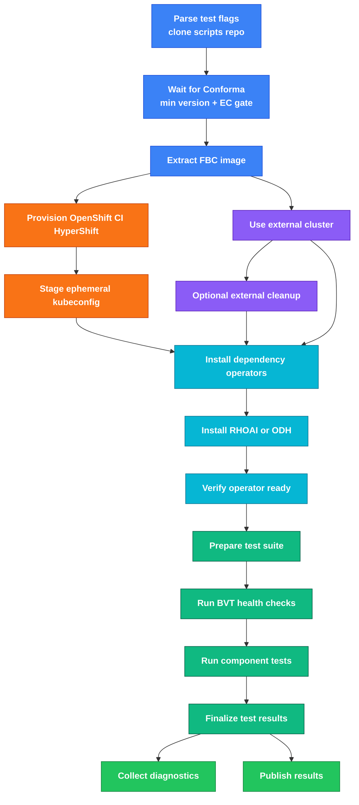

# olminstall Integration Test Scenario

End-to-end Konflux integration test for [ODH](../../doc/contributing-konflux-testing-rhoai.md#odh)/[RHOAI](../../doc/contributing-konflux-testing-rhoai.md#rhoai) operator installation via [OLM](../../doc/contributing-konflux-testing-rhoai.md#olm). Provisions an ephemeral [HyperShift](../../doc/contributing-konflux-testing-rhoai.md#hypershift) cluster using OpenShift CI [`provision-ephemeral-cluster`](https://github.com/openshift/konflux-tasks/tree/main/tasks/provision-ephemeral-cluster/0.1), installs the operator from the [FBCF](../../doc/contributing-konflux-testing-rhoai.md#fbc--fbcf) catalog image in the Konflux [Snapshot](../../doc/contributing-konflux-testing-rhoai.md#snapshot), verifies the [CSV](../../doc/contributing-konflux-testing-rhoai.md#csv) reaches `Succeeded`, then runs [BVT](../../doc/contributing-konflux-testing-rhoai.md#bvt) (`opendatahub-tests` `cluster_health` and `operator_health` markers).

**Operational runbook** (ephemeral OpenShift CI vs external kubeconfig, tenant secrets, `maas_billing` prereqs, trigger/watch): [contributing guide](../../doc/contributing-konflux-testing-rhoai.md) and [Triggering](#triggering) below. This README focuses on pipeline architecture and in-tree files.

**Terms and abbreviations:** [BVT](../../doc/contributing-konflux-testing-rhoai.md#bvt), [CSV](../../doc/contributing-konflux-testing-rhoai.md#csv), [EPHC](../../doc/contributing-konflux-testing-rhoai.md#ephc), [FBC / FBCF](../../doc/contributing-konflux-testing-rhoai.md#fbc--fbcf), [HyperShift](../../doc/contributing-konflux-testing-rhoai.md#hypershift), [IDMS](../../doc/contributing-konflux-testing-rhoai.md#idms), [OLM](../../doc/contributing-konflux-testing-rhoai.md#olm), [Snapshot](../../doc/contributing-konflux-testing-rhoai.md#snapshot), [ITS](../../doc/contributing-konflux-testing-rhoai.md#its), [full glossary](../../doc/contributing-konflux-testing-rhoai.md#terms-and-abbreviations) ([DBus](../../doc/contributing-konflux-testing-rhoai.md#dbus), [DSC](../../doc/contributing-konflux-testing-rhoai.md#dsc), [HCCO](../../doc/contributing-konflux-testing-rhoai.md#hcco), [MCO](../../doc/contributing-konflux-testing-rhoai.md#mco), …).

## Test layers

| Layer | Path / entry | Runs on | Purpose |
|-------|----------------|---------|---------|
| **Konflux integration** | `integration-tests/olminstall/` (Tekton pipeline, `olm_pipeline.py`) | Live cluster (EPHC or external kubeconfig) | Operator install, BVT, per-component pytest gates |
| **Pipeline unit tests** | `unit_tests/` (`pytest.ini` → `testpaths = unit_tests`) | Developer machine / CI (no `oc`) | CLI parsing, Tekton step logic, catalog/plan helpers |
| **opendatahub-tests** | Cloned at runtime into test image | Cluster under test | Actual product pytest (`tests/workbenches/`, …) |

**Naming:** repo directories use **kebab-case** (`integration-tests/`); importable Python packages use **snake_case** (`unit_tests/`, `steps.*`, `runners.*`, `suite.*`). Do not rename `integration-tests/` to match pytest style - the names refer to different layers.

## Directory layout

| Path | Role |
|------|------|
| [`tekton/`](tekton/) | Tekton pipelines, tasks, ITS, shell scripts (`python -m steps.*` / `runners.*` from YAML) |
| [`steps/`](steps/) | Tekton step entrypoints (`write_pipeline_test_flags`, `summarize_test_output`, diagnostics, …) |
| [`runners/`](runners/) | Test orchestration (BVT, per-component pytest/golang/Cypress) and [`runners/cli/`](runners/cli/) for `olm_pipeline.py` |
| [`runners/report/`](runners/report/) | JUnit aggregation, Slack, PipelineRun summary, artifact URLs |
| [`install/`](install/) | OLM install, pull secret, dependency operators, DSC policy |
| [`suite/`](suite/) | Catalog, plan, phases, constants, tests-config parsing |
| [`k8s/`](k8s/) | `oc` helpers, external kubeconfig, cluster probes |
| [`components/`](components/) | Component-specific prereqs (e.g. `maas_billing/`) |
| [`config/`](config/) | Phase config, smoke catalog, DSC install map, example Snapshot/PipelineRun |

**Test artifacts:** JUnit and logs land in **`tests-payload/results/`** on the Tekton `tests-shared` workspace (created at runtime, not a source tree directory).

## Pipeline flow

Phases: **setup → cluster/install → prepare → test gates → report**.  
`SCRIPTS_REPO` is cloned once in **`parse-pipeline-tests`** into **`tests-shared/scripts-repo`**; later tasks read that PVC. Entry is a Konflux [Snapshot](../../doc/contributing-konflux-testing-rhoai.md#snapshot) (ITS auto) or a direct CLI / **`--run-its`** PipelineRun (see [Triggering](#triggering)).



**Legend:** blue setup · orange ephemeral HyperShift · purple external · cyan install · green tests/report.  
Skipped nodes are normal: ephemeral vs external vs test-only `PRODUCT` (empty), Conforma **skip**, or a **`COMPONENTS`** subset.
## What it does

1. **parse-pipeline-tests** - runs first; shallow-clones `SCRIPTS_REPO_*` into **`tests-shared/scripts-repo`** (once per PipelineRun), then runs [`steps/write_pipeline_test_flags.py`](steps/write_pipeline_test_flags.py) with params **`TEST_GATES`** (default `bvt,smoke`), **`COMPONENTS`**, [`config/olminstall-tests-config.yaml`](config/olminstall-tests-config.yaml), and [`config/olminstall-components-smoke.yaml`](config/olminstall-components-smoke.yaml) to set Tekton results (`RUN_SMOKE`, `RUN_BVT`, `RUN_MINIMAL_DEPS`, `RUN_OPENDATAHUB_TESTS`, …). Downstream tasks read the same checkout from the PVC.
2. **wait-for-conforma** - **`runAfter`** **`parse-pipeline-tests`**; for **`PRODUCT=rhoai`** ITS auto-runs, skips e2e when the triggering Snapshot PAC metadata shows a catalog line below **`MIN_RHOAI_VERSION`** (default `3.5`, e.g. `rhoai-2.25` patches on `rhoai-fbc-fragment-ocp-421`). Then polls Enterprise Contract (conforma) PipelineRuns on the same Konflux [Snapshot](../../doc/contributing-konflux-testing-rhoai.md#snapshot). Sets **`CONFORMA_GATE=pass|skip`** (`WAIT_FOR_CONFORMA`, default `true`; bypass when test-only `PRODUCT` (empty) or no snapshot). **`skip`** is written for the intentional below-min-version path and also when conforma fails or times out (detail distinguishes the reason). On intentional below-min-version **skip**, install/smoke tasks are skipped via Tekton `when`, the PipelineRun stays **Succeeded**, and Konflux shows a yellow **Test output** warning (`TEST_OUTPUT.result=WARNING`). On conforma **fail** or **timeout**, install/smoke are still skipped, but **`publish-results`** fails **`check-requested-gates-ran`** so requested **`TEST_GATES`** cannot finish green without running. On **pass**, the pipeline continues normally. **ITS auto** runs use the gate; **CLI direct** / **`--run-its`** set `WAIT_FOR_CONFORMA=false` (debug runs, no conforma wait).
3. **extract-fbcf-image** - **`runAfter`** **`wait-for-conforma`**; reads scripts from **`tests-shared/scripts-repo`**. Extracts the [FBC](../../doc/contributing-konflux-testing-rhoai.md#fbc--fbcf) `containerImage` for `RHOAI_FBC_NAME` from the Konflux [Snapshot](../../doc/contributing-konflux-testing-rhoai.md#snapshot) (or writes `n/a` when **test-only `PRODUCT` (empty)**).
4. **resolve-oci-releases** / **provision-ephemeral-cluster** - resolve OCP minor from `OCP_VERSION_PREFIX` or `RHOAI_FBC_NAME`, then provision an ephemeral [HyperShift](../../doc/contributing-konflux-testing-rhoai.md#hypershift) cluster via OpenShift CI [`provision-ephemeral-cluster`](https://github.com/openshift/konflux-tasks/tree/main/tasks/provision-ephemeral-cluster/0.1) (`hypershift-hostedcluster-workflow`, cluster profile **`aws-konflux-prod`**, `HOSTED_MANAGEMENT_CLUSTER` **`hosted-mgmt2`**, `OCP_RELEASE_CHANNEL` `stable`/`candidate`/`nightly`, `IMAGE_CONTENT_SOURCES` `registry.redhat.io/rhoai` → `quay.io/rhoai`). OpenShift CI provision (KONFLUX-15294).
5. **stage-ephemeral-kubeconfig** - copies the OpenShift CI kubeconfig Secret onto **`tests-shared`** for **`install-dep-operators`** and pytest; echoes **`ocpMinor`** / **`ocpChannel`** from **`resolve-oci-releases`**.
6. **install-dep-operators** _(when **`RUN_INSTALL_DEP_OPERATORS=true`** from `parse-pipeline-tests`)_ - unified EPHC + external task ([`tekton/tasks/task-install-dep-operators.yaml`](tekton/tasks/task-install-dep-operators.yaml)); on EPHC copies kubeconfig from **`tests-shared`** (staged by **`stage-ephemeral-kubeconfig`**), on external fetches from the tenant secret. Scripts from **`tests-shared/scripts-repo`**; clones **`OLMINSTALL_REPO_*`** into the task pod. Runs olminstall **`setup-dependencies.sh`** (`-M` by default), pins RHCL CSV from olminstall manifest, runs **`post-install-rhcl-operator.sh`**, then Serverless/Llama Stack sidecars when selected. With **`INSTALL_DEPENDENCIES=true`** (`--install-dependencies` on **test-only (omit `--product`)**), also runs **`prepare-component-cluster`** (DSC, MaaS gateway, LDAP, dashboard route, …) in the same task. **Fails** when MaaS/smoke-selected deps cannot be recovered; on **product install** without MaaS smoke, partial dependency issues **warn and succeed** so **`install-rhoai`** / **`install-odh`** can run and **`verify-operator-ready`** gates dashboard readiness.
7. **install-operator** - unified EPHC + external task (`install-rhoai` / `install-odh`); **`runAfter`** **`install-dep-operators`** (skipped when **`RUN_INSTALL_DEP_OPERATORS=false`**). Scripts from **`tests-shared/scripts-repo`**; clones **`OLMINSTALL_REPO_*`**; patches pull secret, runs [`install/install_and_verify.py`](install/install_and_verify.py).
8. **verify-operator-ready** - Jenkins **`verifyDashboardRoute`** parity ([`tekton/tasks/task-verify-operator-ready.yaml`](tekton/tasks/task-verify-operator-ready.yaml)): wait for **all cluster Deployments** (`oc wait` parallel, 3 min), **`DashboardReady`**, and gateway HTTP preflight after **`install-rhoai`** / **`install-odh`** (whichever ran) or **`external-cluster-ready`**. Runs only when **`CONFORMA_GATE=pass`** and a workload cluster is configured (`PRODUCT` + `CLUSTER_SOURCE`); no **`TEST_GATES`** / **`RUN_OPENDATAHUB_TESTS`** gate. Skips cleanly for **test-only `PRODUCT` (empty)** with no kubeconfig (snapshot-only). Stages **`odh-dashboard-url.txt`** for component prepare.
9. **opendatahub-tests-prepare** _(when `RUN_OPENDATAHUB_TESTS=true`)_ - fetch and stage kubeconfig (EPHC or external), `opendatahub-tests` image resolve; when **`RUN_COMPONENT_TESTS`** (smoke and/or tier1): component plan export and, unless **`RUN_COMPONENT_CLUSTER_PREP_IN_DEP_OPERATORS=true`**, cluster prereqs in **`prepare-components-prerequisites-*`** (reuses dashboard URL from **`verify-operator-ready`** when present). Scripts from **`tests-shared/scripts-repo`**. **`onError: continue`**.
10. **bvt-health-checks** _(when `RUN_BVT=true`)_ - `cluster_health` / `operator_health` only (not per-component). **`runAfter`** **`opendatahub-tests-prepare`**; must pass before component smoke (**no** `onError: continue`).
11. **test-<component>*** _(when `RUN_COMPONENT_TESTS=true`)_ - **one pipeline task per component** (separate Konflux DAG node each). **`runAfter`** serial catalog order: first selected smoke waits on **`opendatahub-tests-prepare`** + **`bvt-health-checks`**; each later catalog task waits on the previous one. With a **`COMPONENTS`** subset, unselected tasks are skipped via **`when:`** and do not block selected smokes. Konflux still lists every catalog **`test-*`** node; unselected ones appear grey/skipped. Each task runs **one pytest session** for all selected component phases (`smoke`, `tier1`, or both) via combined `-m` markers from the catalog, not separate Tekton cycles per phase. **`onError: continue`** so one failed component does not block the next. **`test-finalize`** **`runAfter`** the last catalog task only (also **`onError: continue`**); emits aggregate **`TEST_OUTPUT`**; **`publish-results`** uploads **`tests-payload/`** once.
12. **`publish-results`** - `finally` task (parallel with **`collect-diagnostics`**): OCI upload, Konflux UI summary, Slack, and pipeline `TEST_OUTPUT`.
13. **collect-diagnostics** _(when **`CONFORMA_GATE=pass`** and the target cluster was reachable)_ - RHOAI triage (status, events, since-window logs, issues summary), DSC/OLM dumps.

### Konflux UI: PipelineRun results, task logs, and files on the step pod

- **PipelineRun / TaskRun logs:** Open your application → **Pipeline runs** (or activity / pipelines for your tenant), select the run, then open individual **tasks** / **steps** to stream logs ([Konflux user flows vary slightly by deployment](https://konflux-ci.dev/docs/getting-started/)).
- **Tekton results surfaced in the UI:** Integration pipelines often expose standard **`TEST_OUTPUT`** and similar task results; Konflux [documents](https://konflux-ci.dev/docs/testing/integration/standardized-outputs/) that task-level results appear when you **click the task name** and inspect the details panel.
- **Pipeline-level results:** The **`PipelineRun` → Results / Summary** area shows values wired under `spec.results` (when emitted); some references are omitted when the source task was skipped.
- **publish-results task Results (Konflux):** Open **publish-results** → **Details** → **Results** for **`TEST_OUTPUT`**, **`ARTIFACTS_URL`**, **`RUN_SUMMARY`**, **`CLUSTER`**, and **`OPERATOR_VERSION`**.
- **JUnit in the shared artifact browser:** After tests complete, **`publish-results`** pushes matching JUnit and logs from **`tests-payload/results/`** to **`quay.io/opendatahub/odh-ci-artifacts`** under **`…/<PipelineRun>/test-payload-results/`** (patterns in [`config/olminstall-tests-config.yaml`](config/olminstall-tests-config.yaml) **`artifactUpload`**). Tool binaries such as staged **`oc`** are not uploaded.

- **Large files on the pod filesystem:** Files written only inside the pod (**`/artifacts/*.xml`**, etc.) are **not automatically downloadable as blobs from the Konflux UI** unless a task publishes them as a Tekton **result** (size-limited) or copies them to external storage. **`collect-diagnostics`** publishes **`<product>-diagnostic-<datetime>.log`** via **`tests-payload/results/`** and OCI upload. In practice you rely on **step logs**, the artifact browser, or copy from the pod while it still exists. **Uncertainty:** Red Hat hosted Konflux builds evolve  -  confirm the exact panel labels (**Pipeline run**, **Task runs**, **Results**) in your tenant.

## Files

| File | Purpose |
|------|---------|
| [`tekton/pipelines/olminstall-pipeline.yaml`](tekton/pipelines/olminstall-pipeline.yaml) | Tekton pipeline: setup → cluster/install → prepare → test gates → `finally` reporting |
| [`tekton/tasks/task-bvt-health-checks.yaml`](tekton/tasks/task-bvt-health-checks.yaml) | BVT `cluster_health` + `operator_health` pytest (or placeholder when test-only `PRODUCT` (empty)) |
| [`tekton/tasks/task-component-pytest.yaml`](tekton/tasks/task-component-pytest.yaml) | One component pytest step (`test-*` pipeline tasks; `component-test-plan.json`) |
| [`tekton/tasks/task-test-finalize.yaml`](tekton/tasks/task-test-finalize.yaml) | Aggregate component `TEST_OUTPUT`, gate rows (`BVT_GATE`, `SMOKE_GATE`, `TESTS_SUMMARY`), and pytest exit check |
| [`tekton/tasks/task-install-operator.yaml`](tekton/tasks/task-install-operator.yaml) | Reusable Tekton Task for OLM install + CSV verify (`install-rhoai` / `install-odh`) |
| [`tekton/tasks/task-install-dep-operators.yaml`](tekton/tasks/task-install-dep-operators.yaml) | Reusable Tekton Task: `setup-dependencies.sh`, RHCL CSV pin + `post-install-rhcl-operator.sh` on EPHC or external clusters (`install-dep-operators`; fails pipeline on error) |
| [`install/rhcl_deps.py`](install/rhcl_deps.py) | RHCL CSV pin from olminstall manifest, `post-install-rhcl-operator.sh`, Authorino readiness (`ensure_maas_rhcl_dependency_stack`) |
| [`install/olminstall_checkout.py`](install/olminstall_checkout.py) | Shared olminstall clone path resolution for install and component prep |
| [`tekton/tasks/task-verify-operator-ready.yaml`](tekton/tasks/task-verify-operator-ready.yaml) | Post-install dashboard readiness gate (Jenkins `verifyDashboardRoute`); stages `odh-dashboard-url.txt` |
| [`runners/verify_operator_ready.py`](runners/verify_operator_ready.py) | Python entry for **`verify-operator-ready`** (dashboard wait + gateway curl) |
| [`unit_tests/suite/test_pipeline_catalog_consistency.py`](unit_tests/suite/test_pipeline_catalog_consistency.py) | Drift test: validates every catalog component has a matching `test-*` pipeline task and `RUN_SMOKE_*` result |
| [`config/olminstall-pipeline-snippets.yaml`](config/olminstall-pipeline-snippets.yaml) | Pattern reference for common step scripts (not a full pipeline mirror; see [Pipeline snippets](#pipeline-snippets-configolminstall-pipeline-snippetsyaml)) |
| [`config/olminstall-tests-config.yaml`](config/olminstall-tests-config.yaml) | Declarative **phases** (ids, defaults, Tekton `RUN_*` mapping); read by `olm_pipeline.py` and by `parse-pipeline-tests` after cloning `SCRIPTS_REPO` |
| [`config/olminstall-components-smoke.yaml`](config/olminstall-components-smoke.yaml) | Per-component catalog (`smoke` + `tier1` markers in `qualityGatesMap.default`); used when component phases are in **`TEST_GATES`** |
| [`steps/tekton_util.py`](steps/tekton_util.py) | Shared library: `require_env`, `write_result`, `git_clone` (with optional RH internal TLS workaround), `run`, `parse_junit_summary` |
| [`steps/resolve_ocp_prefix.py`](steps/resolve_ocp_prefix.py) | Tekton step: derive `OCP_VERSION_PREFIX` / default-minor prefix string for EPHC `pick-version` |
| [`steps/extract_fbcf_image.py`](steps/extract_fbcf_image.py) | Tekton step: extract FBCF container image from a Konflux `ApplicationSnapshot` JSON |
| [`steps/resolve_opendatahub_tests_image.py`](steps/resolve_opendatahub_tests_image.py) | Tekton step: maps installed CSV version to `opendatahub-tests` image tag (`skopeo` probe, `:latest` fallback) |
| [`runners/run_bvt_pytest.py`](runners/run_bvt_pytest.py) | BVT pytest runner: single marker via env, or `BVT_SUITE=health` for cluster + operator |
| [`steps/summarize_test_output.py`](steps/summarize_test_output.py) | Tekton step: parse JUnit XML files and write a Konflux-standardised `TEST_OUTPUT` result |
| [`steps/collect_diagnostics.py`](steps/collect_diagnostics.py) | Tekton step: RHOAI triage + DSC/DSCi; OLM dumps when install ran; optional `oc adm inspect` on install or pipeline failure |
| [`steps/rhoai_triage.py`](steps/rhoai_triage.py) | Status report, events, operator highlights, since-window pod logs, issues summary |
| [`runners/report/send_notification.py`](runners/report/send_notification.py) | Tekton step: Slack notification summarising pipeline run results |
| [`install/patch_cluster_pull_secret.py`](install/patch_cluster_pull_secret.py) | Tekton step: injects `quay.io/rhoai` credentials into the [EPHC](../../doc/contributing-konflux-testing-rhoai.md#ephc) cluster at all required levels |
| [`tekton/its/its-olminstall-open-data-hub-tenant.yaml`](tekton/its/its-olminstall-open-data-hub-tenant.yaml) | [ITS](../../doc/contributing-konflux-testing-rhoai.md#its) `odh-olminstall` for [ODH](../../doc/contributing-konflux-testing-rhoai.md#odh) (`open-data-hub-tenant`, `odh-operator-catalog` component) |
| [`tekton/its/its-rhoai-e2e-ephc-ocp421.yaml`](tekton/its/its-rhoai-e2e-ephc-ocp421.yaml) | [ITS](../../doc/contributing-konflux-testing-rhoai.md#its) `rhoai-e2e-ephc-ocp421` - EPHC **slice A** on **`rhoai-fbc-fragment-ocp-421`** (in-tree; enable after upstream merge) |
| [`tekton/its/its-rhoai-e2e-ephc-ocp422.yaml`](tekton/its/its-rhoai-e2e-ephc-ocp422.yaml) | [ITS](../../doc/contributing-konflux-testing-rhoai.md#its) `rhoai-e2e-ephc-ocp422` - EPHC **slice B** on **`rhoai-fbc-fragment-ocp-422`** (in-tree; enable after upstream merge) |
| [`tekton/its/its-rhoai-e2e-ephc-playpen-a.yaml`](tekton/its/its-rhoai-e2e-ephc-playpen-a.yaml) | Playpen debug **slice A** (all smoke except platform + Cypress) |
| [`tekton/its/its-rhoai-e2e-ephc-playpen-b.yaml`](tekton/its/its-rhoai-e2e-ephc-playpen-b.yaml) | Playpen debug **slice B** (`dashboard_cypress` + `platform` only) |
| [`tekton/its/its-rhoai-e2e-rh-nightly-pm-ocp420.yaml`](tekton/its/its-rhoai-e2e-rh-nightly-pm-ocp420.yaml) | Auto [ITS](../../doc/contributing-konflux-testing-rhoai.md#its) on **`rhoai-fbc-fragment-ocp-420`** for external rh-nightly cluster (`optional: true`) |
| [`config/test-snapshot-rh-nightly.yaml`](config/test-snapshot-rh-nightly.yaml) | Offline FBC pin for `--run-its` when Konflux lookup fails (rh-nightly ITS) |
| [`suite/its_registry.py`](suite/its_registry.py) | Resolve in-tree ITS YAML by `metadata.name` for `--enable-its` / `--disable-its` |
| [`suite/tests_plan.py`](suite/tests_plan.py) | Validates/normalizes `TESTS` strings using [`config/olminstall-tests-config.yaml`](config/olminstall-tests-config.yaml) (or `--tests-config`) |
| [`install/install_and_verify.py`](install/install_and_verify.py) | Tekton step: creates [OLM](../../doc/contributing-konflux-testing-rhoai.md#olm) resources, waits for [CSV](../../doc/contributing-konflux-testing-rhoai.md#csv) `Succeeded`, writes `INSTALL_STATUS` |
| [`olm_pipeline.py`](olm_pipeline.py) | Local CLI — apply/patch ITS for triggers, **`--enable-its`** / **`--disable-its`** for in-tree manifests, create a [PipelineRun](../../doc/contributing-konflux-testing-rhoai.md#pipelinerun), stream logs. Default **test-only (omit `--product`)** injects **test-only `PRODUCT` (empty)** (skips EPHC/install); use **`--install-dependencies`** with external kubeconfig for cluster prep. **`--product rhoai`** / **`odh`** runs full install. **`TESTS`** is independent of product mode. |
| [`requirements.txt`](requirements.txt) | Python deps for unit tests (`pytest`, `pyyaml`, …); install via `make deps` or `pip install -r` |
| [`Makefile`](Makefile) | `make test`, `make test-cli`, `make deps` (local unit tests, no `oc`) |
| [`config/test-snapshot.yaml`](config/test-snapshot.yaml) | Example [Snapshot](../../doc/contributing-konflux-testing-rhoai.md#snapshot) for manual pipeline trigger |
| [`runners/report/prune_stale_testops_its.py`](runners/report/prune_stale_testops_its.py) | Optional: `oc delete` retired `IntegrationTestScenario` names before raw `oc create -f config/test-snapshot.yaml` on testops-playpen (see `config/olminstall-stale-its.yaml`) |
| [`config/test-pipelinerun.yaml`](config/test-pipelinerun.yaml) | Example [PipelineRun](../../doc/contributing-konflux-testing-rhoai.md#pipelinerun) for local/manual execution |

The canonical runnable pipeline is [`tekton/pipelines/olminstall-pipeline.yaml`](tekton/pipelines/olminstall-pipeline.yaml). Konflux Tekton does **not** support nested `pipelineRef` pipelines; reusable **tasks** live under [`tekton/tasks/`](tekton/tasks/).

### Pipeline snippets (`config/olminstall-pipeline-snippets.yaml`)

Konflux Tekton does **not** support nested `pipelineRef` pipelines. The runnable pipeline is [`tekton/pipelines/olminstall-pipeline.yaml`](tekton/pipelines/olminstall-pipeline.yaml); shared tasks are under [`tekton/tasks/`](tekton/tasks/) (BVT, component pytest, finalize, install-operator).

[`config/olminstall-pipeline-snippets.yaml`](config/olminstall-pipeline-snippets.yaml) documents **recurring step patterns** (clone scripts repo, `python -m steps.<module>` or `python -m runners.<module>`, kubeconfig staging). It is not a full extract of the pipeline. When you change task behavior, update the monolithic pipeline and any referenced `tekton/tasks/*.yaml` first; refresh snippets only when the pattern itself changes.

| Pattern | Purpose |
|---------|---------|
| `clone-scripts-repo` | Shallow git fetch of `SCRIPTS_REPO_*` into **`tests-shared/scripts-repo`** (once in **`parse-pipeline-tests`** only; downstream tasks mount the PVC) |
| `run-olminstall-helper` | `python -m steps.<module>` or `python -m runners.<module>` from `OLMINSTALL_DIR` (e.g. `runners.run_component_pytest`) |
| `prepare-kubeconfig-ephc` / `prepare-kubeconfig-external` | Stage `/credentials/kubeconfig` |
| `verify-operator-ready` | Dashboard deployments + gateway HTTP preflight after install |
| `pipeline-run-summary-step` | Dispatch `steps.pipeline_run_summary_steps` |
| `write-konflux-task-summary-finally` | Per-task `TASK_MESSAGE` via `tekton/scripts/run_write_task_message.sh` (standalone Tasks use `finally:`; inline pipeline `taskSpec`s use a last step  -  Konflux rejects nested `taskSpec.finally`) |

ITS objects ([`its-rhoai-e2e-ephc-ocp421.yaml`](tekton/its/its-rhoai-e2e-ephc-ocp421.yaml), [`its-rhoai-e2e-ephc-ocp422.yaml`](tekton/its/its-rhoai-e2e-ephc-ocp422.yaml), [`its-rhoai-e2e-ephc-playpen-a.yaml`](tekton/its/its-rhoai-e2e-ephc-playpen-a.yaml), [`its-rhoai-e2e-ephc-playpen-b.yaml`](tekton/its/its-rhoai-e2e-ephc-playpen-b.yaml), [`its-rhoai-e2e-rh-nightly-pm-ocp420.yaml`](tekton/its/its-rhoai-e2e-rh-nightly-pm-ocp420.yaml), [`its-olminstall-open-data-hub-tenant.yaml`](tekton/its/its-olminstall-open-data-hub-tenant.yaml)) point at the monolithic pipeline via `resolverRef`, not at snippets.

### Konflux UI (reading a PipelineRun)

The [Pipeline flow](#pipeline-flow) diagram is the expected DAG. In the UI:

- **Task runs** — each **`test-<component>`** is its own node; unselected catalog tasks stay grey/skipped when **`COMPONENTS`** is a subset. Inside a TaskRun, **`smoke`** and **`tier1`** (when both in `TEST_GATES`) share **one** pytest session (`-m 'smoke or tier1'`). **`bvt-health-checks`** has no `onError: continue` (failure blocks smoke). Each **`test-*`** uses **`onError: continue`**. **`test-finalize`** aggregates **`TEST_OUTPUT`**; **`publish-results`** uploads **`tests-payload/`**.
- **publish-results → Results** — `TEST_OUTPUT` / `ARTIFACTS_URL` / `RUN_SUMMARY` / `CLUSTER`. Step **`patch-summary-annotations`** prints the human-readable summary in the task log.

## Tenant and application

[`its-olminstall-open-data-hub-tenant.yaml`](tekton/its/its-olminstall-open-data-hub-tenant.yaml) targets **`open-data-hub-tenant`**, application **`opendatahub-builds`**, context `component_odh-operator-catalog`, triggering on [ODH](../../doc/contributing-konflux-testing-rhoai.md#odh) [FBCF](../../doc/contributing-konflux-testing-rhoai.md#fbc--fbcf) builds.

[`its-rhoai-e2e-ephc-ocp421.yaml`](tekton/its/its-rhoai-e2e-ephc-ocp421.yaml) targets **`rhoai-tenant`**, application **`rhoai-fbc-fragment-ocp-421`**, with EPHC **slice A** `COMPONENTS` (pairs with [`its-rhoai-e2e-ephc-ocp422.yaml`](tekton/its/its-rhoai-e2e-ephc-ocp422.yaml) = slice B on ocp-422). Keep both in-tree until after upstream merge; debug with playpen ITS or `--run-its … --konflux-app testops-playpen`. Re-applying `ocp421` on the FBC app cuts that app over from the previous full matrix to slice A.

**Why extra PipelineRuns appear:** A Konflux [Snapshot](../../doc/contributing-konflux-testing-rhoai.md#snapshot) for an **Application** starts **one `PipelineRun` per `IntegrationTestScenario`** that matches that app. Old scenarios still **on the cluster** (for example `rhoai-test` → `testops-e2e-test`) are **not** removed when you update git; they keep firing until deleted. **`testops-playpen-enterprise-contract-*`** runs are **Enterprise Contract** policy checks  -  separate from olminstall; tune or disable them in Konflux application / release / EC settings for your tenant, not via `tekton/pipelines/olminstall-pipeline.yaml`.

**`olm_pipeline.py` default:** Trigger mode creates a **PipelineRun directly** (no Snapshot), so it does **not** fan out via every `IntegrationTestScenario` on the tenant. For **`testops-playpen`** manual Snapshots, old scenarios still on the cluster (`rhoai-test`, `testops-playpen-enterprise-contract`, retired `odh-olminstall-*` names — see [`config/olminstall-stale-its.yaml`](config/olminstall-stale-its.yaml)) can start extra runs; run [`runners/report/prune_stale_testops_its.py`](runners/report/prune_stale_testops_its.py) before **`oc create -f test-snapshot.yaml`**. Production FBC apps use **`--enable-its rhoai-e2e-*`** on `rhoai-fbc-fragment-ocp-*`, not the stale list.

> **PipelineRun naming:** Konflux-visible runs use the **`e2e-`** prefix (end-to-end tests). **`olm_pipeline.py`** CLI-direct runs use `generateName` `e2e-cli-{user}-{cluster}-…` (e.g. `e2e-cli-nmanos-ephc-rhoai-smoke-7kx2p`; a single `--components` id is appended after the gates). Integration Service runs use the ITS pipelinerun template (rh-nightly: `e2e-its-rh-nightly-pm-smoke-*`; EPHC: `e2e-its-ephc-smoke-*`). Production ITS names use `rhoai-e2e-*`; the pipeline and repo folder remain `olminstall` internally. Rerun a manual run via **`olminstall.trigger-command`** or repeat the same CLI flags.

The pipeline also needs a tenant secret with quay credentials. Each ITS sets `QUAY_PULL_SECRET_NAME`:
- `its-olminstall-open-data-hub-tenant.yaml` uses `odh-quay-secret`
- `its-rhoai-e2e-ephc-ocp421.yaml` uses `rhoai-external-quay-secret`

Channel defaults:
- `its-olminstall-open-data-hub-tenant.yaml` sets `UPDATE_CHANNEL=odh-stable` for Konflux auto-triggered [ODH](../../doc/contributing-konflux-testing-rhoai.md#odh) runs
- `python3 …/olm_pipeline.py --product odh` auto-selects `odh-stable` unless `--rhoai-channel` is explicitly provided
- `python3 …/olm_pipeline.py --product rhoai --rhoai-version <x.y>` auto-selects `stable` (2.x), `stable-<x.y>` (3.x+ GA), or `beta` (EA / no version); use `--rhoai-channel stable-3.x` for the rolling 3.x GA channel

## Auth strategy for IDMS mirrors

The [RHOAI](../../doc/contributing-konflux-testing-rhoai.md#rhoai) operator bundle images are referenced in the [FBC](../../doc/contributing-konflux-testing-rhoai.md#fbc--fbcf) as `registry.redhat.io/rhoai/odh-operator-bundle@sha256:...` but are only accessible at `quay.io/rhoai/`. The pipeline configures an [IDMS](../../doc/contributing-konflux-testing-rhoai.md#idms) mirror at cluster provisioning to redirect `registry.redhat.io/rhoai` → `quay.io/rhoai`.

However, [OLM's](../../doc/contributing-konflux-testing-rhoai.md#olm) bundle-unpack job runs on a worker node via [CRI-O](../../doc/contributing-konflux-testing-rhoai.md#cri-o), and [CRI-O](../../doc/contributing-konflux-testing-rhoai.md#cri-o) < 1.34 (OCP ≤ 4.20) has a known bug ([cri-o/cri-o#4941](https://github.com/cri-o/cri-o/issues/4941)): **pod-level `imagePullSecrets` are not forwarded to [IDMS](../../doc/contributing-konflux-testing-rhoai.md#idms) mirror registry pulls**. OpenShift documentation explicitly states that for [IDMS](../../doc/contributing-konflux-testing-rhoai.md#idms) mirror registries, only the cluster-wide global pull secret is supported  -  not project or pod pull secrets.

In a standard cluster, updating the global pull secret propagates via the Machine Config Operator ([MCO](../../doc/contributing-konflux-testing-rhoai.md#mco)). In [HyperShift](../../doc/contributing-konflux-testing-rhoai.md#hypershift), [MCO](../../doc/contributing-konflux-testing-rhoai.md#mco) changes trigger **node replacement** (not in-place update), which takes 15-30 minutes  -  too slow for an ephemeral integration test.

**Solution:** `patch_cluster_pull_secret.py` creates a secret named `additional-pull-secret` in `kube-system`. [HyperShift's](../../doc/contributing-konflux-testing-rhoai.md#hypershift) **Hosted Cluster Config Operator ([HCCO](../../doc/contributing-konflux-testing-rhoai.md#hcco))** automatically detects this secret and deploys a `global-pull-secret-syncer` DaemonSet in `kube-system` that:
- Merges credentials into `/var/lib/kubelet/config.json` on each node
- Restarts kubelet via systemd [DBus](../../doc/contributing-konflux-testing-rhoai.md#dbus)

This is the **official [HyperShift](../../doc/contributing-konflux-testing-rhoai.md#hypershift) mechanism** for propagating pull-secret changes without node replacement. `install_and_verify.py` waits for the syncer to complete on all nodes before creating the Subscription.

> **Note:** Use namespace-specific credential keys (e.g. `quay.io/rhoai`) rather than bare `quay.io` in `additional-pull-secret`. [HCCO](../../doc/contributing-konflux-testing-rhoai.md#hcco) applies original-pull-secret entries with higher precedence on conflict, so namespace-specific keys avoid being overridden.

## Triggering

- **Automatic (Konflux CI):** New [Snapshot](../../doc/contributing-konflux-testing-rhoai.md#snapshot) → matching [ITS](../../doc/contributing-konflux-testing-rhoai.md#its) → [PipelineRun](../../doc/contributing-konflux-testing-rhoai.md#pipelinerun). Example ITS: [`its-olminstall-open-data-hub-tenant.yaml`](tekton/its/its-olminstall-open-data-hub-tenant.yaml), [`its-rhoai-e2e-ephc-ocp421.yaml`](tekton/its/its-rhoai-e2e-ephc-ocp421.yaml), [`its-rhoai-e2e-rh-nightly-pm-ocp420.yaml`](tekton/its/its-rhoai-e2e-rh-nightly-pm-ocp420.yaml).
- **Manual (CLI):** [`olm_pipeline.py`](olm_pipeline.py) applies or overrides the sandbox [ITS](../../doc/contributing-konflux-testing-rhoai.md#its), resolves an image when needed, creates a [PipelineRun](../../doc/contributing-konflux-testing-rhoai.md#pipelinerun) directly (or via Snapshot when using raw `oc create -f`), and streams logs.
- **Manual (`oc` only):** After [logging in](../../doc/contributing-konflux-testing-rhoai.md#log-in-and-pick-a-namespace) to the tenant namespace, apply an [ITS](../../doc/contributing-konflux-testing-rhoai.md#its), then create a [Snapshot](../../doc/contributing-konflux-testing-rhoai.md#snapshot) (pinned file or latest image for your app label). Example for the [RHOAI](../../doc/contributing-konflux-testing-rhoai.md#rhoai) sandbox [ITS](../../doc/contributing-konflux-testing-rhoai.md#its) and `rhoai-fbc-fragment-ocp-421`:

```bash
# Prefer playpen debug until after upstream merge; applying ocp421 on FBC cuts over to slice A:
# oc apply -n rhoai-tenant -f integration-tests/olminstall/tekton/its/its-rhoai-e2e-ephc-ocp421.yaml
oc create -n rhoai-tenant -f integration-tests/olminstall/config/test-snapshot.yaml
# Or substitute the latest snapshot image (adjust -l / jsonpath for your application):
LATEST=$(oc get snapshots -n rhoai-tenant \
  --sort-by=.metadata.creationTimestamp \
  -l appstudio.openshift.io/application=rhoai-fbc-fragment-ocp-421 \
  -o jsonpath='{.items[-1].spec.components[0].containerImage}')
sed "s|containerImage:.*|containerImage: $LATEST|" \
  integration-tests/olminstall/config/test-snapshot.yaml | oc create -n rhoai-tenant -f -
oc get pipelinerun -n rhoai-tenant
python3 integration-tests/olminstall/olm_pipeline.py -w --konflux-namespace rhoai-tenant --konflux-app testops-playpen
```

For generic Konflux testing (login, namespaces, [PipelineRun](../../doc/contributing-konflux-testing-rhoai.md#pipelinerun) vs [Snapshot](../../doc/contributing-konflux-testing-rhoai.md#snapshot)/[ITS](../../doc/contributing-konflux-testing-rhoai.md#its); [manual vs ITS vs PAC](../../doc/contributing-konflux-testing-rhoai.md#how-integration-runs-are-triggered)), see [contributing guide](../../doc/contributing-konflux-testing-rhoai.md#terms-and-abbreviations).

### IntegrationTestScenario admin (`--enable-its` / `--disable-its` / `--run-its`)

Rh-nightly stays on **FBC ocp-420** (full matrix, external cluster). EPHC smoke is split across FBC apps: **ocp-421 = slice A** (all smoke except Cypress/platform), **ocp-422 = slice B** (`dashboard_cypress` + `platform` only; same `COMPONENTS` as playpen-a/b). Debug on **`testops-playpen`** via `--run-its rhoai-e2e-ephc-playpen-*` (or FBC ITS names + `--konflux-app testops-playpen`). Do **not** `--enable-its` for `rhoai-e2e-ephc-ocp421` / `ocp422` on FBC apps until after this PR merges upstream; re-applying `ocp421` cuts that app over from full matrix to slice A.

| ITS name | Konflux Application | Cluster | `CLUSTER_SOURCE` | Auto-trigger context | Smoke | ITS PipelineRun prefix |
|----------|---------------------|---------|------------------|----------------------|-------|-------------------------|
| `rhoai-e2e-rh-nightly-pm-ocp420` | **`rhoai-fbc-fragment-ocp-420`** | rh-nightly-pm (external) | `olminstall-kubeconfig-rh-nightly-pm` | `component_rhoai-fbc-fragment-ocp-420` | full | `e2e-its-rh-nightly-pm-smoke-*` |
| `rhoai-e2e-ephc-ocp421` | **`rhoai-fbc-fragment-ocp-421`** | EPHC (ephemeral) | `EPHC` | `component_rhoai-fbc-fragment-ocp-421` | **slice A** | `e2e-its-ephc-smoke-*` |
| `rhoai-e2e-ephc-ocp422` | **`rhoai-fbc-fragment-ocp-422`** | EPHC (ephemeral) | `EPHC` | `component_rhoai-fbc-fragment-ocp-422` | **slice B** | `e2e-its-ephc-smoke-*` |
| `rhoai-e2e-ephc-playpen-a` | **`testops-playpen`** | EPHC (ephemeral) | `EPHC` | `push` (manual) | **slice A** | `e2e-its-ephc-smoke-*` |
| `rhoai-e2e-ephc-playpen-b` | **`testops-playpen`** | EPHC (ephemeral) | `EPHC` | `push` (manual) | **slice B** | `e2e-its-ephc-smoke-*` |

Use [`olm_pipeline.py`](olm_pipeline.py) to apply or remove in-tree [ITS](../../doc/contributing-konflux-testing-rhoai.md#its) manifests by **`metadata.name`**, **olminstall-relative path** (preferred, e.g. `tekton/its/its-rhoai-e2e-rh-nightly-pm-ocp420.yaml`), **repo-relative path** (e.g. `integration-tests/olminstall/tekton/its/…`), or **absolute path** under the repository root. **`--enable-its`** applies the ITS only (launch-and-forget); only Konflux rollout flags are allowed (`--konflux-repo`, `--konflux-branch`, `--konflux-app`). **`--run-its`** creates a one-shot direct CLI PipelineRun (`e2e-cli-*`, Konflux **Incoming**) without applying ITS; cluster and test overrides (`--components`, `--tests`, `--external-kubeconfig`, etc.) are allowed.

**Debug on playpen:** pass **`--konflux-app testops-playpen`** on `--enable-its` or `--run-its` to patch `spec.application` at apply time (does not auto-trigger on upstream FBC builds — playpen Snapshots only). Pass **`--external-kubeconfig PATH`** on **`--run-its`** to run on a pooled cluster instead of `olminstall-kubeconfig-rh-nightly-pm`. Omit both flags to use manifest defaults (`rhoai-fbc-fragment-ocp-420` + rh-nightly-pm secret for rh-nightly).

**Steady state (rh-nightly on ocp-420 FBC app):**

```bash
python3 integration-tests/olminstall/olm_pipeline.py \
  --enable-its rhoai-e2e-rh-nightly-pm-ocp420 \
  --konflux-repo https://github.com/<you>/odh-konflux-central.git \
  --konflux-branch <branch> \
  --konflux-namespace rhoai-tenant
```

**After this PR merges upstream** (EPHC slice A on 421 + slice B on 422):

```bash
python3 integration-tests/olminstall/olm_pipeline.py \
  --enable-its rhoai-e2e-ephc-ocp421 \
  --konflux-repo https://github.com/<you>/odh-konflux-central.git \
  --konflux-branch main \
  --konflux-namespace rhoai-tenant
python3 integration-tests/olminstall/olm_pipeline.py \
  --enable-its rhoai-e2e-ephc-ocp422 \
  --konflux-repo https://github.com/<you>/odh-konflux-central.git \
  --konflux-branch main \
  --konflux-namespace rhoai-tenant
```

Tenant secret **`olminstall-kubeconfig-rh-nightly-pm`** must exist before rh-nightly runs. All three ITS use `optional: true` so failures do not block FBC release.

**Autonomous external login:** store durable htpasswd credentials in tenant Secret **`olminstall-external-rh-nightly-pm-credentials`** (`HTPASSWD_USER`, `HTPASSWD_PASS`, `API_SERVER`). The pipeline step **`refresh-external-kubeconfig`** (in **`external-cluster-ready`**) logs in with those credentials, refreshes the bearer token, writes the kubeconfig back to **`CLUSTER_SOURCE`** (step fails if write-back fails), and stages it for downstream tasks. When that Secret is absent, the same step falls back to Vault **`apps/rhods-ci/openshift`** AWS keys (via mounted **`vault-approle`**) and **`s3://hcp-clusters-mdata/openshift-cli-installer/<cluster>.zip`** → **`auth/rosa-admin-password`**, then **`oc login -u rosa-admin`** using the bootstrap kubeconfig API URL.

**Shared external cluster:** unlike EPHC (one cluster per run), each physical external cluster allows only **one active olminstall PipelineRun** at a time. Matching uses **`olminstall.cluster-key`** (normalized API server hostname from the kubeconfig, e.g. `api.ods-qe-psi-23.osp.rh-ods.com`) with fallbacks to **`olminstall.cluster`** / **`CLUSTER_SOURCE`**. No OpenShift cluster UUID is queried. The CLI creates the PipelineRun immediately (after a fast Konflux lock-query check) and **`external-cluster-ready`** polls in **`assert-external-cluster-idle`** until the cluster is idle (covers CLI, Integration Service, and PAC auto-triggers). Pass **`--force-cluster-run`** to skip that wait and allow parallel runs on the same cluster. EPHC is never serialized.

| Goal | Command |
|------|---------|
| Enable rh-nightly ITS (FBC app, auto on upstream builds) | `--enable-its rhoai-e2e-rh-nightly-pm-ocp420` (manifest app) |
| Debug rh-nightly ITS on playpen (manual Snapshots only) | `--enable-its rhoai-e2e-rh-nightly-pm-ocp420 --konflux-app testops-playpen` |
| Debug rh-nightly ITS cluster on playpen | add `--external-kubeconfig ~/.kube/<cluster>` to **`--run-its`** |
| Enable EPHC slice A (421 FBC) after upstream merge | `--enable-its rhoai-e2e-ephc-ocp421` |
| Enable EPHC slice B (422 FBC) after upstream merge | `--enable-its rhoai-e2e-ephc-ocp422` |
| Debug EPHC ITS on playpen (manual Snapshots only) | `--enable-its rhoai-e2e-ephc-ocp421 --konflux-app testops-playpen` |
| Enable playpen EPHC smoke slice A/B (not FBC) | `--enable-its rhoai-e2e-ephc-playpen-a` / `…-playpen-b` |
| Run playpen EPHC slice now | `--run-its rhoai-e2e-ephc-playpen-a` (or `-b`) |
| Debug FBC A/B ITS on playpen | `--run-its rhoai-e2e-ephc-ocp421 --konflux-app testops-playpen` (same for `ocp422`) |
| Run rh-nightly now (direct CLI PR, streams logs) | `--run-its rhoai-e2e-rh-nightly-pm-ocp420` |
| Scoped smoke debug | `--run-its rhoai-e2e-rh-nightly-pm-ocp420 --tests smoke --components dashboard_cypress` |
| Disable a profile | `--disable-its NAME` |

**How to tell how a PipelineRun was started** (Konflux Activity **Trigger** is always **Push** for Snapshot-driven runs — use name + annotations instead):

| Path | PipelineRun name prefix | Konflux **Trigger** | `olminstall.trigger-type` |
|------|-------------------------|---------------------|----------------------------|
| **CLI direct** (`--run-its`, default trigger without ITS) | `e2e-cli-<user>-*` | **Incoming** | `manual` |
| **Integration Service** (upstream FBC build Snapshot) | `e2e-its-rh-nightly-pm-smoke-*` or `e2e-its-ephc-smoke-*` | **Push** | *(absent)* |

**`parse-pipeline-tests`** step **`print-run-context`** logs trigger/FBC details and writes **separate Results rows** (`TRIGGER`, `KONFLUX_EVENT`, `FBC`, `CLUSTER`, `RUN`, `TRIGGER_CMD`, …). **`olm_pipeline.py -w PIPELINERUN`** prints **Trigger context** (annotations) at the end of the watch summary.

**Example Results (upstream FBC build — Integration Service):**

| Result | Value |
|--------|-------|
| `TRIGGER` | Integration Service (upstream FBC build) |
| `KONFLUX_EVENT` | Push — Integration Service (Snapshot / ITS) |
| `SNAPSHOT` | rhoai-fbc-fragment-ocp-420-on-push-xyz |
| `FBC` | rhoai-fbc-fragment-ocp-420 @ sha256:ab0042e79c99… |
| `CLUSTER` | rh-nightly-pm |
| `RUN` | product=rhoai, tests=bvt,smoke |
| `TRIGGER_CMD` | (none — upstream component build; Integration Service only) |

**Example Results (CLI direct `--run-its`):**

| Result | Value |
|--------|-------|
| `TRIGGER` | CLI direct (manual trigger) |
| `KONFLUX_EVENT` | Incoming — CLI direct PipelineRun |
| `FBC` | rhoai-fbc-fragment-ocp-420 @ sha256:d9f54f26a526… |
| `CLUSTER` | rh-nightly-pm |
| `RUN` | product=rhoai, tests=bvt,smoke |
| `TRIGGER_CMD` | python3 integration-tests/olminstall/olm_pipeline.py … --run-its … |

**`--run-its`** creates a **direct PipelineRun** using params from the ITS manifest (`e2e-cli-{user}-…` prefix; Konflux **Trigger: Incoming**). It resolves the **latest snapshot on the ITS `spec.application`** for `RHOAI_FBC_NAME` (one Konflux Application, not `rhoai-v*` fan-out; offline YAML is fallback only). After trigger it **waits and streams logs** like a normal CLI run. It does **not** apply the ITS to the cluster or use Integration Service. Steady `--enable-its` uses Integration Service; rh-nightly runs get prefix `e2e-its-rh-nightly-pm-smoke-*` via [`olminstall-pipelinerun-rh-nightly.yaml`](tekton/pipelines/olminstall-pipelinerun-rh-nightly.yaml); EPHC ITS runs use `e2e-its-ephc-smoke-*` via [`olminstall-pipelinerun-ephc.yaml`](tekton/pipelines/olminstall-pipelinerun-ephc.yaml).

```bash
# One-shot verify via direct CLI PipelineRun (fork branch until merged to main)
python3 integration-tests/olminstall/olm_pipeline.py \
  --run-its rhoai-e2e-rh-nightly-pm-ocp420 \
  --konflux-namespace rhoai-tenant --konflux-app testops-playpen \
  --konflux-repo https://github.com/<you>/odh-konflux-central.git \
  --konflux-branch olminstall_smoke
```

Tooling for local debug commands in this section:
- `oc` (required)
- `python3` (required for [`olm_pipeline.py`](olm_pipeline.py); use **`-w`** to stream logs or replay from KubeArchive)
- `tkn` (optional; trigger mode uses it when installed, otherwise polls with `oc`)
- `skopeo` (optional; used by `--product odh` when Konflux snapshots are unavailable)
- `yq` (required for `olm_pipeline.py` trigger/apply: the CLI always patches ITS param **`PRODUCT`** to match **`--product`**, plus any of `--konflux-repo`, `--konflux-branch`, `--rhoai-channel`, `--ocp-version`, `--ocp-channel`, non-default **`--tests`**, **`--slack-channel-id`**, or **`--product odh`** operator overrides)

Quick watch after triggering (newest olminstall run for the app; add a PipelineRun name after `-w` to target one run):

```bash
python3 integration-tests/olminstall/olm_pipeline.py -w --konflux-namespace rhoai-tenant --konflux-app testops-playpen
```

## Parameters (Pipeline)

| Parameter | Default | Description |
|-----------|---------|-------------|
| `RHOAI_FBC_NAME` | `odh-operator-catalog` | [Snapshot](../../doc/contributing-konflux-testing-rhoai.md#snapshot) component name for the catalog fragment. **`olm_pipeline.py`** sets **`rhoai-fbc-fragment-ocp-4XX`** when **`--product rhoai`** resolves by OCP minor (for example **`rhoai-fbc-fragment-ocp-421`** for **`4.21`**). Used by **`extract-fbcf-image`** to locate the image inside **`SNAPSHOT`**. |
| `RHOAI_FBC_IMAGE` | *(olm_pipeline sets on trigger)* | Informational FBC catalog pullspec for Konflux UI. Empty / **`unspecified (default)`** with **test-only `PRODUCT` (empty)**. Resolved pullspec (or exact ref with **`--image`**) for **`--product rhoai`** / **`odh`**. Install uses pipeline result **`FBCF_IMAGE`** (**`n/a`** when test-only). |
| `OPERATOR_NAMESPACE` | `redhat-ods-operator` | Namespace for operator installation (must match [OLM](../../doc/contributing-konflux-testing-rhoai.md#olm) package expectations; `install_and_verify.py` adapts olminstall manifests to this namespace) |
| `OPERATOR_NAME` | `rhods-operator` | [OLM](../../doc/contributing-konflux-testing-rhoai.md#olm) package via olminstall `install-operator.sh`. [RHOAI](../../doc/contributing-konflux-testing-rhoai.md#rhoai) and **ODH `odh-stable`** (Konflux catalog) both use **`rhods-operator`** (same as Jenkins `odhTestConfigOperator`). Upstream ODH channels outside `odh-stable` / `odh-nightlies` may use `opendatahub-operator`  -  see Jenkins `generateTestConfigFile.groovy`. |
| `HYPERSHIFT_INSTANCE_TYPE` | `m5.2xlarge` | AWS worker instance type for the ephemeral [HyperShift](../../doc/contributing-konflux-testing-rhoai.md#hypershift) cluster |
| `SCRIPTS_REPO_URL` | `https://github.com/opendatahub-io/odh-konflux-central.git` | Repo that provides `integration-tests/olminstall/` (`install/`, `steps/`, `runners/`, …) |
| `SCRIPTS_REPO_REVISION` | `main` | Branch/SHA of the scripts repo |
| `OLMINSTALL_REPO_URL` | `https://gitlab.cee.redhat.com/data-hub/olminstall.git` | olminstall repo with tested OLM manifests (`resources/install-rhods-operator.yaml`, `resources/install-rhcl-operator.yaml`) and `utils/` helpers |
| `OLMINSTALL_REPO_REVISION` | `main` | Branch/SHA of the olminstall repo |
| `OLMINSTALL_GITOPS_BRANCH` | *(empty)* | odh-gitops branch for `setup-dependencies.sh -b` (Jenkins **`GITOPS_REPO_BRANCH`** parity; empty = olminstall default `main`) |
| `SETUP_DEPENDENCIES_ARGS` | `-M` | Args to olminstall **`setup-dependencies.sh`**. **`-M`** skips observability operators only (cluster-observability, opentelemetry, tempo)  -  not a “minimal MaaS-only” profile; RHCL/Kuadrant still install via GitOps. |
| `RHCL_OPERATOR_STARTING_CSV` | from olminstall manifest | MaaS RHCL pin; default read from `resources/install-rhcl-operator.yaml`, override via env |
| `RHCL_OPERATOR_READY_TIMEOUT_SEC` | `600` | Wait for RHCL + authorino-operator CSVs after pin/upgrade |
| `OLMINSTALL_CATALOG_NAME` | `rhoai-catalog-dev` | CatalogSource name used by olminstall's `install-operator.sh` |
| `QUAY_PULL_SECRET_NAME` | `rhoai-external-quay-secret` | Tenant secret mounted for `quay.io/rhoai` credentials (`its-olminstall-open-data-hub-tenant.yaml` overrides to `odh-quay-secret`) |
| `PRODUCT` | `rhoai` (pipeline default); CLI default **test-only** | **test-only** (omit `--product` or empty): skip EPHC and operator install; use with **`--external-kubeconfig`** or **`--external-kubeconfig-secret`** for smoke/BVT on an existing cluster. **`rhoai`** / **`odh`** without external kubeconfig: EPHC provision + full install in-pipeline. **`rhoai`** / **`odh`** with **`--external-kubeconfig`** or **`--external-kubeconfig-secret`**: install against the supplied cluster (skip EPHC). **`verify-operator-ready`** runs whenever a workload cluster is reachable (not gated on **`TEST_GATES`**). |
| `CLUSTER_SOURCE` | `EPHC` (ITS default for install) or `""` | **`EPHC`**  -  provision ephemeral cluster in-pipeline. **Secret name** (e.g. `olminstall-kubeconfig-…`)  -  user-provided cluster (`--external-kubeconfig` / `--external-kubeconfig-secret`). **Empty** with test-only `PRODUCT` (empty)  -  no cluster. |
| `RHOAI_VERSION` | *(olm_pipeline sets on trigger)* | Informational target RHOAI version for Konflux UI. **`3.5`** when passed via **`--rhoai-version`**; **`3.5 (default)`** when inferred from app/channel; **`n/a`** for **test-only `PRODUCT` (empty)**. |
| `OCP_VERSION` | *(olm_pipeline sets on trigger)* | Informational OCP minor for Konflux UI. From **`--ocp-version`**, auto-detected from **`--external-kubeconfig`** when omitted (**`--product rhoai`** only), or **`latest (default)`** on ephemeral when neither applies. **`OCP_VERSION_PREFIX`** uses the same resolved minor for OpenShift CI provision. |
| `OCP_RELEASE_CHANNEL` | `stable` | OpenShift CI payload stream: **`stable`** (GA), **`candidate`** (EC), **`nightly`**. Set via **`--ocp-channel`**. Independent of **`UPDATE_CHANNEL`**. |
| `UPDATE_CHANNEL` | `stable` (pipeline default); ITS **`beta`** (rhoai sandbox); auto **`stable`** (2.x), **`stable-<x.y>`** (3.x+ GA), or **`beta`** (EA / no version); override with **`--rhoai-channel`** (e.g. **`stable-3.x`** rolling) | [OLM](../../doc/contributing-konflux-testing-rhoai.md#olm) subscription channel (install value). **`olm_pipeline.py`** always patches the resolved channel on trigger. |
| `OPENDATAHUB_TESTS_REPO` | `quay.io/opendatahub/opendatahub-tests` | Image repository (no tag) for [BVT](../../doc/contributing-konflux-testing-rhoai.md#bvt); tag derived from installed CSV when install ran, else from **`resolve_opendatahub_tests_image.py`** (empty version → `latest`) |
| `TEST_GATES` | `bvt,smoke` | Comma-separated **gate ids** from [`config/olminstall-tests-config.yaml`](config/olminstall-tests-config.yaml). **`bvt`** → **`bvt-health-checks`**; **`smoke`** / **`tier1`** → per-component **`test-*`** (both phases in one pytest run per component when selected together). Override via ITS or `olm_pipeline.py --tests`. |
| `COMPONENTS` | *(empty)* | When **`smoke`** or **`tier1`** is selected: empty runs **all** catalog ids; comma list restricts. Ignored when neither is in **`TEST_GATES`**. |
| `COMPONENT_TEST_TIMEOUT` | *(empty)* | Per-component smoke timeout (for example `10m`, `90s`, `1h30m`). Set from CLI with `olm_pipeline.py --test-timeout`. On timeout, that component is terminated and marked failed while preserving/importing xUnit output. |
| `FAIL_FAST_DISABLED_COMPONENT` | `true` | When `true`, skip pytest for smoke components **Removed** in the cluster DSC and emit one failing JUnit test per such component (other components still run). Override via ITS param `FAIL_FAST_DISABLED_COMPONENT: "false"` to run full pytest instead. |

Sandbox development may override `SCRIPTS_*` / `OLMINSTALL_*` (and the ITS `resolverRef` URL/revision) so Konflux runs a pipeline revision that is not yet on `main`; see [`its-rhoai-e2e-ephc-ocp421.yaml`](tekton/its/its-rhoai-e2e-ephc-ocp421.yaml).

## Local CLI: `olm_pipeline.py`

**Defaults:** test-only (omit `--product`) skips EPHC/install; use `--product rhoai` or `odh` for full install. **`--tests`** selects gates independently (`bvt`, `smoke`, `tier1`). With **test-only (omit `--product`)** and no **`--external-kubeconfig`**, default **`bvt,smoke`** runs **placeholder BVT only** (smoke is skipped until a cluster secret is set).

From the repo root, invoke `python3 integration-tests/olminstall/olm_pipeline.py` (paths shown below assume that working directory). With **no arguments**, it prints the same usage as `--help`. Use it for local Konflux olminstall workflows (trigger a run, watch logs, list runs, or query supported OCP). It can:
- List latest PipelineRuns for the selected app (`-l [N]`, default `10`), including archived runs from KubeArchive
- Apply the [ITS](../../doc/contributing-konflux-testing-rhoai.md#its) safely on repeated runs, or enable/disable in-tree ITS manifests (`--enable-its` / `--disable-its`)
- Resolve an image (explicit `--image`, **`--product rhoai`** with optional `--rhoai-version` and OCP-aware Konflux lookup via **`--ocp-version`** or external-kubeconfig auto-detect, **`--product odh`**, or omit for **test-only (omit `--product`)** — no FBC snapshot; pipeline records **`n/a`**)
- Inject ITS overrides (`PRODUCT` from **`--product`**, `SCRIPTS_REPO_*`, `UPDATE_CHANNEL` from **`--rhoai-channel`**, `--tests` → ITS param `TEST_GATES`)
- Watch your latest owned PipelineRun or a specific one (`-w [PIPELINERUN]`), with KubeArchive fallback for runs pruned from the cluster
- Stop incomplete live olminstall PipelineRuns (`--delete-pending-pipelines`; optional `--stop-owned-running`, `--include-unowned-stuck`, `--dry-run`)
- Create a [PipelineRun](../../doc/contributing-konflux-testing-rhoai.md#pipelinerun) directly, stream logs, and print a Konflux URL summary

**Default is test-only (omit `--product`):** the ITS gets **test-only `PRODUCT` (empty)** - Konflux skips EPHC provisioning, operator install, and FBC snapshot parsing (`extract-fbcf-image` writes **`n/a`**; inline **`SNAPSHOT`** omits **`containerImage`** unless you pass **`--image`**). If **`TESTS`** includes **`bvt`**, **`bvt-health-checks`** still runs (placeholder JUnit when no cluster is available). Pass **`--product rhoai`** (or **`odh`**) for a full install + EPHC BVT; those resolve the catalog from Konflux (or **`--image`**). Use **`--external-kubeconfig`** for install/BVT/smoke on a cluster you already have (see [External kubeconfig](#external-kubeconfig)).

Examples:

```bash
# Show usage (same as no arguments or --help)
python3 integration-tests/olminstall/olm_pipeline.py --help

# Watch your latest owned olminstall PipelineRun
python3 integration-tests/olminstall/olm_pipeline.py -w

# Watch a specific existing PipelineRun
python3 integration-tests/olminstall/olm_pipeline.py -w e2e-cli-nmanos-ephc-rhoai-3.5ea2-smoke-xxxxx

# List latest PipelineRuns for selected app (default 10)
python3 integration-tests/olminstall/olm_pipeline.py -l

# List latest 20 PipelineRuns for selected app
python3 integration-tests/olminstall/olm_pipeline.py -l 20

# Apply, one-shot verify, or remove an in-tree IntegrationTestScenario
python3 integration-tests/olminstall/olm_pipeline.py \
  --enable-its rhoai-e2e-rh-nightly-pm-ocp420 \
  --konflux-namespace rhoai-tenant --konflux-app testops-playpen
python3 integration-tests/olminstall/olm_pipeline.py \
  --run-its rhoai-e2e-rh-nightly-pm-ocp420 \
  --konflux-namespace rhoai-tenant --konflux-app testops-playpen
python3 integration-tests/olminstall/olm_pipeline.py \
  --disable-its rhoai-e2e-rh-nightly-pm-ocp420 \
  --konflux-namespace rhoai-tenant --konflux-app testops-playpen

# Show usage/help
python3 integration-tests/olminstall/olm_pipeline.py --help

# Latest FBCF across rhoai-v* apps
python3 integration-tests/olminstall/olm_pipeline.py --product rhoai

# Pin exact image
python3 integration-tests/olminstall/olm_pipeline.py \
  --image quay.io/rhoai/rhoai-fbc-fragment@sha256:<digest>

# Test scripts from a fork
python3 integration-tests/olminstall/olm_pipeline.py \
  --konflux-repo https://github.com/you/odh-konflux-central.git \
  --konflux-branch your-feature-branch

# Resolve latest FBCF from a specific RHOAI version stream (any fragment on newest rhoai-v3-5* snapshot)
python3 integration-tests/olminstall/olm_pipeline.py --product rhoai --rhoai-version 3.5

# RHOAI 3.5 EA.2 + OCP 4.21: Konflux component rhoai-fbc-fragment-ocp-421 (no tracer)
python3 integration-tests/olminstall/olm_pipeline.py \
  --product rhoai --rhoai-version 3.5-ea.2 --ocp-version 4.21

# EPHC install: pin cluster minor; EPHC resolves latest patch; FBC matches OCP fragment
python3 integration-tests/olminstall/olm_pipeline.py \
  --product rhoai --rhoai-version 3.5-ea.2 --ocp-version 4.21 --tests bvt,smoke

# External cluster: auto-detect OCP from kubeconfig and pick matching FBC fragment
python3 integration-tests/olminstall/olm_pipeline.py \
  --product rhoai --rhoai-version 3.5-ea.2 \
  --external-kubeconfig ~/.kube/my-cluster --tests bvt,smoke

# Override OLM channel
python3 integration-tests/olminstall/olm_pipeline.py --product rhoai --rhoai-channel beta

# Ephemeral OCP 5.0 EC (keeps ITS RHOAI FBC; does not remap to ocp-500)
python3 integration-tests/olminstall/olm_pipeline.py \
  --run-its rhoai-e2e-ephc-playpen-a --konflux-app testops-playpen \
  --ocp-version 5.0 --ocp-channel candidate

# OLM install + workbenches component smoke only (skip BVT and tier1)
python3 integration-tests/olminstall/olm_pipeline.py --product rhoai --tests smoke --components workbenches

# Install + BVT health pytest only (omit smoke / tier1 tokens from TESTS)
python3 integration-tests/olminstall/olm_pipeline.py --product rhoai --tests bvt

# Full default phases + tier1 no-op placeholder
python3 integration-tests/olminstall/olm_pipeline.py --product rhoai --tests bvt,smoke,tier1

# Custom phases file (same schema as olminstall-tests-config.yaml; needs PyYAML or yq)
python3 integration-tests/olminstall/olm_pipeline.py --product rhoai \
  --tests-config /path/to/my-olminstall-tests.yaml --tests bvt,smoke

# Trigger against ODH (uses sandbox ITS with ODH-specific pipeline params)
python3 integration-tests/olminstall/olm_pipeline.py --product odh

# Existing cluster: tests only (no EPHC, no install; cluster prep in opendatahub-tests-prepare)
python3 integration-tests/olminstall/olm_pipeline.py \
  --external-kubeconfig ~/.kube/my-cluster \
  --tests bvt,smoke

# Existing external cluster: run dependency operators + cluster prep in install-dep-operators
# (opt-in for pooled QE clusters  -  RHCL/setup-dependencies before smoke)
python3 integration-tests/olminstall/olm_pipeline.py \
  --external-kubeconfig ~/.kube/my-cluster \
  --install-dependencies \
  --tests bvt,smoke --components model_server

# Existing cluster: install from snapshot FBCF then BVT
python3 integration-tests/olminstall/olm_pipeline.py \
  --external-kubeconfig ~/.kube/my-cluster \
  --product rhoai --image quay.io/rhoai/rhoai-fbc-fragment@sha256:... --tests bvt

```

### OCP-aware RHOAI FBC resolution

For **`--product rhoai`**, **`olm_pipeline.py`** resolves the catalog from **Konflux Snapshots** (not [tracer](https://github.com/rhods-devops-infra/tree/main/tools/tracer)). When **`--rhoai-version`** is set and an OCP minor is known (**`--ocp-version`**, or auto-detected from **`--external-kubeconfig`**), the CLI:

1. Maps the minor to a snapshot component name (**`4.21`** → **`rhoai-fbc-fragment-ocp-421`**).
2. Finds matching **`rhoai-v*`** applications for the version prefix (for example **`3.5-ea.2`** → **`rhoai-v3-5-ea-2*`**; **`3.5`** → all **`rhoai-v3-5*`** apps).
3. Picks the **newest Snapshot** that lists that component’s **`containerImage`**.
4. Patches ITS **`RHOAI_FBC_NAME`**, inline **`SNAPSHOT`**, and **`OCP_VERSION`** / **`OCP_VERSION_PREFIX`**.

| Flags | FBC selection |
|-------|----------------|
| **`--rhoai-version 3.5-ea.2`** + OCP minor | Newest snapshot for **`rhoai-fbc-fragment-ocp-4XX`** on **`rhoai-v3-5-ea-2*`** apps |
| **`--rhoai-version 3.5`** + OCP minor | Same fragment name; newest snapshot across all **`rhoai-v3-5*`** apps (ea-1, ea-2, …) |
| **`--rhoai-version`** without OCP hint | Legacy: newest FBC image on matching version apps (any fragment) |
| No **`--rhoai-version`** | Highest **`rhoai-v*`** application line, then newest snapshot |
| **test-only (omit `--product`)** | No FBC resolution (unchanged) |
| **`--image @sha256:…`** | Explicit digest wins |

**`--ocp-version`** with **`--external-kubeconfig`** is allowed for **`--product rhoai`** (optional override; omit to auto-detect). It is rejected for **test-only (omit `--product`)** (no catalog install).

### External kubeconfig

**`--external-kubeconfig PATH`** uploads a local kubeconfig as a tenant Secret (key **`kubeconfig`**) and sets pipeline param **`CLUSTER_SOURCE`** to that Secret name. Ephemeral **`provision-ephemeral-cluster`** / **`stage-ephemeral-kubeconfig`** are skipped. With **`--product rhoai`** or **`odh`**, **`install-operator`** runs the same install steps against the mounted secret, then **`verify-operator-ready`** confirms the dashboard; with **test-only (omit `--product`)**, install is skipped and **`verify-operator-ready`** runs against the existing cluster before BVT/smoke.

**`--install-dependencies`** ( **test-only (omit `--product`)** only, requires **`--external-kubeconfig`** or **`--external-kubeconfig-secret`**, and **`--tests`** including **`smoke`** and/or **`tier1`**) sets **`INSTALL_DEPENDENCIES=true`**. The pipeline runs **`install-dep-operators`** ( **`setup-dependencies.sh`**, RHCL pin, Llama/Serverless when needed) and then **`prepare-component-cluster`** in that task. **`prepare-components-prerequisites-*`** in **`opendatahub-tests-prepare`** is skipped so prep is not duplicated. Default **test-only (omit `--product`)** without this flag still prepares the cluster only in **`opendatahub-tests-prepare`** (no **`install-dep-operators`**).

**`--external-kubeconfig-secret NAME`** uses a Secret you created manually (mutually exclusive with **`--external-kubeconfig`**). Env: **`OLMINSTALL_EXTERNAL_KUBECONFIG`**, **`OLMINSTALL_EXTERNAL_KUBECONFIG_SECRET`**.

**EPHC triggers** (`--product rhoai` or `odh` without external kubeconfig) set **`CLUSTER_SOURCE=EPHC`**.

**`--cleanup`** / **`--cleanup true`** runs [olminstall `cleanup.sh`](https://gitlab.cee.redhat.com/data-hub/olminstall/-/blob/main/cleanup.sh) (`-t operator`) **locally** on **`--external-kubeconfig`** (maintenance mode — no PipelineRun). Mutually exclusive with trigger flags (`--tests`, `--product`, …). On a trigger run, only **`--cleanup false`** opts out of inferred pipeline **`CLEANUP`** (default **`true`** for **`rhoai`** / **`odh`**, **`false`** for **test-only**; see **`infer_cleanup_param`** in **`suite/trigger_param_registry.py`**). Tekton **`cleanup-external`** runs the same script when **`CLEANUP=true`** on **`rhoai`**/**`odh`** external installs. **Destructive**.

Operational notes:

- TaskRun pods must reach the API URL in the kubeconfig (network/firewall from Konflux workers).
- The Integration ServiceAccount needs **`get`** on the Secret in the tenant namespace.
- Treat uploaded kubeconfigs as sensitive; the CLI deletes Secrets it created on normal exit (not on Ctrl-C detach).
- **`--ocp-version`** with **`--external-kubeconfig`**: optional for **`--product rhoai`** (FBC fragment selection + ITS display); rejected for **test-only (omit `--product`)**. Omit **`--ocp-version`** on external **`rhoai`** installs to auto-detect the cluster minor from the kubeconfig.
- **External kubeconfig** with **`--product rhoai`** / **`odh`** runs **`install-dep-operators`** before **`install-operator`** (same **`setup-dependencies.sh`** as EPHC). **`collect-diagnostics`** runs after every completed pipeline when a target kubeconfig is available (EPHC or external).

A full `olm_pipeline.py` trigger or watch (including **`--tests bvt`**) will fail at **`oc whoami`** or **`ensure_konflux_cluster`** without a Konflux cluster  -  that is expected. **Local unit tests** (`make test` under `integration-tests/olminstall/`) run without `oc`. Use **`--external-kubeconfig PATH`** (or **`--external-kubeconfig-secret NAME`**) to run BVT/smoke against an existing cluster without EPHC provisioning (see [External kubeconfig](#external-kubeconfig) below).

Omit `--konflux-repo`/`--konflux-branch` to keep the ITS default Git source for the remote pipeline definition. If you see **`CouldntGetPipeline`** / **`tekton/pipelines/olminstall-pipeline.yaml`: file does not exist**, the default revision does not ship that path yet - use **`--konflux-repo`** + **`--konflux-branch`** on a fork/branch where `integration-tests/olminstall/tekton/pipelines/olminstall-pipeline.yaml` exists. Trigger mode prints a **WARN** when **`--konflux-repo` is set without `--konflux-branch`** (resolver revision may stay at the ITS YAML default, e.g. `main`); omitting both flags uses the committed ITS default with no such warning.

> **Concurrent runs:** The CLI does not take a cluster-side lock. If two users run the script simultaneously against the same namespace, both may create Snapshots and trigger separate PipelineRuns. **Trigger mode always starts a new run** (it does not attach to an already-running PipelineRun). If you still have a run in progress for the same app, the helper prints an **INFO** with a copy-pastable `-w <pipelinerun>` command so you can stream that run instead. Use `-w` (no name) to follow your newest owned olminstall run for `--konflux-app`, or `-w <pipelinerun>` for an explicit run. On normal exit the helper deletes your trigger Snapshot; **Ctrl-C while streaming logs only detaches locally**  -  the PipelineRun keeps running and the Snapshot is left in place. Deleting a Snapshot mid-run is non-fatal to the PipelineRun (which has already resolved the snapshot). To avoid confusion, coordinate with your team before triggering manually in a shared namespace.

If a freshly-created Snapshot takes time to trigger, `olm_pipeline.py` waits up to `PR_APPEAR_TIMEOUT_SECONDS` (default `600`) for the corresponding PipelineRun before failing. On this timeout path, it keeps the test Snapshot so a delayed run can still be followed with `-w` (or `-w <name>` once the PipelineRun name is visible in the Konflux UI).

> **Archived runs (KubeArchive):** Completed PipelineRuns are pruned from the live cluster by Tekton Results / cluster GC shortly after completion. `-l` and `-w` automatically fall back to the [KubeArchive](https://konflux-ci.dev/architecture/core/pipeline-service/) REST API to retrieve pruned runs and replay their logs. The `KA_HOST` environment variable can override the KubeArchive endpoint if needed. If KubeArchive is unreachable, the script degrades gracefully to live-only data.

> **`--delete-pending-pipelines` (live cluster only):** Stops incomplete olminstall PipelineRuns still on the apiserver: Kueue/resolver **pending**, your **owned** incomplete runs (PipelineRun or Snapshot `olminstall.run-owner`), and optionally unowned runs stuck with **no TaskRuns** (`--include-unowned-stuck`). Running owned runs with tasks are skipped unless you pass `--stop-owned-running` (uses `tkn pipelinerun cancel` when available). Use `--dry-run` to list targets without cancel/delete.
>
> **Konflux UI ghosts (archived, not live):** Some pruned runs are archived in KubeArchive with `deletionTimestamp` set, Tekton finalizers still present, no `completionTime`, and `Succeeded=Unknown` (for example `ResolvingTaskRef`). Konflux Activity may list these as **Pending/Running** indefinitely. `oc delete` and this CLI **cannot** remove or fix those archive records (tenant KubeArchive API is read-only). **Do not** recreate a PipelineRun by the same name to “unstick” the UI  -  that adds a second archive row and duplicates the ghost. Ignore the stale rows or escalate to platform admin. When no live targets match, the command may list incomplete KubeArchive records for awareness only.

```bash
# Dry-run: show what would be stopped on-cluster
python3 integration-tests/olminstall/olm_pipeline.py --delete-pending-pipelines --dry-run

# Also cancel+delete your actively running owned run (Konflux Stop/Cancel equivalent)
python3 integration-tests/olminstall/olm_pipeline.py --delete-pending-pipelines --stop-owned-running
```

For `--product rhoai`, use `--rhoai-version` in `x.y` form (for example `3.5`).

### Channel behavior for current `rhoai-v3-5-ea-1` FBCF

For a recent CI fragment image (`quay.io/rhoai/rhoai-fbc-fragment@sha256:5f5901d4...`, RHOAI v3.5.0), OLM channel heads are:

| Channel | Latest operator |
|---------|------------------|
| `stable` | `rhods-operator.2.25.11` (2.x line) |
| `stable-3.x` | `rhods-operator.3.5.0` |
| `stable-3.4` | `rhods-operator.3.4.3` |
| `stable-3.5` | `rhods-operator.3.5.0` |
| `beta` | `rhods-operator.3.5.0-ea.2` |
| `fast-3.x` | `rhods-operator.3.3.1` |

`olm_pipeline.py` auto-selects a **pinned** channel from **`--rhoai-version`**: **`stable`** (2.x), **`stable-<x.y>`** (3.x+ GA, e.g. **`stable-3.3`**, **`stable-3.4`**), **`beta`** (EA builds or when version is omitted). For the **rolling** latest 3.x GA line, pass **`--rhoai-channel stable-3.x`** explicitly. Do not use bare **`stable`** for 3.x — it only carries 2.x.

Examples:

```bash
# Pinned 3.5 GA line (stable-3.5 on current FBCF)
python3 integration-tests/olminstall/olm_pipeline.py --product rhoai --rhoai-version 3.5

# Pinned 3.3 line (not stable-3.x, which tracks latest 3.x GA)
python3 integration-tests/olminstall/olm_pipeline.py --product rhoai --rhoai-version 3.3

# Rolling latest 3.x GA
python3 integration-tests/olminstall/olm_pipeline.py --product rhoai --rhoai-channel stable-3.x

# No --rhoai-version: ITS / auto default beta
python3 integration-tests/olminstall/olm_pipeline.py --product rhoai

# EA build
python3 integration-tests/olminstall/olm_pipeline.py --product rhoai --rhoai-version 3.5-ea.2
# or override:
python3 integration-tests/olminstall/olm_pipeline.py --rhoai-channel beta
```

## Test phases configuration (`config/olminstall-tests-config.yaml`)

Phase ids, defaults, and which Tekton results (`RUN_SMOKE`, `RUN_BVT`, `RUN_TIER1`, …) each phase toggles live in [`config/olminstall-tests-config.yaml`](config/olminstall-tests-config.yaml). **`parse-pipeline-tests`** clones `SCRIPTS_REPO` into **`tests-shared/scripts-repo`** and evaluates that file at runtime.

**`artifactUpload`** in the same file controls OCI publish: **`ociSubdir`** (browser folder, default **`test-payload-results`**) and **`includePatterns`** (fnmatch globs, default **`*.xml`**, **`*.log`**, **`*.console.log`**). Workspace JUnit/logs live under **`tests-payload/results/`**; staged **`oc`** stays under **`tests-payload/.tools/`** and is excluded from upload.

When you add a new phase that should drive pipeline `when:` branches, extend **both** the YAML (`setsPipelineResults`) and [`tekton/pipelines/olminstall-pipeline.yaml`](tekton/pipelines/olminstall-pipeline.yaml) (new `results`, `parse-pipeline-tests` wiring, and tasks).

## Component smoke (`config/olminstall-components-smoke.yaml`)

When **`smoke`** and/or **`tier1`** is in **`TESTS`**, each **`test-<component>`** pipeline task runs **one** component test session (pytest, golang, Cypress, or Playwright per catalog `runner`). Each component remains its own Konflux DAG node; phases are not separate pipeline cycles. See [`suite/component_phases.py`](suite/component_phases.py), [`runners/run_component_pytest.py`](runners/run_component_pytest.py), and [`runners/run_component_golang.py`](runners/run_component_golang.py).

The catalog is **[`config/olminstall-components-smoke.yaml`](config/olminstall-components-smoke.yaml)** in this repo (`COMPONENTS_CONFIG` after `SCRIPTS_REPO` clone). Konflux **does not** clone the TestOps Jenkins repo at smoke runtime. Entries use **schemaVersion 2**: a **`component:`** block (manual mirror of shift-left `main.yaml` from TestOps Jenkins `resources/configs/components-testing/components/<name>/`) plus Konflux-only **`konflux:`** extensions. **ods-ci is not invoked** from Konflux olminstall.

**DSC at install:** [`config/olminstall-dsc-install.yaml`](config/olminstall-dsc-install.yaml) maps smoke catalog ids to DSC `spec.components` keys and version bands (Jenkins `generateTestConfigFile` / odhcluster parity). [`install/dsc_install_policy.py`](install/dsc_install_policy.py) resolves Managed vs Removed at `install-rhoai`; component prep enables Managed before pytest.

### Version → test container (dynamic + gates + pins)

| Rule | Behavior |
|------|----------|
| **Default** | Installed operator CSV → `opendatahub-tests` tag via [`steps/resolve_opendatahub_tests_image.py`](steps/resolve_opendatahub_tests_image.py) (mirrors Jenkins BVT). |
| **Gates** | `component.enablement.minRhoai` / `maxRhoai` enforced in [`steps/export_component_plan.py`](steps/export_component_plan.py) during **`opendatahub-tests-prepare`**; [`steps/refresh_component_smoke_flags.py`](steps/refresh_component_smoke_flags.py) runs in **`resolve-component-run-flags`** (after prepare) and publishes `RUN_SMOKE_<id>` so unselected or version-unsupported components are **grey-skipped** in the Konflux DAG. `test-*` PipelineTasks use `when: RUN_SMOKE_<id>` from resolve results (per catalog id, including granular `ai_safety_*` on RHOAI 3.5+). |
| **Pins** | `konflux.opendatahubTestsImage` (e.g. `llama_stack:3.4`) or `runner.image` for golang/mlflow images. |
| **ODH** | `PRODUCT=odh` resolves `opendatahub-tests:latest` (Jenkins `odh-stable.yaml`). |
| **Override** | `--tests-rhoai-version` → ITS param `OLMINSTALL_TESTS_VERSION_OVERRIDE` for external runs. |

Do **not** use `--konflux-branch` for test image selection (that only selects pipeline script revision).

### Upstream provenance convention

When tracing Konflux smoke back to TestOps Jenkins (GitLab **`ods/jenkins`**):

1. **`konflux.description`** in [`config/olminstall-components-smoke.yaml`](config/olminstall-components-smoke.yaml)  -  upstream path (`components/<name>/main.yaml`) or job name (`job dashboard-e2e-tests`) only. No build numbers or Konflux runtime details.
2. **Konflux behavior**  -  `konflux:` block (runners, timeouts, vault keys, `cypress.gates`, pass rates) plus Tekton tasks and Python helpers.
3. **Full parity matrix**  -  tables in this README; do not duplicate in pipeline task YAML or generated descriptions beyond the auto-appended upstream pointer.

Per-component Konflux task descriptions are generated from the smoke catalog into `tekton/tasks/generated/component-<id>.yaml` (see `python3 -m suite.generate_component_tekton_tasks`). The pipeline `pathInRepo` for each `test-*` task points at those files so the Konflux Details panel shows framework, image, commands, and timeouts for that component.

**Regenerate** after editing `config/olminstall-components-smoke.yaml` or any base `tekton/tasks/task-component-*.yaml`, then commit `tekton/tasks/generated/` and any pipeline `pathInRepo` changes:

```bash
cd integration-tests/olminstall && python3 -m suite.generate_component_tekton_tasks
```

Drift tests: `unit_tests/suite/test_pipeline_catalog_consistency.py` and `unit_tests/suite/test_component_task_description.py` (includes regen-vs-committed check).

### Maintaining the catalog (manual copy from Jenkins)

The catalog is **not** generated or synced automatically. When TestOps Jenkins changes a component’s shift-left config:

1. Check out the TestOps Jenkins repo (GitLab **`ods/jenkins`**).
2. Open **`resources/configs/components-testing/components/<name>/main.yaml`** for that component.
3. Copy pytest-related fields into the matching **`component:`** block in [`config/olminstall-components-smoke.yaml`](config/olminstall-components-smoke.yaml): `merge.metadata`, `merge.image.args`, `merge.qualityGatesMap`, `konfluxRepoMapKeys`, and related enablement fields.
4. Update **`konflux:`** only when Konflux pipeline behavior should change (timeouts, `minPassRateForSuccess`, `requiresShiftLeftEnv`, custom runners, etc.).

Optional drift check (local maintainer tool, requires a Jenkins checkout):

```bash
cd integration-tests/olminstall
JENKINS_REPO=/path/to/ods/jenkins python3 -m suite.verify_catalog_parity
```

Compares each catalog ``component:`` slice to ``resources/configs/components-testing/components/<name>/main.yaml``.

| Param / task | Role |
|--------------|------|
| `TESTS=smoke` or `tier1` or `smoke,tier1` | Enables **`opendatahub-tests-prepare`** + per-component **`test-*`** (one DAG task per component; phases combined per pytest run) |
| `COMPONENTS` | Empty = all catalog components; comma list = subset only |
| `install-dep-operators` | When **`RUN_INSTALL_DEP_OPERATORS`**: `setup-dependencies.sh`, RHCL CSV pin + `post-install-rhcl`, Serverless/Llama sidecars; on **test-only `PRODUCT` (empty)** only with **`--install-dependencies`** or **`PRODUCT=rhoai`/`odh`** reinstall; prepare probes MaaS deps and fails with retrigger hint if missing |

### Jenkins parity: `install-dep-operators` vs TestOps InstallDeps

| Topic | Jenkins (TestOps) | Konflux `install-dep-operators` |
|-------|-------------------|----------------------------------|
| Entry | ods-ci Robot **`InstallDeps`** during deploy; **`INSTALL_AUTHORINO_DEPENDENCY`** toggles standalone Authorino on 2.x jobs | Direct **`setup-dependencies.sh`** via [`install/install_minimal_deps.py`](install/install_minimal_deps.py) |
| RHOAI 3.x Authorino | Generated jobs set **`installAuthorino=false`** (RHCL bundle via gitops instead) | RHCL deps when **`RUN_INSTALL_DEP_OPERATORS`** (reinstall or **`--install-dependencies`** on existing) |
| GitOps branch | **`GITOPS_REPO_BRANCH`** job param | Pipeline param **`OLMINSTALL_GITOPS_BRANCH`** → `setup-dependencies.sh -b` |
| RHCL CSV | olminstall **`install-rhcl-operator.yaml`** (`startingCSV`) on direct install paths | Read from cloned olminstall manifest; patch Subscription when pooled cluster has unpinned RHCL |
| Post-install RHCL | **`post-install-rhcl-operator.sh`** after RHCL CSV (Kuadrant wait + Authorino TLS) | Same script from **`ensure_maas_rhcl_dependency_stack()`** in install-dep-operators (not deferred to prepare-only) |
| Failure policy | Deploy job fails when deps/install fail | MaaS/smoke-selected deps **fail** `install-dep-operators`; product install without MaaS smoke **warns** on partial deps issues and **`verify-operator-ready`** gates dashboard readiness |

Disconnected-cluster **`install-operator.sh rhcl-operator`** is out of scope for Konflux olminstall.
| `opendatahub-tests-prepare` | When BVT/smoke/tier1 selected: kubeconfig, resolve `opendatahub-tests` image, smoke plan + prereqs (scripts from **`tests-shared/scripts-repo`**) |

**Smoke catalog (shift-left parity; `cluster_health` / `operator_health` are BVT only):**

| Catalog id | TestOps Jenkins upstream | Konflux runner | Pass rate |
|------------|--------------------------|----------------|-----------|
| `workbenches` | `components/workbenches/main.yaml` | `tests/workbenches/` `-m smoke` | `minPassRateForSuccess` **90%** |
| `model_registry` | `components/ai-hub/main.yaml` | `tests/ai_hub/` `-m smoke` |  -  |
| `model_server` | `components/model-server/main.yaml` | `tests/model_serving/model_server/` `-m smoke` |  -  |
| `model_runtime` | `components/model-runtime/main.yaml` | `tests/model_serving/model_runtime/` `-m smoke` |  -  |
| `maas_billing` | `components/maas_billing/main.yaml` | `tests/model_serving/maas_billing/` `-m smoke` |  -  |
| `ai_pipelines` | `components/ai-pipelines/main.yaml` | `ds-pipelines-tests` `test-run.sh --label-filter=Smoke` |  -  |
| `kuberay` | `components/kuberay/main.yaml` | `kuberay-tests` `run-tests.sh -testTier=Smoke` |  -  |
| `mlflow` | `components/mlflow/main.yaml` | `mlflow-tests` `test-run.sh -m smoke` |  -  |
| `ogx` | `components/ogx/main.yaml` | `tests/ogx/` `-m smoke` |  -  |
| `ai_safety` | `components/model-explainability/main.yaml` | `tests/ai_safety/` `-m smoke` |  -  |
| `llama_stack` | `components/llama_stack/main.yaml` | `tests/llama_stack/` `-m smoke` (pin `:3.4`; gate ≤3.4) |  -  |
| `dashboard_cypress` | `job dashboard-e2e-tests` | `cypress-e2e-image` + clone `odh-dashboard`; `@SmokeSet1-5` | `minPassRateForSuccess` **90%**; vault `envfile-dashboard-cypress` |
| `trainer` | `components/trainer/main.yaml` | `distributed-workloads-tests` `./trainer` `-testTier=Smoke` | gate ≥3.2 |
| `distributed_workloads` | `components/distributed-workloads/main.yaml` | same image `./kfto` `-testTier=Smoke` |  -  |
| `spark_operator` | `components/spark-operator/main.yaml` | `opendatahub-operator-e2e` `--test-component=sparkoperator` | gate ≥3.4 |
| `workbench_images` | `job workbench-images-tests` | Playwright `--grep @smoke` |  -  |
| `codeflare_sdk` | `components/codeflare-sdk/main.yaml` | `codeflare-sdk-tests` `run-tests.sh -m smoke` | vault `envfile-codeflare-sdk` |
| `platform` | `components/platform/main.yaml` | `opendatahub-operator-e2e` `run_e2e_tests.sh` `--tag=Smoke` | gate ≥3.3; **`runOrder: last`** |

**Notes:**

- **`COMPONENTS` empty** (default): smoke runs for **every** catalog id (18 rows).
- **`--components workbenches,model_registry`**: smoke runs only for those ids (still uses each entry’s smoke marker).
- **`model_server`**, **`model_runtime`**, **`maas_billing`** may fail on pooled external clusters without ods-ci vault or MaaS - use **`--components`** to subset when needed.

### TestOps Jenkins shift-left parity

The **`component:`** slices in [`config/olminstall-components-smoke.yaml`](config/olminstall-components-smoke.yaml) are a **manual** mirror of pytest-related fields from TestOps Jenkins (`resources/configs/components-testing/components/<name>/main.yaml`, internal GitLab `ods/jenkins`). Konflux olminstall covers the **opendatahub-tests** subset only; the full Jenkins matrix is broader.

| Legacy shift-left stage | Konflux olminstall smoke catalog |
|-------------------------|----------------------------------|
| validateHealth (BVT pytest) | **`bvt`** gate (`cluster_health` + `operator_health`, ~5 tests) |
| Robot operator checks (pre-pytest) | Not in Konflux (Robot / ods-ci) |
| ai-hub (model registry) pytest | **`model_registry`**: same `-m smoke` on `tests/ai_hub/` |
| ai-safety pytest | **`ai_safety`**: same `-m smoke` |
| workbenches pytest | **`workbenches`**: same `-m smoke` |
| model-server, model-runtime, maas_billing | Same catalog ids (when **`COMPONENTS`** empty) |
| ai-pipelines (`ds-pipelines-tests`) | **`ai_pipelines`** in smoke catalog (`tests/ai_pipelines/` `-m smoke`) |
| kuberay (`kuberay-tests`) | **`kuberay`** in smoke catalog (`run-tests.sh -testTier=Smoke`) |
| mlflow (`mlflow-tests`) | **`mlflow`** in smoke catalog (`test-run.sh -m smoke`) |
| ogx, llama_stack | **`ogx`** and **`llama_stack`** in smoke catalog (version gates) |
| trainer, distributed-workloads | **`trainer`**, **`distributed_workloads`**: `distributed-workloads-tests` golang |
| spark-operator, platform | **`spark_operator`**, **`platform`**: `opendatahub-operator-e2e` golang |
| workbench-images | **`workbench_images`**: Playwright ([`tekton/tasks/task-component-playwright.yaml`](tekton/tasks/task-component-playwright.yaml)) |
| codeflare-sdk | **`codeflare_sdk`**: `codeflare-sdk-tests` external-pytest |
| dashboard-e2e-tests | **`dashboard_cypress`**: runtime clone + `cypress-e2e-image`; vault `envfile-dashboard-cypress` |

Per-component **pytest** counts match the legacy runner when the same marker and path are used. Non-pytest catalog entries (golang, Cypress, Playwright) use dedicated `runner` images documented in the table above. Konflux runs look smaller when:

| Factor | Legacy shift-left (all enabled stages) | Typical Konflux run |
|--------|----------------------------------------|---------------------|
| Components | All enabled pytest stages (~16) | **`COMPONENTS`** empty = **18** catalog ids; **`--components a,b,c`** = subset only |
| Health gates | BVT before components | Only when **`--tests bvt,smoke`** (or ITS includes **`bvt`**) |
| Non-pytest tiers | Robot, golang, Playwright, component-specific images | Same runners in catalog (`runner.type` golang / cypress / playwright) |

Example: **`--tests smoke --components workbenches,model_registry,ai_safety`** runs a small subset, not the full legacy matrix. For catalog parity omit **`--components`** (all 18 ids).

**Infra-blocked verify (revisit only when external prerequisites land):** `maas_billing`, `mlflow`, `model_registry`, `kuberay` on pooled psi-23; `dashboard_cypress` needs vault `envfile-dashboard-cypress` and reachable dashboard gateway URL.

**Deferred (not in catalog):** feast, customer-workflows, *-upstream (Robot/make).

To add a component: extend [`config/olminstall-components-smoke.yaml`](config/olminstall-components-smoke.yaml), then `--tests smoke --components <id>`.

## Rebasing on upstream `main`

[opendatahub-io/odh-konflux-central#362](https://github.com/opendatahub-io/odh-konflux-central/pull/362) is merged. For follow-up work, rebase (or branch) from current upstream `main`:

```bash
git fetch upstream
git rebase upstream/main
# or: git switch -c my-feature upstream/main
```

To base a branch on another open upstream PR, fetch its head by number (`N`):

```bash
git fetch upstream pull/N/head:pr-upstream-N
git switch -c my-follow-up pr-upstream-N
```

## BVT on an existing cluster (outside this CLI)

BVT pytest (`cluster_health` / `operator_health`) runs when `bvt` is included in `TESTS`. Task **`bvt-health-checks`** branches internally for EPHC, external, or placeholder paths. See [`tekton/pipelines/olminstall-pipeline.yaml`](tekton/pipelines/olminstall-pipeline.yaml) for step-level `when:` rules.

## Failure diagnostics vs BVT logs

On every completed pipeline run after the cluster is ready, **collect-diagnostics** writes:

| Output | When |
|--------|------|
| **`/diag/triage/`** | Always (default)  -  status report, events, operator highlights; pod logs use **`oc logs --since-time=<PipelineRun start>`** |
| **`tests-payload/results/{product}-{version?}-{cluster?}-diagnostic-{datetime}.log`** | Merged triage + dependency install + pod logs (product/version from cluster CSV) |
| **`/diag/rhoai-cr-status/`** | Always  -  `DSC` / `DSCInitialization` get + describe |
| **`csv.yaml`**, **`subscription-describe.txt`**, **`marketplace-jobs-summary.txt`** | When **`PRODUCT`** is **`rhoai`** or **`odh`** (operator install path ran) |
| **`inspect-ns-operator/`** (`oc adm inspect`) | When **`install-operator`** **Failed** or overall pipeline **Failed** (override with **`DIAG_COLLECT_ADM_INSPECT`**) |

Env: **`PIPELINE_RUN_NAME`** (in-cluster API lookup for pod log `--since-time`), **`INSTALL_DEP_OPERATORS_STATUS`**, **`DIAG_POD_LOG_MAX_BYTES`**, **`DIAG_ISSUES_SUMMARY_MAX_LINES`**.

When RHOAI is not installed yet (dependency install failure), **dependency install status/events/pod logs** are collected from `kuadrant-system`, `cert-manager`, `openshift-keda`, OLM namespaces, etc. The same report is echoed to the **Tekton step log** (Konflux UI) and uploaded as the OCI artifact.

**`publish-results`** waits on **`.collect-diagnostics-done`** before OCI upload so the diagnostic log is not missed when finally tasks run in parallel.

A **small** `DIAGNOSTICS_MANIFEST` Tekton result leads with the **issues summary** and status snippets. Full triage (including pod logs since pipeline start) is in **`{product}-{version?}-{cluster?}-diagnostic-{datetime}.log`** in the OCI artifact browser (e.g. `rhoai-2.4.1-ods-qe-psi-07-diagnostic-2026-06-24T112510Z.log`).

## Slack notifications

The **`publish-results`** task posts to Slack (step **`send-notification`**) when **`SLACK_WEBHOOK_URL`** is set. The message uses aggregate pipeline task status (`Succeeded` when every non-finally task that ran has succeeded; optional phases skipped via `TESTS` do not count as failure). Create an optional Secret in the tenant namespace:

```text
Name: slack-webhook
Key:  webhook-url   (full Slack incoming webhook URL)
```

If the Secret is absent, the step logs the message and exits without failing the run.

## Unit tests (pipeline)

Pytest tests for olminstall **pipeline scripts and helpers** (CLI, Tekton step logic, YAML generation, orchestration). They are **not** the cluster integration runs: operator install, BVT, and RHOAI/ODH component smoke (`bvt-health-checks`, `test-*`, …) execute only in Konflux PipelineRuns against a live cluster.

From `integration-tests/olminstall/` (no `oc` required):

```bash
make deps       # once per venv
make test
make test-cli   # CLI tests only
```

Or from the repo root:

```bash
make -C integration-tests/olminstall deps
make -C integration-tests/olminstall test
make -C integration-tests/olminstall test-cli
```

Or use pytest directly:

```bash
pip install -r integration-tests/olminstall/requirements.txt
cd integration-tests/olminstall
make test          # parallel (-n auto), verbose, 10s per-test timeout, durations summary
make test-serial   # single process when debugging flakes
pytest unit_tests/runners/test_olm_cli.py -v --timeout=30
```

[`pytest.ini`](pytest.ini) sets `testpaths = unit_tests`, `pythonpath = .`, and a **10s per-test timeout** (`pytest-timeout`). Override with `PYTEST_TIMEOUT=30 make test` or `@pytest.mark.timeout(60)` on opt-in slow tests.

**Unit test imports:** prefer production package paths (`from runners.cli…`, `from suite…`). Use `from unit_tests._paths import REPO_ROOT` (or `OLMINSTALL_ROOT`) only when a test needs repo roots; do not call `ensure_olminstall_path()` in test modules.

**Automated PR review:** [`.coderabbit.yaml`](../../.coderabbit.yaml) is repo-wide; it skips olminstall generated Tekton tasks and `unit_tests/**`. Rely on `make test` in CI and local runs for unit tests.

### Python packages

Packages are top-level under `integration-tests/olminstall/` (Tekton invokes `python -m steps.<module>` or `python -m runners.<module>` from `OLMINSTALL_DIR`). See [Directory layout](#directory-layout).

| Package | Role |
|---------|------|
| [`steps/`](steps/) | Tekton step entrypoints (flags, kubeconfig, diagnostics, `TEST_OUTPUT`) |
| [`runners/`](runners/) | BVT and per-component test runners; [`runners/cli/`](runners/cli/) backs `olm_pipeline.py` |
| [`runners/report/`](runners/report/) | JUnit/UI summary, Slack, artifact URLs, ITS prune helper |
| [`suite/`](suite/) | Catalog, plan, phases, constants, tests-config parsing |
| [`install/`](install/) | OLM install, pull secret, dependency operators, DSC policy |
| [`k8s/`](k8s/) | `oc` utilities, external kubeconfig, cluster probes |
| [`components/`](components/) | Component-specific prereqs (e.g. [`maas_billing/`](components/maas_billing/)  -  gateway, DB, UWM, AuthPolicy; RHCL stack in [`install/rhcl_deps.py`](install/rhcl_deps.py)) |

Per-component catalog gates (**`smoke`**, **`tier1`**) share one pytest runner; **BVT** is separate.

| Module | Role |
|--------|------|
| [`runners/run_bvt_pytest.py`](runners/run_bvt_pytest.py) | Tekton: BVT (`cluster_health` / `operator_health`) |
| [`runners/run_component_pytest.py`](runners/run_component_pytest.py) | Tekton: per-component opendatahub-tests (smoke and/or tier1 markers) |
| [`suite/component_catalog.py`](suite/component_catalog.py) | Load [`config/olminstall-components-smoke.yaml`](config/olminstall-components-smoke.yaml) |
| [`suite/verify_catalog_parity.py`](suite/verify_catalog_parity.py) | Local maintainer check: catalog `component:` slices vs Jenkins `main.yaml` (`JENKINS_REPO`) |
| [`suite/component_plan.py`](suite/component_plan.py) | Validate/normalize `COMPONENTS` selection |
| [`suite/component_phases.py`](suite/component_phases.py) | Map `TESTS` phases to combined pytest `-m` expressions |
| [`runners/component_cluster_prep.py`](runners/component_cluster_prep.py) | Tekton: cluster prep before component pytest |
| [`suite/component_dsc_gate.py`](suite/component_dsc_gate.py) | DSC Removed check before component pytest |
| [`runners/orchestrator.py`](runners/orchestrator.py) | Prereq orchestration for catalog components |

## Maintenance

- **Image digest pins**  -  Some steps in [`tekton/pipelines/olminstall-pipeline.yaml`](tekton/pipelines/olminstall-pipeline.yaml) pin tool images by digest (e.g. `konflux-test:stable@sha256:…`) so runs stay reproducible; refresh those digests on whatever cadence your team uses and re-run the pipeline after each bump.
- **BVT image**  -  **`opendatahub-tests-prepare`** resolves a versioned or `:latest` [`opendatahub-tests`](https://quay.io/repository/opendatahub/opendatahub-tests) image. **`bvt-health-checks`** runs **`uv run pytest`** where a cluster is available.
